# Secret Link (Magic Link) Authentication

## Цель

Реализовать вход в систему по уникальной секретной ссылке вместо email+пароль.
Пользователь получает ссылку один раз при регистрации, может посмотреть её в настройках профиля, и использует для входа.

---

## 1. Backend: Модель User — поле `secret_link_token`

**Файл:** [`backend/app/modules/auth/shared/models.py`](backend/app/modules/auth/shared/models.py)

Добавить в модель `User` новое поле:

```python
secret_link_token: Mapped[str | None] = mapped_column(
    String(255), unique=True, nullable=True, index=True,
)
```

**Миграция:** создать Alembic migration, добавляющую колонку `secret_link_token` в таблицу `users`.

---

## 2. Backend: Генерация `secret_link_token` при регистрации

**Файл:** [`backend/app/modules/auth/features/register/domain.py`](backend/app/modules/auth/features/register/domain.py)

При создании пользователя генерировать уникальный `secret_link_token`:

```python
import secrets

secret_token = secrets.token_urlsafe(48)
```

Передавать `secret_link_token` в `create_user_repo`.

**Файл:** [`backend/app/modules/auth/features/register/repository.py`](backend/app/modules/auth/features/register/repository.py)

Обновить `create_user()` — принять и сохранить `secret_link_token`.

---

## 3. Backend: Возвращать `secret_link` в ответе регистрации

**Файл:** [`backend/app/modules/auth/features/register/schemas.py`](backend/app/modules/auth/features/register/schemas.py)

Добавить поле `secret_link: str` в `RegisterResponse`:

```python
class RegisterResponse(BaseModel):
    ...
    session: RegisterSessionInfo
    secret_link: str  # <-- НОВОЕ
```

**Файл:** [`backend/app/modules/auth/features/register/domain.py`](backend/app/modules/auth/features/register/domain.py)

Вернуть `secret_link`:

```python
secret_link = f"{FRONTEND_URL}/auth/link?token={secret_token}"

return RegisterResponse(
    ...
    session=...,
    secret_link=secret_link,
)
```

FRONTEND_URL — добавить в `Settings` (config) или передавать как env.

---

## 4. Backend: Новый feature — Magic Link Login

Создать модуль:

```
backend/app/modules/auth/features/magic_link/
    __init__.py
    action.py       # GET /api/auth/link?token=xxx
    domain.py       # validate token -> create session
    repository.py   # find user by secret_link_token
    schemas.py      # response (same shape as LoginResponse)
```

### action.py

```python
router = APIRouter(prefix="/api/auth", tags=["auth"])

@router.get("/link", response_model=ApiResponse)
async def magic_link_login(
    token: str,
    db: AsyncSession = Depends(get_db),
):
    result = await login_via_link(db, token)
    return ApiResponse(success=True, data=result.model_dump(mode="json"))
```

### domain.py

```python
async def login_via_link(db, token: str) -> LoginResponse:
    # 1. Find user by secret_link_token
    user = await get_user_by_secret_link(db, token)
    if not user:
        raise UnauthorizedError("Invalid or expired link")

    # 2. Generate session token + CSRF
    session_token = serializer.dumps({"user_id": str(user.id)})
    csrf_token = generate_csrf()
    expires_at = datetime.now(timezone.utc) + timedelta(hours=24)

    # 3. Store session in DB
    await create_session_repo(db, user.id, hash(session_token), csrf_token, expires_at)

    # 4. Return LoginResponse (same shape as email login)
    return LoginResponse(
        user=UserInfo(...),
        session=SessionInfo(token=session_token, csrf_token=csrf_token, expires_at=expires_at),
    )
```

---

## 5. Backend: Secret link в профиле пользователя

**Эндпоинт:** `GET /api/auth/me` ([`me/action.py`](backend/app/modules/auth/features/me/action.py))

Добавить поле `secret_link` в `MeResponse`.

Также можно добавить отдельный эндпоинт `GET /api/auth/secret-link`, который возвращает только секретную ссылку (для отображения в настройках).

---

## 6. Frontend: Тип RegisterResponse — поле `secret_link`

**Файл:** [`frontend_vue/src/types/auth.ts`](frontend_vue/src/types/auth.ts)

```typescript
export interface RegisterResponse {
  ...
  session: SessionInfo
  secret_link: string  // <-- НОВОЕ
}
```

---

## 7. Frontend: Тип UserProfile — поле `secretLink`

**Файл:** [`frontend_vue/src/types/settings.ts`](frontend_vue/src/types/settings.ts)

```typescript
export interface UserProfile {
  ...
  secretLink: string  // секретная ссылка для входа
}
```

---

## 8. Frontend: Попап после регистрации с secret link

**Файл:** [`frontend_vue/src/views/public/RegisterPage.vue`](frontend_vue/src/views/public/RegisterPage.vue)

После успешной регистрации:
- Вместо (или перед) редиректом в админку — показать модальное окно
- В модалке: "Ваша секретная ссылка для входа:" + ссылка (readonly) + кнопка "Скопировать"
- Инструкция: "Сохраните эту ссылку в надёжном месте. По ней вы будете входить в систему."
- Кнопка "Перейти в админку" (после закрытия попапа)

---

## 9. Frontend: Отображать secret link в настройках профиля

**Файл:** [`frontend_vue/src/views/admin/settings/ProfileSettings.vue`](frontend_vue/src/views/admin/settings/ProfileSettings.vue)

Добавить блок "Секретная ссылка для входа":
- Readonly поле с секретной ссылкой
- Кнопка "Копировать" (с toast-уведомлением "Ссылка скопирована")
- Предупреждение: "Никому не передавайте эту ссылку. По ней можно получить полный доступ к системе."

---

## 10. Frontend: Страница `/login` — режим без моков

**Файл:** [`frontend_vue/src/views/public/LoginPage.vue`](frontend_vue/src/views/public/LoginPage.vue)

Когда `VITE_USE_MOCKS=false` (реальный режим):
- Скрыть форму email+password
- Показать информационное сообщение:
  - "Вход в систему доступен только по вашей секретной ссылке"
  - "Ссылку можно посмотреть в настройках профиля"
  - "Если вы потеряли ссылку — запросите новую у службы поддержки: support@flexiron.com"

Когда `VITE_USE_MOCKS=true` (демо-режим):
- Оставить текущую форму email+password

---

## 11. Frontend: Обработчик magic link

**Новый компонент/страница:** `AuthLinkHandler` или встроить в `LoginPage`

**Маршрут:** `/auth/link` (query param `?token=xxx`)

**Логика:**
1. При загрузке страницы прочитать `token` из URL
2. Вызвать `GET /api/auth/link?token=xxx`
3. Если успех — сохранить сессию (токен + csrf_token) в localStorage
4. Загрузить профиль через `fetchMe()`
5. Редирект в `/admin/analytics/dashboard`
6. Если ошибка — показать сообщение "Ссылка недействительна или истекла. Запросите новую у поддержки."

**Router:** добавить путь `/auth/link` с компонентом-обработчиком.

---

## 12. Frontend: Добавить fetchMe() при старте приложения

**Файл:** [`frontend_vue/src/App.vue`](frontend_vue/src/App.vue)

В `onMounted` вызывать `fetchMe()` для восстановления сессии:

```typescript
import { useAuth } from '@/composables/useAuth'
const { fetchMe } = useAuth()
onMounted(() => { fetchMe() })
```

---

## Порядок выполнения

```mermaid
flowchart TD
    A[Backend: secret_link_token в модель User] --> B[Backend: генерация token при регистрации]
    B --> C[Backend: возврат secret_link в RegisterResponse]
    B --> D[Backend: Magic Link Login feature]
    D --> E[Backend: выдача session при валидном token]
    C --> F[Frontend: обновить RegisterResponse type]
    F --> G[Frontend: попап после регистрации]
    E --> H[Frontend: AuthLinkHandler страница]
    H --> I[Frontend: router + fetchMe на старте]
    B --> J[Backend: secret_link в MeResponse]
    J --> K[Frontend: secretLink в профиле]
    K --> L[Frontend: блок secret link в ProfileSettings]
    M[Frontend: LoginPage для production режима] --> N[Инфо о секретной ссылке + email поддержки]
```



### Очередность реализации

| № | Что | Где |
|---|-----|-----|
| 1 | Поле `secret_link_token` в User model | `shared/models.py` |
| 2 | Alembic migration | новая миграция |
| 3 | Генерация `secret_link_token` при регистрации | `register/domain.py`, `register/repository.py` |
| 4 | `secret_link` в RegisterResponse | `register/schemas.py`, `register/domain.py` |
| 5 | Magic Link Login feature (validate token → create session) | новый `features/magic_link/` |
| 6 | `secret_link` в MeResponse | `me/schemas.py`, `me/domain.py` |
| 7 | Frontend: обновить типы (auth.ts, settings.ts) | `types/auth.ts`, `types/settings.ts` |
| 8 | Frontend: попап после регистрации | `RegisterPage.vue` |
| 9 | Frontend: secret link в ProfileSettings | `ProfileSettings.vue` |
| 10 | Frontend: `/auth/link` handler | новая страница + router |
| 11 | Frontend: fetchMe() в App.vue | `App.vue` |
| 12 | Frontend: LoginPage для production | `LoginPage.vue` |
