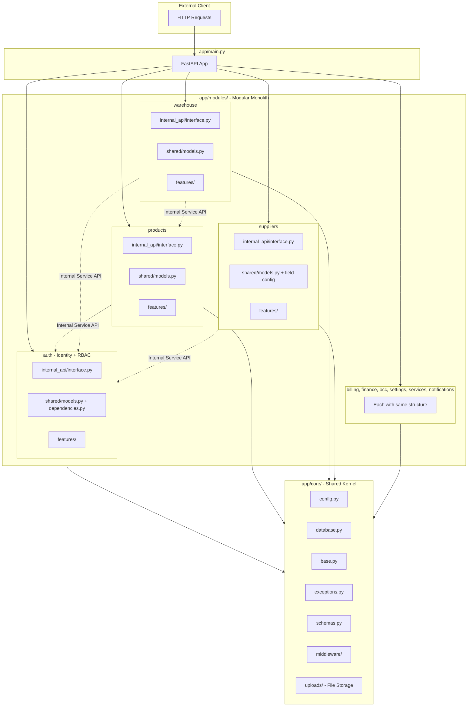

# Backend Refactoring Plan: Modular Monolith + Vertical Slice Architecture

> ✅ **USER APPROVED** with corrections:
> 1. **`permissions` merged into `auth`** — roles/permissions are part of identity
> 2. **`uploads` moved to `app/core/uploads/`** — cross-cutting infrastructure concern
> 3. **Alembic migrations** — careful `env.py` update for model discovery

## 1. Current State Analysis

**Current structure:** Flat horizontal layout with all models in [`app/models/`](backend/app/models), no routers implemented yet, schemas only have common base classes.

**Current business domains** (from model files):

| Domain | Models | File |
|--------|--------|------|
| Auth | Tenant, User, Session, UserRole | [`app/models/auth.py`](backend/app/models/auth.py) |
| Billing | Plan, TenantPlan, PlanFeature, TenantFeatureOverride, FeatureDefinition | [`app/models/billing.py`](backend/app/models/billing.py) |
| Products | Product, ProductFieldValue | [`app/models/product.py`](backend/app/models/product.py) |
| Categories | Category, CategoryField | [`app/models/category.py`](backend/app/models/category.py) |
| Warehouse | WarehouseBatch, WarehouseMovement, WarehouseOffcut, WarehouseDeficit, StockItem, StockAuditEntry | [`app/models/warehouse.py`](backend/app/models/warehouse.py) |
| Suppliers | Supplier, SupplierAddress, SupplierContact, SupplierFile, SupplierAuditEntry, SupplierPriceEntry | [`app/models/supplier.py`](backend/app/models/supplier.py) |
| Finance | FinancePayment, PaymentDocument, DocumentArchiveItem | [`app/models/finance.py`](backend/app/models/finance.py) |
| BCC | BccCategory, BccEvent | [`app/models/bcc.py`](backend/app/models/bcc.py) |
| Settings | CompanyInfo, GlobalConstants, Currency, Uom, UomConversion, OrderStatusSetting | [`app/models/settings.py`](backend/app/models/settings.py) |
| Config | FieldDefinition, SectionConfig, SectionField, PermissionItem, RolePermission, UserPermission | [`app/models/config.py`](backend/app/models/config.py) |
| Services | Service | [`app/models/service.py`](backend/app/models/service.py) |
| Uploads | UploadedFile | [`app/models/upload.py`](backend/app/models/upload.py) |
| Notifications | Notification | [`app/models/notification.py`](backend/app/models/notification.py) |

**Technical infrastructure:**
- [`app/config.py`](backend/app/config.py) — `Settings` class (Pydantic)
- [`app/database.py`](backend/app/database.py) — async engine + session factory + `get_db` dependency
- [`app/main.py`](backend/app/main.py) — FastAPI app with CORS and health check
- [`app/models/base.py`](backend/app/models/base.py) — `Base`, `UUIDMixin`, `TimestampMixin`
- [`app/alembic/env.py`](backend/app/alembic/env.py) — imports `Base` from `app.models` and `settings` from `app.config`
- [`app/schemas/common.py`](backend/app/schemas/common.py) — `ApiResponse`, `PaginatedResponse`, `TranslatedString`

## 2. Target Architecture (Corrected)

```
backend/app/
├── core/                              # Shared Kernel (technical, business-agnostic)
│   ├── __init__.py
│   ├── config.py                      # From app/config.py
│   ├── database.py                    # From app/database.py
│   ├── exceptions.py                  # Global custom exceptions (NEW)
│   ├── base.py                        # From app/models/base.py (Base, UUIDMixin, TimestampMixin)
│   ├── schemas.py                     # From app/schemas/common.py
│   ├── middleware/
│   │   ├── __init__.py
│   │   └── cors.py                    # CORS middleware (extracted from main.py)
│   └── uploads/                       # Cross-cutting: file storage infrastructure
│       ├── __init__.py
│       ├── models.py                  # UploadedFile ORM model
│       └── service.py                 # Upload/delete/file operations
│
├── modules/
│   ├── auth/                          # AUTH + PERMISSIONS (merged per user feedback)
│   │   ├── __init__.py
│   │   ├── internal_api/
│   │   │   ├── __init__.py
│   │   │   └── interface.py
│   │   ├── shared/
│   │   │   ├── __init__.py
│   │   │   ├── models.py             # Tenant, User, Session, UserRole
│   │   │   │                         # + PermissionItem, RolePermission, UserPermission
│   │   │   └── dependencies.py       # get_current_user, permissions
│   │   └── features/
│   │       ├── login/                # POST /auth/login
│   │       │   ├── action.py
│   │       │   ├── domain.py
│   │       │   ├── repository.py
│   │       │   └── schemas.py
│   │       ├── register/             # POST /auth/register
│   │       ├── logout/               # POST /auth/logout
│   │       └── me/                   # GET /auth/me
│   │
│   ├── products/                     # PRODUCTS (Category + Product merged)
│   │   ├── __init__.py
│   │   ├── internal_api/
│   │   │   ├── __init__.py
│   │   │   └── interface.py
│   │   ├── shared/
│   │   │   ├── __init__.py
│   │   │   ├── models.py            # Category, CategoryField, Product, ProductFieldValue
│   │   │   └── dependencies.py
│   │   └── features/
│   │       ├── create_product/
│   │       │   ├── action.py
│   │       │   ├── domain.py
│   │       │   ├── repository.py
│   │       │   └── schemas.py
│   │       ├── get_product_detail/
│   │       │   ├── action.py
│   │       │   ├── domain.py
│   │       │   ├── repository.py
│   │       │   └── schemas.py
│   │       ├── list_categories/
│   │       └── create_category/
│   │
│   ├── warehouse/                    # WAREHOUSE module
│   │   ├── __init__.py
│   │   ├── internal_api/
│   │   │   ├── __init__.py
│   │   │   └── interface.py
│   │   ├── shared/
│   │   │   ├── __init__.py
│   │   │   ├── models.py            # WarehouseBatch, WarehouseMovement, etc.
│   │   │   └── dependencies.py
│   │   └── features/
│   │       ├── get_batch_detail/
│   │       └── list_movements/
│   │
│   ├── suppliers/                    # SUPPLIERS + dynamic field config
│   │   ├── __init__.py
│   │   ├── internal_api/
│   │   │   ├── __init__.py
│   │   │   └── interface.py
│   │   ├── shared/
│   │   │   ├── __init__.py
│   │   │   ├── models.py            # Supplier + related
│   │   │   │                        # + FieldDefinition, SectionConfig, SectionField
│   │   │   └── dependencies.py
│   │   └── features/
│   │       └── get_supplier_detail/
│   │
│   ├── billing/                      # BILLING (plans & feature flags)
│   │   ├── __init__.py
│   │   ├── internal_api/
│   │   │   ├── __init__.py
│   │   │   └── interface.py
│   │   ├── shared/
│   │   │   ├── __init__.py
│   │   │   ├── models.py            # Plan, TenantPlan, PlanFeature, etc.
│   │   │   └── dependencies.py
│   │   └── features/
│   │
│   ├── finance/                      # FINANCE module
│   │   ├── __init__.py
│   │   ├── internal_api/
│   │   │   ├── __init__.py
│   │   │   └── interface.py
│   │   ├── shared/
│   │   │   ├── __init__.py
│   │   │   ├── models.py            # FinancePayment, PaymentDocument, DocumentArchiveItem
│   │   │   └── dependencies.py
│   │   └── features/
│   │
│   ├── bcc/                          # BCC (Supplier Communication)
│   │   ├── __init__.py
│   │   ├── internal_api/
│   │   │   ├── __init__.py
│   │   │   └── interface.py
│   │   ├── shared/
│   │   │   ├── __init__.py
│   │   │   ├── models.py            # BccCategory, BccEvent
│   │   │   └── dependencies.py
│   │   └── features/
│   │
│   ├── settings/                     # SETTINGS (tenant config)
│   │   ├── __init__.py
│   │   ├── internal_api/
│   │   │   ├── __init__.py
│   │   │   └── interface.py
│   │   ├── shared/
│   │   │   ├── __init__.py
│   │   │   ├── models.py            # CompanyInfo, GlobalConstants, Currency, Uom, etc.
│   │   │   └── dependencies.py
│   │   └── features/
│   │
│   ├── services/                     # SERVICES module
│   │   ├── __init__.py
│   │   ├── internal_api/
│   │   │   ├── __init__.py
│   │   │   └── interface.py
│   │   ├── shared/
│   │   │   ├── __init__.py
│   │   │   ├── models.py            # Service
│   │   │   └── dependencies.py
│   │   └── features/
│   │
│   └── notifications/                # NOTIFICATIONS module
│       ├── __init__.py
│       ├── internal_api/
│       │   ├── __init__.py
│       │   └── interface.py
│       ├── shared/
│       │   ├── __init__.py
│       │   ├── models.py            # Notification
│       │   └── dependencies.py
│       └── features/
│
└── main.py                            # FastAPI app entry point
```

## 3. Module Grouping Rationale (Corrected)

| Business Module | Models | Reasoning |
|----------------|--------|-----------|
| **auth** | Tenant, User, Session, UserRole + PermissionItem, RolePermission, UserPermission | Identity + RBAC — tightly coupled per user feedback |
| **products** | Category, CategoryField, Product, ProductFieldValue | Categories are product taxonomy — tightly coupled |
| **warehouse** | WarehouseBatch, Movement, Offcut, Deficit, StockItem, AuditEntry | Inventory lifecycle |
| **suppliers** | Supplier, Address, Contact, File, AuditEntry, PriceEntry + FieldDefinition, SectionConfig, SectionField | Supplier card + its dynamic field config |
| **billing** | Plan, TenantPlan, PlanFeature, TenantFeatureOverride, FeatureDefinition | Subscription & feature flags |
| **finance** | FinancePayment, PaymentDocument, DocumentArchiveItem | Payment processing |
| **bcc** | BccCategory, BccEvent | Supplier communication/catalog |
| **settings** | CompanyInfo, GlobalConstants, Currency, Uom, UomConversion, OrderStatusSetting | Tenant-level configuration |
| **services** | Service | Services price list |
| **notifications** | Notification | System notifications |

**Infrastructure layer (core/):**
| Component | Source | Reasoning |
|-----------|--------|-----------|
| **core/uploads/** | UploadedFile model | Cross-cutting concern, needed by all modules per user feedback |
| **core/base.py** | Base, UUIDMixin, TimestampMixin | Technical ORM infrastructure |
| **core/config.py** | Settings | Global app configuration |
| **core/database.py** | Engine, session, get_db | Database connectivity |
| **core/schemas.py** | ApiResponse, PaginatedResponse, TranslatedString | Shared DTOs |
| **core/exceptions.py** | Custom exception classes | Global error handling |
| **core/middleware/** | CORS middleware | App middleware |

## 4. Key Design Decisions

### 4a. `core/` vs `modules/` boundary
- **`core/`** contains ONLY technical infrastructure: config, database engine, base ORM classes, common schemas, middleware, file upload infrastructure. NO business logic references.
- **`modules/`** contains ALL business logic, organized by domain.

### 4b. `models/config.py` splitting
The current [`app/models/config.py`](backend/app/models/config.py) contains two distinct concerns:
1. `FieldDefinition`, `SectionConfig`, `SectionField` — supplier card section/field configuration → move to **suppliers** module
2. `PermissionItem`, `RolePermission`, `UserPermission` — permission matrix → move to **auth** module (per user feedback)

### 4c. `core/base.py` location
The `Base`, `UUIDMixin`, `TimestampMixin` classes are technical infrastructure (not business logic), so they go to [`core/base.py`](backend/app/core/base.py). All module models import from there.

### 4d. Alembic compatibility
The alembic [`env.py`](backend/app/alembic/env.py) currently does:
```python
from app.models import Base  # gets all models registered
from app.config import settings
```

After refactoring:
```python
from app.core.base import Base  # declarative base
from app.core.config import settings
```

**Model discovery for alembic:** We need to ensure all module models are imported so `Base.metadata` is complete. Strategy:
- Create [`app/_alembic_imports.py`](backend/app/_alembic_imports.py) that imports all module models explicitly
- Or update `env.py` to import each module's `shared/models.py`

## 5. Execution Plan (Todo List)

### Phase 1: Core Infrastructure Setup
1. Create [`app/core/`](backend/app/core/) directory structure with `__init__.py`
2. Move [`app/config.py`](backend/app/config.py) → [`app/core/config.py`](backend/app/core/config.py), update internal imports
3. Move [`app/database.py`](backend/app/database.py) → [`app/core/database.py`](backend/app/core/database.py), update import of `settings` to `from app.core.config import settings`
4. Move [`app/models/base.py`](backend/app/models/base.py) → [`app/core/base.py`](backend/app/core/base.py), update import paths
5. Move [`app/schemas/common.py`](backend/app/schemas/common.py) → [`app/core/schemas.py`](backend/app/core/schemas.py)
6. Create [`app/core/exceptions.py`](backend/app/core/exceptions.py) with global custom exception classes
7. Create [`app/core/middleware/`](backend/app/core/middleware/) and extract CORS setup from `main.py`
8. Create [`app/core/uploads/`](backend/app/core/uploads/) with models.py and service.py for file management
9. Update [`app/main.py`](backend/app/main.py) to import from `app.core.*`

### Phase 2: Module Directory Scaffolding + Model Migration
10. Create all module directories under [`app/modules/`](backend/app/modules/)
11. Move each model file to `modules/*/shared/models.py`, updating all `from app.models.base` → `from app.core.base`
12. Merge `category.py` into `products/shared/models.py`
13. Split `config.py`: field config → `suppliers/shared/models.py`, permissions → `auth/shared/models.py`
14. Delete old [`app/models/`](backend/app/models/) and [`app/schemas/`](backend/app/schemas/)

### Phase 3: Alembic Update
15. Update [`app/alembic/env.py`](backend/app/alembic/env.py) imports
16. Create model import collector for alembic metadata
17. Verify with `alembic current`

### Phase 4: Demo Vertical Slice Features
18. Implement `products/features/get_product_detail/` full stack
19. Implement `products/features/create_product/` full stack
20. Implement `products/internal_api/interface.py`
21. Implement `auth/features/me/` for demo
22. Implement `auth/internal_api/interface.py`

### Phase 5: Finalize
23. Update [`app/main.py`](backend/app/main.py) with router includes
24. Verify full import chain: `python -c "from app.main import app"`
25. Final directory tree review

## 6. Architecture Diagram



## 7. Cross-Module Communication Pattern

When module `warehouse` needs product data:

```python
# modules/warehouse/features/get_batch_detail/domain.py
from app.modules.products.internal_api.interface import get_product_by_id

async def get_batch_detail(batch_id: UUID) -> BatchDetailResponse:
    batch = await repository.get_batch(batch_id)
    # Cross-module call via Internal Service API (in-memory)
    product = await get_product_by_id(batch.product_id)
    return BatchDetailResponse(batch=batch, product=product)
```

```python
# modules/products/internal_api/interface.py
# This is the ONLY entry point for other modules
from app.modules.products.shared.models import Product
from app.modules.products.features.get_product_detail.repository import get_product_by_id as _repo_get

async def get_product_by_id(product_id: UUID) -> Product | None:
    return await _repo_get(product_id)
```

## 8. File-by-File Migration Map (Corrected)

| Current File | Target File | Action |
|-------------|-------------|--------|
| `app/config.py` | `app/core/config.py` | MOVE + update imports |
| `app/database.py` | `app/core/database.py` | MOVE + update `settings` import |
| `app/models/base.py` | `app/core/base.py` | MOVE + update all model imports |
| `app/schemas/common.py` | `app/core/schemas.py` | MOVE |
| `app/main.py` | `app/main.py` | UPDATE (imports + router includes) |
| `app/models/auth.py` | `app/modules/auth/shared/models.py` | MOVE + RBAC models from config.py merged in |
| `app/models/billing.py` | `app/modules/billing/shared/models.py` | MOVE |
| `app/models/product.py` | `app/modules/products/shared/models.py` | MOVE |
| `app/models/category.py` | `app/modules/products/shared/models.py` | MERGE into products |
| `app/models/warehouse.py` | `app/modules/warehouse/shared/models.py` | MOVE |
| `app/models/supplier.py` | `app/modules/suppliers/shared/models.py` | MOVE |
| `app/models/finance.py` | `app/modules/finance/shared/models.py` | MOVE |
| `app/models/bcc.py` | `app/modules/bcc/shared/models.py` | MOVE |
| `app/models/settings.py` | `app/modules/settings/shared/models.py` | MOVE |
| `app/models/service.py` | `app/modules/services/shared/models.py` | MOVE |
| `app/models/notification.py` | `app/modules/notifications/shared/models.py` | MOVE |
| `app/models/upload.py` | `app/core/uploads/models.py` | MOVE to core (cross-cutting) |
| `app/models/config.py` (FieldDefinition etc.) | `app/modules/suppliers/shared/models.py` | MERGE into suppliers |
| `app/models/config.py` (PermissionItem etc.) | `app/modules/auth/shared/models.py` | MERGE into auth |
| `app/models/__init__.py` | DELETE | |
| `app/schemas/__init__.py` | DELETE | |
| `app/alembic/env.py` | `app/alembic/env.py` | UPDATE imports + model discovery |

## 9. Risks & Mitigations

| Risk | Impact | Mitigation |
|------|--------|------------|
| Alembic migrations reference old model paths | Migration failure | Update env.py BEFORE running any migration; existing migrations reference table names (not Python paths), so they're safe |
| Circular imports in `internal_api/interface.py` | Runtime import error | Keep interface.py thin — only re-export pure async functions |
| `pyproject.toml` packages.find | Module not found | Update `where = ["app"]` if needed |
| Frontend API contracts break | Integration issues | No routes existed yet, so no breaking changes |
