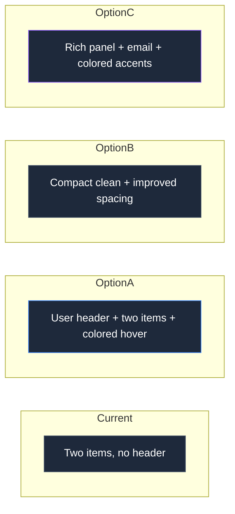

# User Dropdown Menu — Design Options

All options follow the existing dark glass-morphism aesthetic of the admin panel.

---

## Current Implementation (for reference)

```
┌──────────────────────┐
│ ⚙️  Настройки        │
│ ─────────────────── │
│ ← Выйти             │
└──────────────────────┘
```

Minimal — two items, no user info inside dropdown.

---

## Option A: Glass Card with User Header

```
┌──────────────────────────┐
│ ┌────┐                   │
│ │ 👤 │  Иван Петров      │
│ │    │  Администратор    │
│ └────┘                   │
│ ──────────────────────── │
│ ⚙️  Настройки            │
│ ──────────────────────── │
│ 🚪  Выйти                │  ← красноватый оттенок при hover
└──────────────────────────┘
```

**Features:**
- User avatar (circle with initials or icon) + full name + role at the top
- Glass background with stronger blur
- Wider card (~220px)
- Settings icon: `settings-gear` (already exists)
- Logout icon: `corner-up-left` (already exists) with slightly reddish tint on hover
- Smooth fade+slide animation

**CSS additions:**
```css
.user-dropdown-header {
  display: flex;
  align-items: center;
  gap: 12px;
  padding: 12px 14px 10px;
  border-bottom: 1px solid rgba(255, 255, 255, 0.06);
  margin-bottom: 4px;
}

.user-dropdown-avatar {
  width: 36px;
  height: 36px;
  border-radius: 50%;
  background: linear-gradient(135deg, var(--primary), var(--primary-dark));
  display: flex;
  align-items: center;
  justify-content: center;
  font-weight: 700;
  font-size: 0.85rem;
  color: #fff;
  flex-shrink: 0;
}

.user-dropdown-name {
  font-size: 0.9rem;
  font-weight: 600;
  color: #fff;
  line-height: 1.2;
}

.user-dropdown-role {
  font-size: 0.72rem;
  color: rgba(255, 255, 255, 0.5);
  line-height: 1.2;
}

.user-dropdown-item.logout:hover {
  color: #ff6b6b;
  background: rgba(255, 107, 107, 0.1);
}
```

---

## Option B: Compact Clean with Better Icons & Spacing

```
┌──────────────────────┐
│ ⚙️  Настройки         │
│                       │
│ 🚪  Выйти             │
└──────────────────────┘
```

**Features:**
- Clean two-item list with improved spacing
- Larger clickable area (more padding)
- Subtle `→` arrow hint on settings hover
- Logout item turns slightly red on hover
- Smaller, more compact card width (~180px)
- Same glass background

---

## Option C: Rich Panel with Accents & Shortcuts

```
┌──────────────────────────┐
│ ┌────┐                   │
│ │ 👤 │  Иван Петров      │
│ │    │  Ivan@email.com   │
│ └────┘                   │
│ ════════════════════════ │
│ ⚙️  Настройки профиля    │  → синий акцент
│ 🚪  Выйти                │  → красный акцент
└──────────────────────────┘
```

**Features:**
- Full user card at top: avatar, name, email
- Double-line separator (thicker)
- Full-width labels
- Color-coded accent on hover (blue for settings, red for logout)
- Subtle scale transform on hover (1.02)

---

## Recommendation

**Option A** is recommended because it:
1. Shows the user info inside the dropdown (redundant with header, but visually rich)
2. Follows modern SaaS admin panel conventions
3. Maintains consistency with the app's glass-morphism design
4. Provides visual feedback with hover states
5. Doesn't over-engineer

Would you like me to implement one of these options, or do you have a different vision?


