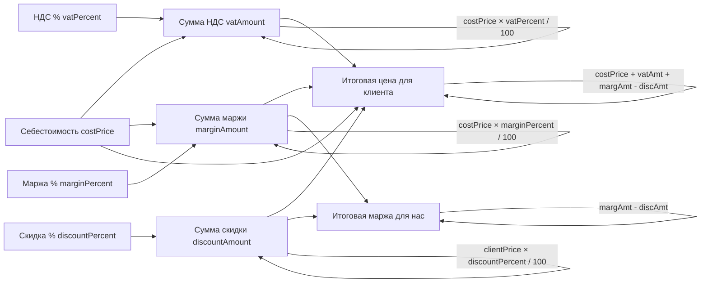

# План: Доработка ценовых секций в карточке товара и заказа

## 1. Карточка товара — переименование полей цен

**Файлы:**
- [`frontend_vue/src/views/admin/products/ProductCardPage.vue`](../frontend_vue/src/views/admin/products/ProductCardPage.vue)
- [`frontend_vue/src/i18n/admin/products.ts`](../frontend_vue/src/i18n/admin/products.ts)

**Текущее состояние:**
- Секция `section_price` содержит поле `field_price` ("Цена") + `field_price_quantity` + `field_sale_uom` + `field_currency`
- Непонятно, что это закупочная или продажная цена

**Изменения:**
- Переименовать `field_price` → `field_purchase_price` (Закупочная цена / Purchase price)
- Добавить уточняющую подсказку: "Цена за единицу товара при закупке"
- `field_price_quantity` оставить (цена за N единиц)
- `field_sale_uom` оставить

---

## 2. Карточка заказа — реструктуризация секции цен

### 2.1 Типы данных

**Файл:** [`frontend_vue/src/types/order.ts`](../frontend_vue/src/types/order.ts)

Добавить в `Order`:
```ts
export interface Order {
  // ... existing fields
  vatPercent: number          // процент НДС
  marginPercent: number       // процент маржи
}
```

Добавить в `OrderFormFields` (composable):
```ts
interface OrderFormFields {
  // ... existing
  costPrice: number           // себестоимость (редактируемая)
  vatPercent: number          // процент НДС
  marginPercent: number       // процент маржи
}
```

### 2.2 Композабл useOrderCard

**Файл:** [`frontend_vue/src/composables/useOrderCard.ts`](../frontend_vue/src/composables/useOrderCard.ts)

Добавить в форму:
- `costPrice: number` — себестоимость (редактируемая, сумма товаров и услуг без маржи)
- `vatPercent: number` — процент НДС (по умолчанию из `settings.constants.vatRate`)
- `marginPercent: number` — процент маржи (по умолчанию из `settings.constants.defaultMargin`)

Добавить вычисляемые поля:
```ts
const vatAmount = computed(() => costPrice * (vatPercent / 100))
const marginAmount = computed(() => costPrice * (marginPercent / 100))
const discountAmount = computed(() => clientPrice * (discountPercent / 100))
const clientPrice = computed(() => costPrice + vatAmount + marginAmount - discountAmount)
const totalMargin = computed(() => marginAmount - discountAmount)
```

### 2.3 Шаблон OrderCardPage

**Файл:** [`frontend_vue/src/views/admin/orders/OrderCardPage.vue`](../frontend_vue/src/views/admin/orders/OrderCardPage.vue)

#### Новая структура секции центральной колонки:

```
GlassPanel title="Финансовый расчёт"
├── Себестоимость (редактируемое поле) [EUR]
│   └── hint: "Общая стоимость товаров и услуг без наценок"
├── НДС % (редактируемое, default из настроек) [%]
├── Маржа % (редактируемое, default из настроек) [%]
├── Скидка % (редактируемое, уже есть) [%]
├── ─ ─ ─ divider ─ ─ ─
├── Сумма НДС (readonly) [EUR]
├── Сумма маржи (readonly) [EUR]
├── Итоговая цена для клиента (readonly, жирный) [EUR]
├── Итоговая маржа для нас (readonly, красный если отрицательная) [EUR]
└── Валюта (селектор, уже есть)
```

#### Вес — переместить в отдельную секцию или в левую колонку

#### Примечания — отдельный GlassPanel внизу

### 2.4 Мок-данные заказа

**Файл:** [`frontend_vue/src/services/mocks/orders.ts`](../frontend_vue/src/services/mocks/orders.ts)

- Добавить `vatPercent` и `marginPercent` в мок-заказы

---

## 3. Формулы расчёта

**Формула:** `clientPrice = себестоимость × (1 + ндс%/100) × (1 + маржа%/100) × (1 - скидка%/100)`

1. `baseWithVAT = себестоимость × (1 + vatPercent/100)`
2. `baseWithMargin = baseWithVAT × (1 + marginPercent/100)`
3. `clientPrice = baseWithMargin × (1 - discountPercent/100)`
4. `totalMargin = (baseWithMargin - себестоимость) - (clientPrice × discountPercent/100)`

**Себестоимость:** автоматически из суммы товаров и услуг, но поле редактируемое.



**Вопрос:** В какой последовательности применять проценты? 

Вариант А (как описано):
1. себестоимость + НДС + маржа - скидка = цена клиента
2. Итоговая маржа = маржа - скидка

Вариант Б (классический):
1. себестоимость × (1 + маржа%) × (1 + НДС%) × (1 - скидка%) = цена клиента

---

## 4. Файлы для изменений

| Файл | Изменения |
|------|-----------|
| [`frontend_vue/src/types/order.ts`](../frontend_vue/src/types/order.ts) | Добавить `vatPercent`, `marginPercent` в `Order`, обновить `OrderFormFields` |
| [`frontend_vue/src/composables/useOrderCard.ts`](../frontend_vue/src/composables/useOrderCard.ts) | Добавить `costPrice`, `vatPercent`, `marginPercent` в форму и computed |
| [`frontend_vue/src/views/admin/orders/OrderCardPage.vue`](../frontend_vue/src/views/admin/orders/OrderCardPage.vue) | Реструктурировать секцию цен, вынести вес и примечания |
| [`frontend_vue/src/views/admin/products/ProductCardPage.vue`](../frontend_vue/src/views/admin/products/ProductCardPage.vue) | Переименовать поле цены |
| [`frontend_vue/src/i18n/admin/orders.ts`](../frontend_vue/src/i18n/admin/orders.ts) | Новые ключи для НДС%, маржи%, себестоимости |
| [`frontend_vue/src/i18n/admin/products.ts`](../frontend_vue/src/i18n/admin/products.ts) | Переименовать ключ `field_price` |
| [`frontend_vue/src/services/mocks/orders.ts`](../frontend_vue/src/services/mocks/orders.ts) | Добавить `vatPercent`, `marginPercent` |

---

