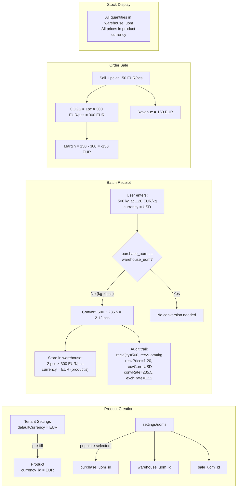

# Plan: Product UoM Restructure

## Summary

Refactor product's unit-of-measure model from a single `uom_id` to three separate UoM fields (purchase, warehouse, sale), add per-product currency, price quantity basis, and conversion rules. Update warehouse batch model to track purchase audit trail.

---

## 1. Complete Field Listing

### 1.1 Product — все поля

```python
# ═══════════════════════════════════════════════════════════
# 1. Основная информация (существующее, без изменений)
# ═══════════════════════════════════════════════════════════
name: str                    # Название товара
category_id: UUID | None     # Категория
sku: str | None              # Артикул
description: str | None      # Описание
min_stock: float | None      # Минимальный остаток (в warehouse_uom)

# ═══════════════════════════════════════════════════════════
# 2. Единицы измерения (3 отдельных FK)
# ═══════════════════════════════════════════════════════════
purchase_uom_id: UUID | None   # → uoms.id: в чём закупаем (кг, т, м...)
warehouse_uom_id: UUID | None  # → uoms.id: в чём храним на складе (кг, шт, м...)
sale_uom_id: UUID | None       # → uoms.id: в чём продаём / указываем цену (шт, кг, м...)

# ═══════════════════════════════════════════════════════════
# 3. Ценообразование
# ═══════════════════════════════════════════════════════════
currency_id: UUID | None    # → currencies.id: валюта товара (редактируется)
price: float | None         # Базовая цена продажи
price_quantity: int         # Цена за N единиц sale_uom (по умолч. 1)
                            # Пример: 150 EUR за 1 шт  → price=150, qty=1
                            # Пример: 45 EUR за 1000 шт → price=45, qty=1000

# ═══════════════════════════════════════════════════════════
# 4. Конвертация между единицами (опционально)
# ═══════════════════════════════════════════════════════════
# Покупка → Хранение (если purchase_uom ≠ warehouse_uom)
purchase_to_warehouse_formula_type: str | None  # 'weight_per_unit', 'area_to_weight', 'length_to_weight', или 'custom'
purchase_to_warehouse_factor: float | None       # Числовой коэффициент
# Пример: закупаем листы в кг, храним в шт → factor = 235.5 (кг/шт)

# Хранение → Продажа (если warehouse_uom ≠ sale_uom)
warehouse_to_sale_formula_type: str | None       # та же логика
warehouse_to_sale_factor: float | None           # Числовой коэффициент
# Пример: храним в кг, продаём в шт → factor = 235.5 (кг/шт)
```

### 1.2 Batch — все поля

```python
# ═══════════════════════════════════════════════════════════
# 1. Связи
# ═══════════════════════════════════════════════════════════
product_id: UUID             # → products.id
supplier_id: UUID | None     # → suppliers.id

# ═══════════════════════════════════════════════════════════
# 2. Складской учёт (EDITABLE — пользователь может менять)
# ═══════════════════════════════════════════════════════════
quantity: float              # Количество на складе (в warehouse_uom товара)
unit_price: float            # Цена за единицу (в валюте товара, за warehouse_uom)
                             # Пример: товар в EUR, warehouse_uom = кг → EUR/кг
currency: str                # = product.currency (наследуется, не меняется отдельно)
expires_at: date | None      # Срок годности
location: str | None         # Место хранения
batch_number: str            # Номер партии
lot_code: str                # Код лота
status: str                  # Статус (available, in_storage...)
certificate_ref: str | None  # Сертификат
notes: str | None            # Примечания

# ═══════════════════════════════════════════════════════════
# 3. Аудит закупки (READ-ONLY — заполняются при создании, не редактируются)
# ═══════════════════════════════════════════════════════════
received_quantity: float | None      # Сколько купили (в единицах поставщика)
received_uom_id: UUID | None         # → uoms.id: единица поставщика (кг, т, м...)
received_unit_price: float | None    # Цена за единицу поставщика (в валюте поставщика)
received_currency_id: UUID | None    # → currencies.id: валюта поставщика (USD, EUR...)
purchase_to_warehouse_rate: float | None  # Коэффициент конвертации
                                     # Пример: купили 1000 кг, на склад = 4 шт
                                     # rate = 250 (кг/шт), qty = 1000/250 = 4
exchange_rate: float | None          # Курс валюты (received_currency → product.currency)
                                     # Пример: купили за USD 1.20, product в EUR
                                     # rate = 0.92 (1 USD = 0.92 EUR)
```

### 1.3 Что где отображается

| Экран | Единица измерения | Валюта |
|-------|-------------------|--------|
| Карточка товара (цена) | **sale_uom** | product.currency |
| Карточка товара (мин. остаток) | **warehouse_uom** | — |
| Создание партии (покупка) | **purchase_uom** (ввод) → **warehouse_uom** (результат) | received_currency (ввод) → product.currency (результат) |
| Склад: остатки | **warehouse_uom** | product.currency |
| Склад: движения | **warehouse_uom** | product.currency |
| Заказ (позиция) | **sale_uom** | product.currency |
| Заказ (COGS) | **warehouse_uom** (внутренний расчёт) | product.currency |
| Отчёт о марже | sale_uom для выручки, warehouse_uom для COGS | product.currency |

---

## 2. Data Model Changes (code)

### 2.1 Product Model

**Current** (`backend/app/modules/products/shared/models.py`):
- `uom_id: UUID | None` — single unit
- `currency_id: UUID | None` — currently non-editable
- `price: float | None`
- `price_unit: str | None` — legacy string field (being phased out)

**New**:

```python
# ── 3 separate UoM references ──
purchase_uom_id: Mapped[uuid.UUID | None] = mapped_column(
    UUID(as_uuid=True), ForeignKey("uoms.id", ondelete="RESTRICT"), nullable=True, index=True,
)
warehouse_uom_id: Mapped[uuid.UUID | None] = mapped_column(
    UUID(as_uuid=True), ForeignKey("uoms.id", ondelete="RESTRICT"), nullable=True, index=True,
)
sale_uom_id: Mapped[uuid.UUID | None] = mapped_column(
    UUID(as_uuid=True), ForeignKey("uoms.id", ondelete="RESTRICT"), nullable=True, index=True,
)

# ── Currency (now editable) ──
currency_id: Mapped[uuid.UUID | None] = mapped_column(
    UUID(as_uuid=True), ForeignKey("currencies.id", ondelete="RESTRICT"), nullable=True, index=True,
)

# ── Price quantity basis ──
price_quantity: Mapped[int] = mapped_column(Integer, nullable=False, default=1, server_default="1")

# ── Conversion overrides (optional, override settings defaults) ──
purchase_to_warehouse_formula_type: Mapped[str | None] = mapped_column(String(30), nullable=True)
purchase_to_warehouse_factor: Mapped[float | None] = mapped_column(Numeric(20, 6), nullable=True)
warehouse_to_sale_formula_type: Mapped[str | None] = mapped_column(String(30), nullable=True)
warehouse_to_sale_factor: Mapped[float | None] = mapped_column(Numeric(20, 6), nullable=True)
```

**Migration** (`phase_15`):
- `sale_uom_id` ← copy from existing `uom_id`
- `warehouse_uom_id` ← copy from existing `uom_id` (default = sale_uom)
- `purchase_uom_id` ← copy from existing `uom_id` (default = warehouse_uom)
- `price_quantity` ← 1 for all existing rows
- `currency_id` ← set to tenant's default currency for each product
- Drop `uom_id` column (old single-UoM FK)
- Drop `price_unit` column (legacy string)

### 2.2 Batch Model

**Add audit trail columns** (read-only after creation):

```python
# ── Purchase audit trail (set at creation, read-only thereafter) ──
received_quantity: Mapped[float | None] = mapped_column(Numeric(14, 4), nullable=True)
received_uom_id: Mapped[uuid.UUID | None] = mapped_column(
    UUID(as_uuid=True), ForeignKey("uoms.id", ondelete="SET NULL"), nullable=True,
)
received_unit_price: Mapped[float | None] = mapped_column(Numeric(14, 6), nullable=True)
received_currency_id: Mapped[uuid.UUID | None] = mapped_column(
    UUID(as_uuid=True), ForeignKey("currencies.id", ondelete="SET NULL"), nullable=True,
)
purchase_to_warehouse_rate: Mapped[float | None] = mapped_column(Numeric(20, 6), nullable=True)
exchange_rate: Mapped[float | None] = mapped_column(Numeric(14, 6), nullable=True)
```

### 2.3 New Model: ProductUomConversion (optional, future)

If product-specific conversion rules become complex (multiple rules per product), extract to a separate table. For now, the 4 fields on Product suffice.

---

## 2. Frontend Type Changes

### 2.1 [`frontend_vue/src/types/product.ts`](frontend_vue/src/types/product.ts)

```typescript
// REMOVE hardcoded PriceUnit type:
// export type PriceUnit = 'EUR/vnt' | 'EUR/kg' | 'EUR/m'  ← DELETE

// UPDATE Product interface:
export interface Product {
  id: string
  name: TranslatedString
  categoryId: string | null
  categoryName: TranslatedString | null
  sku: string | null
  description: TranslatedString | null
  
  // === UoM (3 separate) ===
  purchaseUomId: string | null
  warehouseUomId: string | null
  saleUomId: string | null
  
  // === Pricing ===
  price: number | null
  priceQuantity: number          // default 1
  currencyId: string | null
  
  // === Conversion (optional) ===
  purchaseToWarehouseFormulaType: string | null
  purchaseToWarehouseFactor: number | null
  warehouseToSaleFormulaType: string | null
  warehouseToSaleFactor: number | null
  
  // === Legacy (keep during migration) ===
  // priceUnit: string | null     ← DELETE after migration
  
  // === Existing fields ===
  minStock: number | null
  createdAt: string
  fieldValues: ProductFieldValue[]
  linkedSuppliers: LinkedSupplier[]
  auditLog: SupplierAuditEntry[]
}
```

### 2.2 [`frontend_vue/src/types/warehouse.ts`](frontend_vue/src/types/warehouse.ts)

```typescript
// REMOVE hardcoded StockUnit type:
// export type StockUnit = 'kg' | 'm' | 'pcs' | 'm2'  ← DELETE or change to string

// UPDATE BatchCreatePayload and Batch:
export interface Batch {
  id: string
  productId: string
  // ...
  quantity: number
  unit: string                    // was StockUnit, now string
  unitPrice: number
  currency: string
  
  // ── Audit trail (read-only) ──
  receivedQuantity: number | null
  receivedUnitId: string | null
  receivedUnitPrice: number | null
  receivedCurrency: string | null
  purchaseToWarehouseRate: number | null
  exchangeRate: number | null
}
```

### 2.3 [`frontend_vue/src/types/settings.ts`](frontend_vue/src/types/settings.ts)

No changes needed — `Uom` interface is already generic (`id`, `code`, `name`, `category`).

---

## 3. Backend API Changes

### 3.1 Product CRUD

**Schemas** (`backend/app/modules/products/features/.../schemas.py`):

```python
class CreateProductInput(BaseModel):
    # ... existing fields ...
    purchase_uom_id: str | None = None
    warehouse_uom_id: str | None = None
    sale_uom_id: str | None = None
    price_quantity: int = 1
    currency_id: str | None = None
    purchase_to_warehouse_formula_type: str | None = None
    purchase_to_warehouse_factor: float | None = None
    warehouse_to_sale_formula_type: str | None = None
    warehouse_to_sale_factor: float | None = None
```

**Logic** (`backend/app/modules/products/features/create_product/domain.py`):
- Remove `_resolve_price_unit` (no more "EUR/vnt" parsing)
- If `currency_id` not provided → use tenant's default currency
- If `sale_uom_id` not provided → default to first UoM matching 'quantity' category
- If `warehouse_uom_id` not provided → default to `sale_uom_id`
- If `purchase_uom_id` not provided → default to `warehouse_uom_id`

### 3.2 Batch CRUD

**Create Batch** — new input fields:
- `received_quantity`, `received_unit_id`, `received_unit_price`, `received_currency_id`
- Backend converts: `quantity = convert(received_quantity, received_unit → product.warehouse_uom)`
- Backend calculates: `unit_price = convert_currency(received_unit_price, received_currency → product.currency)`
- Stores both main fields + audit trail

### 3.3 Settings → UoM API

No changes needed — `/api/settings/uoms` already returns all UoM per tenant.

---

## 4. Frontend UI Changes

### 4.1 Product Card Page (`ProductCardPage.vue`)

**Current**: hardcoded `priceUnitOptions` with 3 values

**New layout**:

```
┌──────────────────────────────────────────────┐
│  💰 Цена и единицы измерения                  │
│                                               │
│  Цена: [150.00]  за [1] [шт]  Валюта: [EUR▼] │
│          ▲ price   ▲ qty   ▲ sale_uom         │
│                                               │
│  ─── Закупка ───                              │
│  Единица закупки: [кг▼]                       │
│  Конвертация: 1 кг = [235.5] шт  (вес/шт)    │
│                                               │
│  ─── Хранение ───                             │
│  Единица хранения: [кг▼]                      │
│                                               │
│  ─── Продажа ───                             │
│  Единица продажи: [шт▼]                       │
│  (цена указана за единицу продажи)            │
└──────────────────────────────────────────────┘
```

**Rules**:
- All 3 UoM selectors populated dynamically from `useSettings().uoms`
- If `purchase_uom ≠ warehouse_uom` → show conversion section (purchase→warehouse)
- If `warehouse_uom ≠ sale_uom` → show conversion section (warehouse→sale)
- Conversion factor pre-filled from settings' `UomConversion` if exists, editable
- Currency selector populated from `useSettings().currencies`

### 4.2 Product Create Modal (`ProductsPage.vue`)

Same layout as Product Card but in a modal.

### 4.3 Batch Create Modal (`CreateBatchModal.vue` / `useWarehouseBatchCreate.ts`)

**Current**: hardcoded `UNIT_OPTIONS = ['kg', 'm', 'pcs', 'm2']`

**New flow**:

```
┌──────────────────────────────────────────────┐
│  Создание партии                              │
│                                               │
│  Товар: [Стальной лист 1500×3000▼]            │
│                                               │
│  ─── Покупка ───                              │
│  Количество: [500] [кг▼]  Цена: [1.20]       │
│  ▼ выпадающий список единиц из settings/uoms  │
│  Валюта покупки: [EUR▼]                       │
│                                               │
│  ─── Конвертация ───                          │
│  500 кг × [235.5] кг/шт = 2.12 → [2.0] шт   │
│  ═══════════════════════════════════          │
│  На склад: 2 шт × 300.00 EUR/шт              │
│  Общая стоимость: 600.00 EUR                  │
│                                               │
│  [Сохранить]                                   │
└──────────────────────────────────────────────┘
```

**Logic**:
- UoM selector: dynamic from `useSettings().uoms`
- Pre-selected to `product.purchaseUomId`
- Conversion preview: `received_qty ÷ factor = warehouse_qty`
- User can override the converted quantity
- On save: store converted values as main fields, originals as audit trail

### 4.4 Warehouse Stock Filters (`WarehousePage.vue`)

**Current**: hardcoded `UNIT_OPTIONS` (kg, m, pcs, m2) in all 5 filter sets.

**New**: Populate dynamically from `useSettings().uoms`, filtered to categories actually present in stock data.

```typescript
const UNIT_OPTIONS = computed(() => {
  const all = settings.value.uoms
  // Optional: filter to only units present in current stock items
  const usedUnits = new Set(stockItems.value.map(i => i.unit))
  return [
    { value: '', label: t('warehouse.filter_unit_all') },
    ...all
      .filter(u => usedUnits.has(u.code.en))    // only units with stock
      .map(u => ({ value: u.code.en, label: u.code.en }))
  ]
})
```

### 4.5 Orders — Add Order Items Modal

**Current**: hardcoded `mapPriceUnitToStockUnit` mapping 3 PriceUnits → StockUnits.

**New**: Use product's `saleUomId` directly (no mapping needed). Price display uses the product's sale unit.

---

## 5. Key Behaviors

### 5.1 Currency Rules

| Scenario | Rule |
|----------|------|
| Product created | `currency_id` = tenant's default currency at that moment (pre-filled, editable) |
| Product edited | `currency_id` can be changed freely |
| Batch created | Inherits product's `currency_id` (can't change main currency) |
| Batch created (purchase currency) | `received_currency` can differ — stored as audit |
| Tenant default currency changes | Existing products/batches **unchanged** |
| New product after default change | Gets new default, can be edited |

### 5.2 Conversion Rules

| Scenario | Source of conversion |
|----------|---------------------|
| Settings have matching `UomConversion` | Pre-filled, user can override |
| Settings don't have it | User enters manually |
| Product overrides it | Stored in product's conversion fields |
| Batch overrides it | Stored in batch's audit trail (`purchase_to_warehouse_rate`) |

### 5.3 Stock Display

- All stock quantities shown in `warehouse_uom`
- All prices shown in product's `currency_id`
- Unit filter in stock page shows dynamic list

---

## 6. Implementation Order

```
Step 1: Backend — Product model migration
  ├── Add new columns (purchase_uom_id, warehouse_uom_id, sale_uom_id, price_quantity, conversion fields)
  ├── Migration: copy uom_id → all three, set currency_id, drop old uom_id column
  └── Update ProductCreateInput/ProductResponse schemas

Step 2: Backend — Batch model migration
  ├── Add audit trail columns to batches table
  └── Update BatchCreateInput/BatchResponse schemas

Step 3: Backend — Update create_product domain logic
  ├── Remove _resolve_price_unit
  ├── Default fallback logic for missing UoM/currency
  └── Remove legacy price_unit parsing

Step 4: Backend — Update create_batch domain logic
  ├── Add conversion from received units → warehouse units
  ├── Add currency conversion logic
  └── Store audit trail fields

Step 5: Frontend — Types
  ├── Remove hardcoded PriceUnit
  ├── Remove hardcoded StockUnit (or change to string)
  └── Update Product, Batch interfaces

Step 6: Frontend — Product Card Page
  ├── Dynamic UoM selectors from useSettings()
  ├── 3 separate UoM fields with conditional conversion sections
  ├── Editable currency
  └── Price quantity field

Step 7: Frontend — Batch Create Modal
  ├── Dynamic UoM selector
  ├── Purchase section (qty, unit, price, currency)
  ├── Conversion preview
  └── Store audit trail

Step 8: Frontend — Warehouse Stock Filters
  ├── Dynamic UNIT_OPTIONS from useSettings()
  └── Optional: filter to only units with data

Step 9: Frontend — Orders (AddOrderItemsModal)
  ├── Remove mapPriceUnitToStockUnit
  └── Use product.saleUomId directly

Step 10: Cleanup
  ├── Remove legacy price_unit references
  ├── Remove hardcoded UNIT_OPTIONS from all warehouse pages
  └── Update mock data factories
```

---

## 7. Mermaid: Data Flow



---

## 8. Risks & Considerations

| Risk | Mitigation |
|------|------------|
| Existing products have `uom_id = NULL` | Migration sets all 3 from category defaults or fallback to 'pcs'/kg |
| Batch audit trail values mixed with editable fields | Separate section in UI clearly marked as read-only / history |
| Conversion rules don't exist in settings | Allow manual entry per product; store in product's conversion fields |
| Performance: loading all UoM for selectors | Already cached in `useSettings()` composable — no extra requests |
| price_unit string still used somewhere | Search for all references to `priceUnit` / `price_unit` in codebase and migrate |
