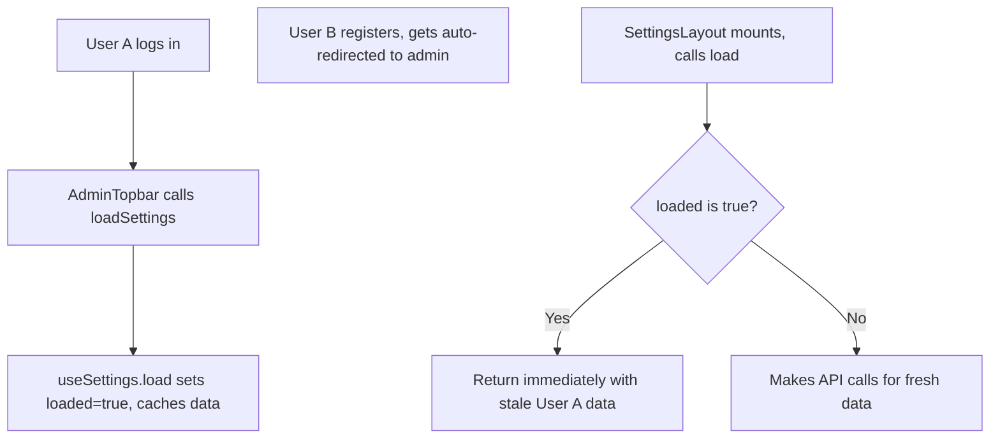
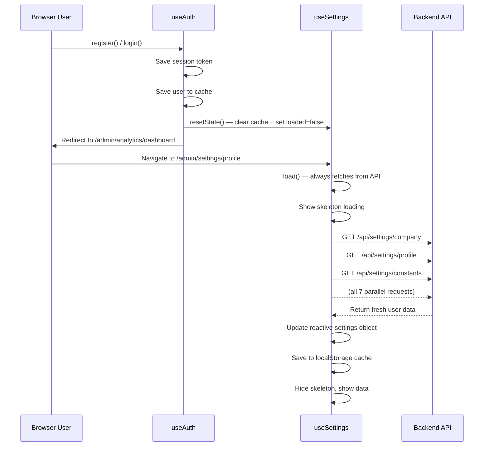

# Plan: Fix Stale Settings Data After Registration/Login

## Problem Summary

When a user registers a new account and immediately navigates to the admin panel, the settings pages (`/admin/settings/profile`, `/admin/settings/company`) and the header show **old data from the previous user's session**. Only a full page refresh displays the correct data.

## Root Causes

### Cause 1: Module-level `loaded` flag in `useSettings.ts`

The `useSettings()` composable maintains module-level singleton state. The `loaded` boolean flag (line 67) persists across component instances and user sessions.



The critical code in [`load()`](frontend_vue/src/composables/useSettings.ts:149):
```ts
if (loaded) {
    return // SKIP — keeps stale data
}
```

Even though the function purges `localStorage` cache at the start, it returns early before making any API calls because `loaded` is still `true`.

### Cause 2: Settings cached in localStorage with 24h TTL

Settings are written to `localStorage` with `CACHE_KEY = 'flexiron_settings_cache_v3'` and a 24-hour TTL. Even if the `loaded` guard is removed, the cache would be used before the API call.

### Cause 3: Header uses `useSettings().settings.profile` instead of `useAuth().user`

In [`AdminTopbar.vue`](frontend_vue/src/components/admin/AdminTopbar.vue:19-24), the user name is derived from `settings.profile` (which is stale) rather than from `useAuth().user` (which gets correctly updated by `register()` / `login()`).

### Cause 4: No skeleton loading or error UI

SettingsLayout shows only text "Loading..." and has no proper skeleton or error state when the backend is unavailable.

## Solution

### Fix 1: Modify `useSettings.ts` — Remove `loaded` guard, add `resetState()`

**Changes to `load()` function:**
- Remove the `loaded` flag entirely
- `load()` should ALWAYS:
  1. Purge all localStorage caches
  2. Set `loading = true`
  3. Make all 7 parallel API calls (`getCompany`, `getConstants`, `getCurrencies`, `getUoms`, `getConversions`, `getOrderStatuses`, `getProfile`)
  4. Update the reactive `settings` object with fresh data
  5. Save new data to localStorage cache (for offline/fast refresh)
  6. Set `loading = false`
- Remove the early-return `if (loaded) return` block

**Add `resetState()` method:**
```ts
function resetState() {
    // Reset settings to defaults
    Object.assign(settings, JSON.parse(JSON.stringify(defaultSettings)))
    // Clear localStorage caches
    const allCacheKeys = [CACHE_KEY, ...LEGACY_CACHE_KEYS]
    for (const key of allCacheKeys) {
        try { localStorage.removeItem(key) } catch { /* ignore */ }
    }
    // Reset state
    loading.value = false
    saving.value = false
    error.value = null
    loaded = false  // if we keep the variable internally
    snapshot = null
    dirtySections.clear()
}
```

**Export `resetState()` alongside other functions.**

### Fix 2: Modify `useAuth.ts` — Reset settings on register/login

In the `register()` function, after successfully setting the session and saving the user:
```ts
// Reset settings cache to force fresh data on next load
const { resetState } = useSettings()
resetState()
// Also clear the settings localStorage cache
```

Same for `login()` — add the same reset call.

This ensures that when the user navigates to admin after register/login, `load()` will make fresh API calls.

### Fix 3: Fix `AdminTopbar.vue` — Use `useAuth().user` for header display

Change the `userName` and `userRole` computed properties to use `useAuth().user` instead of `useSettings().settings.profile`:

```ts
const { user: authUser } = useAuth()

const userName = computed(() => {
    if (!authUser.value) return t('head.user')
    if (authUser.value.first_name && authUser.value.last_name) 
        return `${authUser.value.first_name} ${authUser.value.last_name}`
    if (authUser.value.first_name) return authUser.value.first_name
    return t('head.user')
})

const userRole = computed(() => {
    if (!authUser.value?.role) return t('head.role')
    return t(`settingsUsers.role_${authUser.value.role}`)
})
```

The `settings.profile` is used for editing in the settings page, but the header should always reflect the authenticated user.

### Fix 4: Add GlassPanel skeleton loading to `SettingsLayout.vue`

Replace the plain text "Loading..." with proper skeleton UI:

```html
<template v-if="loading">
    <GlassPanel :loading="true" :skeleton-rows="6" data-test="settings-loading">
        <!-- skeleton rows will render automatically -->
    </GlassPanel>
</template>
```

### Fix 5: Add error state UI to `SettingsLayout.vue`

When `error` is set (and not loading), show an error state:

```html
<div v-else-if="error && !loading" class="settings-error" data-test="settings-error">
    <div class="error-state">
        <SvgIcon name="alert-circle" width="48" height="48" />
        <h3>{{ t('settings.loadError') }}</h3>
        <p>{{ error }}</p>
        <button class="btn btn-primary" @click="load">
            {{ t('common.retry') }}
        </button>
    </div>
</div>
```

Add CSS for `.settings-error` and `.error-state`.

## Data Flow After Fix



## Files to Modify

| File | Changes |
|------|---------|
| [`frontend_vue/src/composables/useSettings.ts`](frontend_vue/src/composables/useSettings.ts) | Remove `loaded` flag early-return; add `resetState()` method; export it |
| [`frontend_vue/src/composables/useAuth.ts`](frontend_vue/src/composables/useAuth.ts) | Call `useSettings().resetState()` after successful `register()` and `login()` |
| [`frontend_vue/src/components/admin/AdminTopbar.vue`](frontend_vue/src/components/admin/AdminTopbar.vue) | Replace `useSettings().settings.profile` with `useAuth().user` for header display |
| [`frontend_vue/src/views/admin/settings/SettingsLayout.vue`](frontend_vue/src/views/admin/settings/SettingsLayout.vue) | Add skeleton loading panels and error state UI |

## Verification Steps

1. Open the app with User A logged in
2. Logout
3. Register a new User B with different name/company info
4. Navigate to `/admin/settings/profile` — should show User B's data immediately (with skeleton loading during fetch)
5. Navigate to `/admin/settings/company` — should show User B's company data
6. Check the header — should display User B's name
7. Test error state: stop the backend server, refresh the page — should show error UI with retry button
8. Test that login also works: login as User A again, verify settings update to User A's data
