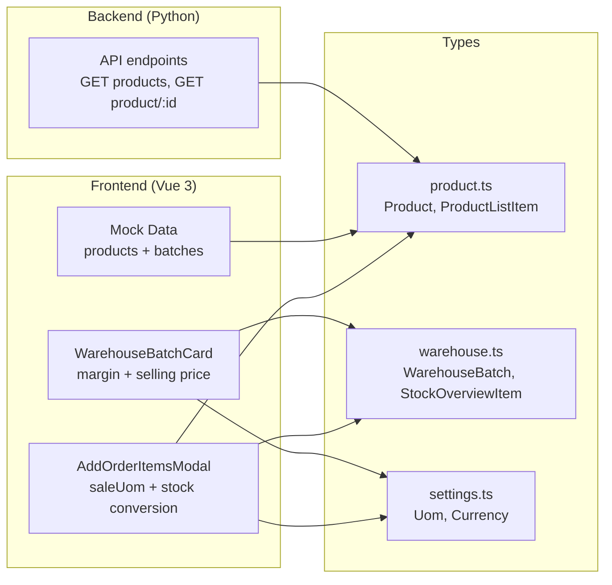
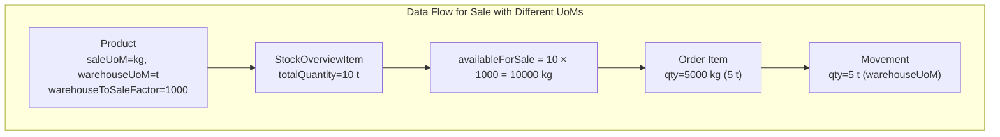

# UoM Restructure Completion Plan

## Overview
Complete the UoM (Unit of Measure) restructure for the Flexiron ERP. Based on the [session-summary-and-next-prompt.md](../session-summary-and-next-prompt.md), this plan covers 5 steps to finish the remaining work.

## Architecture Diagram

## Steps

### Step 1: Mock product with 3 different UoMs

**Files:**
- [`frontend_vue/src/services/mocks/products.ts`](../frontend_vue/src/services/mocks/products.ts)
- [`frontend_vue/src/mocks/warehouse-batches.ts`](../frontend_vue/src/mocks/warehouse-batches.ts)

**Tasks:**
- [ ] Modify product `prod-003` (Steel Pipe 60x4) to have 3 different UoMs:
  - `purchaseUomId: 'uom-kg'`
  - `warehouseUomId: 'uom-t'`
  - `saleUomId: 'uom-kg'`
  - `purchaseToWarehouseFactor: 0.001` (1 kg = 0.001 t)
  - `warehouseToSaleFactor: 1000` (1 t = 1000 kg)
- [ ] Add mock batches for `prod-003` with quantity in tonnes (`unit: 't'`), e.g. batch `whb-075` with qty 10t
- [ ] Update existing batches for `prod-003` to use tonnes if needed

### Step 2: Sale conversion in AddOrderItemsModal

**Files:**
- [`frontend_vue/src/views/admin/orders/AddOrderItemsModal.vue`](../frontend_vue/src/views/admin/orders/AddOrderItemsModal.vue)
- [`frontend_vue/src/composables/useSettings.ts`](../frontend_vue/src/composables/useSettings.ts)

**Tasks:**
- [ ] Load `StockOverviewItem` for each product to get stock quantity in warehouseUoM
- [ ] If `warehouseUomId !== saleUomId` on the product, convert displayed stock quantity:
  - `availableForSale = stockQty × warehouseToSaleFactor`
- [ ] Show converted stock: "Available: 42.6 kg (10 t × 4.26 kg/t)"
- [ ] Quantity input field value remains in saleUoM (user enters in sale units)
- [ ] Price displayed per saleUoM (from `product.price`)
- [ ] When adding items, store both the sale qty and the converted warehouse qty
- [ ] Include `saleUomId`, `warehouseUomId`, `warehouseToSaleFactor` in product load

### Step 3: Movement creation with conversion

**Files:**
- [`frontend_vue/src/views/admin/warehouse/CreateMovementModal.vue`](../frontend_vue/src/views/admin/warehouse/CreateMovementModal.vue)
- [`frontend_vue/src/types/warehouse.ts`](../frontend_vue/src/types/warehouse.ts)

**Tasks:**
- [ ] When creating an expense/sale movement where `warehouseUoM !== saleUoM`:
  - Convert: `warehouseQty = saleQty / warehouseToSaleFactor`
- [ ] Movement is created/stored in warehouseUoM
- [ ] Add reference to order ID in movement reference fields
- [ ] Update `MovementCreatePayload` type if needed for conversion info

### Step 4: Batch card — margin, selling price

**Files:**
- [`frontend_vue/src/views/admin/warehouse/WarehouseBatchCard.vue`](../frontend_vue/src/views/admin/warehouse/WarehouseBatchCard.vue)
- [`frontend_vue/src/types/warehouse.ts`](../frontend_vue/src/types/warehouse.ts)
- [`frontend_vue/src/composables/useWarehouseBatch.ts`](../frontend_vue/src/composables/useWarehouseBatch.ts)
- [`frontend_vue/src/composables/useWarehouseBatchCreate.ts`](../frontend_vue/src/composables/useWarehouseBatchCreate.ts)

**Tasks:**
- [ ] Add `marginPercent` field to `WarehouseBatch` type (editable, default from settings.constants.defaultMargin)
- [ ] Add computed `sellingPrice` = `unitPrice × (1 + marginPercent / 100)` (EUR per warehouseUoM)
- [ ] Add computed `sellingPricePerSaleUoM` = `sellingPrice / warehouseToSaleFactor` (EUR per saleUoM) when warehouseUoM ≠ saleUoM
- [ ] Display in batch card:
  - Purchase price: [editable] EUR / warehouseUoM
  - Margin: [editable] % (default from settings)
  - Selling price (calculated): computed EUR / warehouseUoM
  - Selling price per unit: computed / factor EUR / saleUoM
  - Product card price: product.price (readonly) EUR / saleUoM
  - Total cost: qty × unitPrice (EUR)
- [ ] Add save logic for `marginPercent` to batch update

### Step 5: API verification

**Files:**
- Backend API endpoints (read-only verification)

**Tasks:**
- [ ] Verify `GET /api/products` returns `sale_uom_id`, `warehouse_uom_id`, `purchase_uom_id`
- [ ] Verify `GET /api/products/:id` returns `price_unit` (reconstructed) + new UoM fields
- [ ] Verify mock-level API responses match expected types from the frontend
- [ ] Run frontend build/type-check to ensure no type errors

## Key Relationships

## Files Not Modified (read-only reference)

- [`frontend_vue/src/types/product.ts`](../frontend_vue/src/types/product.ts) — verify types are sufficient
- [`frontend_vue/src/types/settings.ts`](../frontend_vue/src/types/settings.ts) — verify settings types
