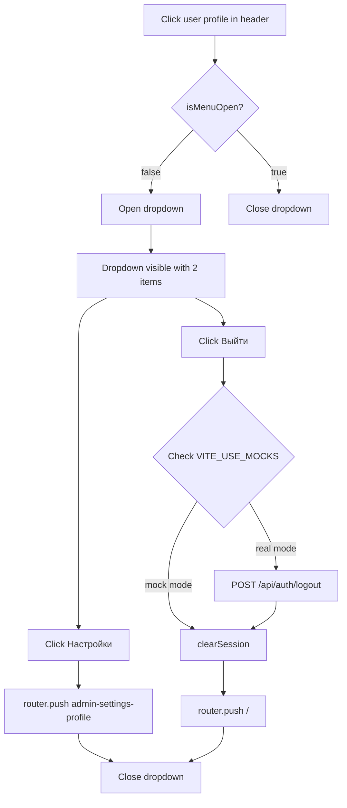

# User Dropdown Menu in Admin Header

## Objective

Replace the current `<router-link>` user profile button in the admin topbar with a clickable dropdown menu containing two items:

1. **Settings** (Настройки) — link to `/admin/settings/profile`
2. **Logout** (Выйти) — logout action that redirects to `/`

## Behavior by Mode

| Mode | Logout Behavior |
|------|----------------|
| **Mock** (`VITE_USE_MOCKS` ≠ `'false'`) | Clear session + redirect to `/` |
| **Real** (`VITE_USE_MOCKS` = `'false'`) | Call `POST /api/auth/logout` API + clear session + redirect to `/` |

---

## Changes Required

### 1. [`frontend_vue/src/components/admin/AdminTopbar.vue`](frontend_vue/src/components/admin/AdminTopbar.vue)

**What:** Replace the `<router-link class="user-profile">` with a `<div class="user-profile" @click="toggleMenu">` that manages open/close state and renders a dropdown menu.

**Details:**
- Add `import { useAuth } from '@/composables/useAuth'`
- Add `import { ref } from 'vue'`
- Add `import { useRouter } from 'vue-router'`
- Create `isMenuOpen` ref and `toggleMenu()` / `closeMenu()` functions
- Create `handleLogout()` async function:
  - Read `import.meta.env.VITE_USE_MOCKS` to determine mode
  - If mock mode: call `auth.clearSession()`, then `router.push('/')`
  - If real mode: call `auth.logout()` (which already does `clearSession()`), then `router.push('/')`
  - **Note:** The existing `auth.logout()` currently redirects to `/login` — this needs to be changed
- Render dropdown with:
  - "Настройки" → `<router-link :to="{ name: 'admin-settings-profile' }">` — closes menu on click
  - "Выйти" → `<button @click="handleLogout">` — calls logout
- Use `v-if="isMenuOpen"` with `@click.stop` propagation
- Add `@click.outside` or handle click outside to close menu

### 2. [`frontend_vue/src/composables/useAuth.ts`](frontend_vue/src/composables/useAuth.ts)

**What:** Modify the `logout()` function to accept a redirect path parameter or modify behavior.

**Current behavior (line 214-217):**
```ts
async function logout(): Promise<void> {
  clearSession()
  await router.push('/login')
}
```

**New behavior:**
```ts
async function logout(redirectTo = '/'): Promise<void> {
  const USE_MOCKS = import.meta.env.VITE_USE_MOCKS !== 'false'
  
  if (!USE_MOCKS) {
    // Real mode: call logout API
    try {
      await apiPost('/api/auth/logout', {}, { headers: authHeaders() })
    } catch {
      // Silently ignore — session will be cleared locally anyway
    }
  }
  
  clearSession()
  await router.push(redirectTo)
}
```

**Note:** The mock logout API path `/api/auth/logout` needs to be added to the mock handlers in `postMock()` to avoid a thrown error in mock mode. But since we skip the API call in mock mode, this isn't strictly necessary.

### 3. [`frontend_vue/src/i18n/admin/layout.ts`](frontend_vue/src/i18n/admin/layout.ts)

**What:** Add translations for the two dropdown menu items under the `head` section.

**Add to each locale's `head` object:**
```ts
head: {
  // ... existing keys
  settings: 'Настройки',     // ru
  logout: 'Выйти',            // ru
}
```

| Locale | settings | logout |
|--------|----------|--------|
| ru | Настройки | Выйти |
| en | Settings | Logout |
| lt | Nustatymai | Atsijungti |

### 4. [`frontend_vue/src/styles/erp-base.css`](frontend_vue/src/styles/erp-base.css)

**What:** Add CSS for the dropdown menu positioned below the user profile area.

**Add after the `.user-role` rules (~line 425):**

```css
/* User profile dropdown */
.user-profile {
  position: relative;
}

.user-dropdown {
  position: absolute;
  top: calc(100% + 8px);
  right: 0;
  min-width: 190px;
  background: var(--glass-medium, rgba(30, 41, 59, 0.95));
  backdrop-filter: blur(16px);
  -webkit-backdrop-filter: blur(16px);
  border: 1px solid rgba(255, 255, 255, 0.1);
  border-radius: 10px;
  padding: 6px;
  box-shadow: 0 8px 32px rgba(0, 0, 0, 0.4);
  z-index: 100;
}

.user-dropdown-item {
  display: flex;
  align-items: center;
  gap: 10px;
  padding: 10px 14px;
  border-radius: 8px;
  color: rgba(255, 255, 255, 0.88);
  text-decoration: none;
  font-size: 0.88rem;
  font-weight: 500;
  cursor: pointer;
  background: none;
  border: none;
  width: 100%;
  text-align: left;
  transition: background 0.15s ease;
}

.user-dropdown-item:hover {
  background: rgba(255, 255, 255, 0.08);
  color: #fff;
}

.user-dropdown-divider {
  height: 1px;
  background: rgba(255, 255, 255, 0.08);
  margin: 4px 8px;
}
```

### 5. Mock logout handling (optional)

**What:** Add logout mock handler in [`frontend_vue/src/services/mocks/index.ts`](frontend_vue/src/services/mocks/index.ts) within `postMock()`.

```ts
if (path === '/api/auth/logout') {
  clearStoredMockUser()
  return delay(undefined as T)
}
```

**Necessity:** Since we skip the API call in mock mode, this is optional but nice to have for completeness.

---

## Flow Diagram



---

## Execution Order

1. Add i18n translations for dropdown items
2. Add CSS styles for dropdown
3. Modify `useAuth.ts` to accept redirect path and call logout API in real mode
4. Modify `AdminTopbar.vue` to add dropdown with click handling
5. (Optional) Add logout mock handler
