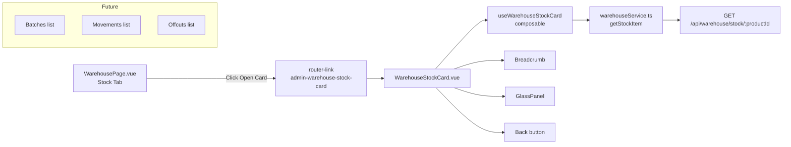

# Plan: Stock Remainder Card (Карточка остатка)

## Overview

When the user clicks the "Open Card" button (external-link icon) on a row in the **Stock** tab at `/admin/warehouse/stock`, the app should navigate to a **Stock Remainder Card** page showing detailed information about that product's stock balance.

Currently, the "Open Card" button in the stock tab links to the **Product Card** (`admin-product-card`). The goal is to change this to link to a **Stock Remainder Card** instead.

## Current State

### Stock tab row actions (lines 1540-1558 of `WarehousePage.vue`)

The stock table has two action buttons per row:
1. **View details** (external-link icon) — currently links to `admin-product-card` (product card)
2. **Delete** (trash icon) — deletes the stock item

### Existing routes in `router/index.ts`

| Route | Name | Component |
|-------|------|-----------|
| `/admin/warehouse/:tab(stock\|batches\|offcuts\|movements\|deficit)?` | `admin-warehouse` | `WarehousePage.vue` |
| `/admin/warehouse/batches/:id` | `admin-warehouse-batch` | `WarehouseBatchCard.vue` |

### Existing card components

- `WarehouseBatchCard.vue` — full-featured batch card with view/edit modes, movements, offcuts, files, audit sections
- No `WarehouseStockCard.vue` exists yet

### Data model — `StockOverviewItem`

```ts
interface StockOverviewItem {
  productId: string
  productName: TranslatedString
  totalQuantity: number
  reservedQuantity: number
  availableQuantity: number
  unit: StockUnit
  batchCount: number
  avgUnitPrice: number
  totalValue: number
  minStock: number | null
  isDeficit: boolean
  categoryId?: string | null
  categoryName?: TranslatedString | null
}
```

### API endpoints available

- `GET /api/warehouse/stock` — paginated stock overview list (already used)
- `GET /api/warehouse/stock/:productId` — **needs to be created** for single stock item details
- `DELETE /api/warehouse/stock/:productId` — already exists

## What needs to be done

### Step 1: Create API endpoint `GET /api/warehouse/stock/:productId`

Add a new function in `warehouseService.ts`:

```ts
export async function getStockItem(productId: string): Promise<StockOverviewItem> {
  return apiGet<StockOverviewItem>(`/api/warehouse/stock/${productId}`)
}
```

Also add the corresponding mock handler in `services/mocks/warehouse.ts` to return mock data for `GET /api/warehouse/stock/:productId`.

### Step 2: Create `useWarehouseStockCard` composable

Create `frontend_vue/src/composables/useWarehouseStockCard.ts` that:

- Accepts `productId: string`
- Fetches stock item details via `getStockItem(productId)`
- Returns reactive state: `item`, `loading`, `error`
- Provides `load()` and `tf()` (translated field) helpers

### Step 3: Create `WarehouseStockCard.vue` component (stub)

Create `frontend_vue/src/views/admin/warehouse/WarehouseStockCard.vue` as a **stub** page with:

- Breadcrumb: Warehouse → Product Name
- GlassPanel with skeleton loading
- Error state with retry
- Basic read-only display of stock info:
  - Product name (title)
  - Total quantity, reserved, available
  - Unit
  - Batch count
  - Average unit price
  - Total value
  - Min stock threshold
  - Deficit badge (if applicable)
- Back button
- Placeholder sections for future expansion:
  - "Batches from this product" (list of batches)
  - "Movements" (list of movements)
  - "Offcuts" (list of offcuts)

### Step 4: Add route for stock card

Add to `router/index.ts`:

```ts
{
  path: 'warehouse/stock/:productId',
  name: 'admin-warehouse-stock-card',
  component: () => import('@/views/admin/warehouse/WarehouseStockCard.vue'),
  meta: { layout: 'admin', featureFlag: 'adminWarehouse' as FeatureFlagKey },
},
```

### Step 5: Update stock tab "Open Card" button

In `WarehousePage.vue`, change the stock row's view-details link from:

```html
<router-link
  :to="{ name: 'admin-product-card', params: { id: item.productId } }"
  ...
>
```

to:

```html
<router-link
  :to="{ name: 'admin-warehouse-stock-card', params: { productId: item.productId } }"
  ...
>
```

### Step 6: Add i18n keys

Add to `i18n/admin/warehouse.ts` (for ru/en/lt):

```ts
// Stock card
stock_card_title: 'Stock Card / Карточка остатка / Likučio kortelė'
stock_card_section_details: 'Stock Details / Детали остатка / Likučio detalės'
stock_card_section_batches: 'Batches from this product / Партии этого товара / Šio produkto partijos'
stock_card_section_movements: 'Movements / Движения / Judėjimai'
stock_card_section_offcuts: 'Offcuts / Обрезки / Atraižos'
stock_card_btn_back: 'Back to stock / Назад к остаткам / Atgal į likučius'
```

### Step 7: Add CSS styles

Add minimal styles to `warehouse_list.css` for the stock card page (following the same pattern as `.batch-card-*` classes).

## Architecture Diagram



## Route Structure

```mermaid
flowchart TD
    A[/admin] --> B[warehouse]
    B --> C[:tab stock|batches|offcuts|movements|deficit]
    B --> D[batches/:id]
    B --> E[stock/:productId  NEW]
    
    C --> F[WarehousePage.vue]
    D --> G[WarehouseBatchCard.vue]
    E --> H[WarehouseStockCard.vue  NEW]
```

## Files to create

1. `frontend_vue/src/composables/useWarehouseStockCard.ts`
2. `frontend_vue/src/views/admin/warehouse/WarehouseStockCard.vue`

## Files to modify

1. `frontend_vue/src/services/warehouseService.ts` — add `getStockItem()`
2. `frontend_vue/src/services/mocks/warehouse.ts` — add mock handler for `GET /api/warehouse/stock/:productId`
3. `frontend_vue/src/router/index.ts` — add route `admin-warehouse-stock-card`
4. `frontend_vue/src/views/admin/warehouse/WarehousePage.vue` — change stock row view link
5. `frontend_vue/src/i18n/admin/warehouse.ts` — add i18n keys (ru/en/lt)
6. `frontend_vue/src/styles/admin/warehouse_list.css` — add stock card CSS classes

## Acceptance Criteria

- [ ] Clicking the "Open Card" (external-link) button on a stock row navigates to `/admin/warehouse/stock/:productId`
- [ ] The stock card page shows product name, quantities, unit, price, value, min stock, deficit status
- [ ] Breadcrumb shows Warehouse → Product Name
- [ ] Error state with retry button works
- [ ] Loading skeleton shows while fetching
- [ ] Back button returns to stock tab
- [ ] Route is protected by `adminWarehouse` feature flag
- [ ] All i18n keys added for ru/en/lt
- [ ] Mock data works for development
