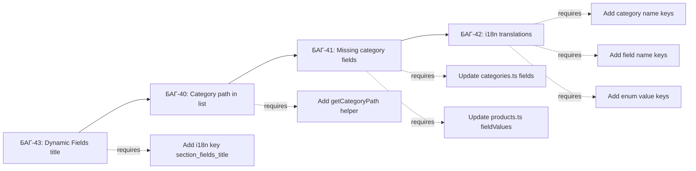

# План: Исправление 4 оставшихся багов страницы Товаров

## Обзор

Исправление 4 багов (БАГ-40, БАГ-41, БАГ-42, БАГ-43) в файлах:
- [`ProductsPage.vue`](frontend_vue/src/views/admin/products/ProductsPage.vue)
- [`ProductCardPage.vue`](frontend_vue/src/views/admin/products/ProductCardPage.vue)
- [`mocks/categories.ts`](frontend_vue/src/services/mocks/categories.ts)
- [`mocks/products.ts`](frontend_vue/src/services/mocks/products.ts)
- [`i18n/admin.ts`](frontend_vue/src/i18n/admin.ts)

---

## БАГ-40 — Категории отображаются коротким именем вместо полного иерархического пути

### Проблема

В [`ProductsPage.vue`](frontend_vue/src/views/admin/products/ProductsPage.vue:45) `categoryFilterOptions` использует `c.name` напрямую:

```ts
const categoryFilterOptions = computed(() =>
  catItems.value.map((c) => ({ value: c.id, label: c.name })),
)
```

В MultiSelect фильтра категорий отображается только короткое имя (например, "Sheets"), а нужно полный путь (например, "Metal → Sheets").

### Решение

Создать функцию `getCategoryPath` в `ProductsPage.vue` (аналогичную той, что уже есть в [`useProductCard.ts`](frontend_vue/src/composables/useProductCard.ts:66)), которая строит путь из плоского списка `catItems`, используя `parentId` и `parentName`.

**Шаги:**

1. В [`ProductsPage.vue`](frontend_vue/src/views/admin/products/ProductsPage.vue) добавить функцию `getCategoryPath(cat: CategoryListItem): string`:
   - Принимает объект категории (имеет `parentId`, `parentName`, `name`)
   - Строит путь: если `parentName` есть, то `parentName → name`, иначе просто `name`
   - Для глубокой вложенности (3+ уровня) нужно рекурсивно подниматься по `catItems`, пока не дойдём до корня

2. Обновить `categoryFilterOptions`:
   ```ts
   const categoryFilterOptions = computed(() =>
     catItems.value.map((c) => ({ value: c.id, label: getCategoryPath(c) })),
   )
   ```

3. Также обновить `categoryOptions` (для селекта в модале создания), чтобы там тоже отображался полный путь.

**Файлы для изменения:**
- [`frontend_vue/src/views/admin/products/ProductsPage.vue`](frontend_vue/src/views/admin/products/ProductsPage.vue) — добавить `getCategoryPath`, обновить `categoryFilterOptions` и `categoryOptions`

---

## БАГ-41 — Mock categories: недостающие поля в категориях металлопроката

### Проблема

Категории cat-7 (Beams), cat-8 (Channels), cat-9 (Angles), cat-10 (Rebars), cat-11 (Profiles), cat-12 (Wire), cat-13 (Fittings) имеют минимальный набор полей. Не хватает отраслевых полей:

| Категория | Текущие поля | Нужно добавить |
|-----------|-------------|----------------|
| **cat-7 Beams** | Profile type, Height, Flange width, Length | **Weight per meter (kg/m)**, Flange thickness, Web thickness |
| **cat-8 Channels** | Height, Flange width, Wall thickness, Length | **Weight per meter (kg/m)**, Flange thickness |
| **cat-9 Angles** | Side width, Thickness, Length, Type | **Weight per meter (kg/m)**, Second side width (for Unequal) |
| **cat-10 Rebars** | Diameter, Length, Class | **Weight per meter (kg/m)**, Tensile strength (MPa), Yield strength (MPa) |
| **cat-11 Profiles** | Profile type, Height, Width, Wall thickness, Length | **Weight per meter (kg/m)** |
| **cat-12 Wire** | Diameter, Coating, Spool weight | **Tensile strength (MPa)**, Weight per meter (kg/m) |
| **cat-13 Fittings** | Type, Size DN, Pressure rating | **Connection type** (enum: Threaded, Welded, Flanged), Weight (kg) |

### Решение

1. В [`mocks/categories.ts`](frontend_vue/src/services/mocks/categories.ts) добавить новые поля в `fields` массив каждой категории.
2. Обновить `fieldCount` для каждой изменённой категории.
3. В [`mocks/products.ts`](frontend_vue/src/services/mocks/products.ts) добавить соответствующие `fieldValues` для товаров этих категорий (с реалистичными значениями).

**Важно:** Придерживаться существующей схемы ID: `f-{catNum}-{seq}`. Например, для Beams новое поле Weight per meter будет `f-7-5`.

**Файлы для изменения:**
- [`frontend_vue/src/services/mocks/categories.ts`](frontend_vue/src/services/mocks/categories.ts) — добавить поля, обновить `fieldCount`
- [`frontend_vue/src/services/mocks/products.ts`](frontend_vue/src/services/mocks/products.ts) — добавить `fieldValues` для товаров затронутых категорий

---

## БАГ-42 — i18n: отсутствуют переводы для полей, значений и mock-данных

### Проблема

В [`i18n/admin.ts`](frontend_vue/src/i18n/admin.ts) в секции `products` нет переводов для:
- Названий категорий (Metal, Sheets, Beams, Channels, etc.) — используются в `getCategoryPath()`
- Названий полей (Steel grade, Thickness, Diameter, etc.) — отображаются в Dynamic Fields
- Значений enum (Hot-rolled, Cold-rolled, IPE, HEA, A240, A400, etc.) — отображаются в CustomSelect

Все эти строки сейчас только на английском в mock-данных.

### Решение

Добавить новые ключи в секцию `products` для каждого языка (RU, EN, LT). Согласно баг-репорту, делать батчами по ~10 переводов максимум.

**Предлагаемые ключи (батч 1 — категории):**
```ts
category_Metal: 'Metal' | 'Металл' | 'Metalas'
category_Sheets: 'Sheets' | 'Листы' | 'Lakštai'
category_Aluminium_sheets: 'Aluminium sheets' | 'Алюминиевые листы' | 'Aliuminio lakštai'
category_Pipes: 'Pipes' | 'Трубы' | 'Vamzdžiai'
category_Consumables: 'Consumables' | 'Расходники' | 'Eksploatacinės'
category_Equipment: 'Equipment' | 'Оборудование' | 'Įranga'
category_Beams: 'Beams' | 'Балки' | 'Sijos'
category_Channels: 'Channels' | 'Швеллеры' | 'Šveleriai'
category_Angles: 'Angles' | 'Уголки' | 'Kampuočiai'
category_Rebars: 'Rebars' | 'Арматура' | 'Armatūra'
```

**Батч 2 — поля:**
```ts
field_Steel_grade: 'Steel grade' | 'Марка стали' | 'Plieno markė'
field_Standard_GOST: 'Standard / GOST' | 'Стандарт / ГОСТ' | 'Standartas / GOST'
field_Density: 'Density (kg/m³)' | 'Плотность (кг/м³)' | 'Tankis (kg/m³)'
field_Thickness: 'Thickness (mm)' | 'Толщина (мм)' | 'Storis (mm)'
field_Width: 'Width (mm)' | 'Ширина (мм)' | 'Plotis (mm)'
field_Length: 'Length (mm)' | 'Длина (мм)' | 'Ilgis (mm)'
field_Diameter: 'Diameter (mm)' | 'Диаметр (мм)' | 'Skersmuo (mm)'
field_Height: 'Height (mm)' | 'Высота (мм)' | 'Aukštis (mm)'
field_Weight_per_meter: 'Weight per meter (kg/m)' | 'Вес погонного метра (кг/м)' | 'Svoris vienam metrui (kg/m)'
field_Tensile_strength: 'Tensile strength (MPa)' | 'Предел прочности (МПа)' | 'Tempimo stipris (MPa)'
```

**Батч 3 — enum значения:**
```ts
enum_Hot_rolled: 'Hot-rolled' | 'Горячекатаный' | 'Karštai valcuotas'
enum_Cold_rolled: 'Cold-rolled' | 'Холоднокатаный' | 'Šaltai valcuotas'
enum_Galvanized: 'Galvanized' | 'Оцинкованный' | 'Cinkuotas'
enum_IPE: 'IPE' | 'IPE' | 'IPE'
enum_HEA: 'HEA' | 'HEA' | 'HEA'
enum_HEB: 'HEB' | 'HEB' | 'HEB'
enum_Equal: 'Equal' | 'Равнополочный' | 'Lygiakraštis'
enum_Unequal: 'Unequal' | 'Неравнополочный' | 'Nelygiakraštis'
enum_A240: 'A240' | 'A240' | 'A240'
enum_A400: 'A400' | 'A400' | 'A400'
```

**Важно:** После добавления ключей, нужно обновить рендеринг Dynamic Fields в [`ProductCardPage.vue`](frontend_vue/src/views/admin/products/ProductCardPage.vue) и [`ProductsPage.vue`](frontend_vue/src/views/admin/products/ProductsPage.vue), чтобы они использовали `t()` для отображения названий полей и enum-значений. Однако это может быть слишком объёмным изменением — в баг-репорте указано, что переводы добавляются, но использование в шаблонах может быть отложено.

**Файлы для изменения:**
- [`frontend_vue/src/i18n/admin.ts`](frontend_vue/src/i18n/admin.ts) — добавить ключи в RU/EN/LT секции `products`

---

## БАГ-43 — Секция "Динамические поля" — статичное название вместо "Поля категории (путь)"

### Проблема

В [`ProductCardPage.vue`](frontend_vue/src/views/admin/products/ProductCardPage.vue:199) заголовок GlassPanel для Dynamic Fields статичен:

```vue
<GlassPanel
  :title="t('products.section_fields')"
  ...>
```

Отображается "Dynamic fields", а нужно "Category Fields (Metal → Sheets)" с использованием `getCategoryPath()`.

### Решение

Функция `getCategoryPath` уже доступна в [`useProductCard.ts`](frontend_vue/src/composables/useProductCard.ts:66) и возвращается из композабла (строка 32 в ProductCardPage.vue: `getCategoryPath` деструктурирована).

Нужно:
1. Заменить статический `:title="t('products.section_fields')"` на динамический:
   ```vue
   :title="product ? t('products.section_fields_title', { path: getCategoryPath(product.categoryId) }) : t('products.section_fields')"
   ```
2. Добавить новый i18n ключ `section_fields_title` во все 3 языка:
   - RU: `'Поля категории ({path})'`
   - EN: `'Category Fields ({path})'`
   - LT: `'Kategorijos laukai ({path})'`

**Файлы для изменения:**
- [`frontend_vue/src/views/admin/products/ProductCardPage.vue`](frontend_vue/src/views/admin/products/ProductCardPage.vue:199) — заменить `:title`
- [`frontend_vue/src/i18n/admin.ts`](frontend_vue/src/i18n/admin.ts) — добавить ключ `section_fields_title` в RU/EN/LT

---

## Порядок выполнения



**Рекомендуемый порядок выполнения (каждый шаг — отдельный промпт):**

### Шаг 1: БАГ-43 — Dynamic Fields section title
- **Файлы:** [`ProductCardPage.vue`](frontend_vue/src/views/admin/products/ProductCardPage.vue), [`i18n/admin.ts`](frontend_vue/src/i18n/admin.ts)
- **Изменения:**
  1. В `i18n/admin.ts` добавить `section_fields_title` в RU/EN/LT
  2. В `ProductCardPage.vue` заменить `:title="t('products.section_fields')"` на `:title="product ? t('products.section_fields_title', { path: getCategoryPath(product.categoryId) }) : t('products.section_fields')"`

### Шаг 2: БАГ-40 — Category path in ProductsPage list
- **Файл:** [`ProductsPage.vue`](frontend_vue/src/views/admin/products/ProductsPage.vue)
- **Изменения:**
  1. Добавить функцию `getCategoryPath(cat: CategoryListItem): string` в script setup
  2. Обновить `categoryFilterOptions` и `categoryOptions` для использования `getCategoryPath`

### Шаг 3: БАГ-41 — Missing fields in metal product categories
- **Файлы:** [`mocks/categories.ts`](frontend_vue/src/services/mocks/categories.ts), [`mocks/products.ts`](frontend_vue/src/services/mocks/products.ts)
- **Изменения:**
  1. В `categories.ts` добавить поля для cat-7..cat-13 (weight per meter, flange thickness, tensile strength, connection type и т.д.)
  2. Обновить `fieldCount`
  3. В `products.ts` добавить `fieldValues` для товаров этих категорий

### Шаг 4: БАГ-42 — i18n translations (3 батча)
- **Файл:** [`i18n/admin.ts`](frontend_vue/src/i18n/admin.ts)
- **Изменения:**
  1. Батч 1: названия категорий (10 ключей × 3 языка)
  2. Батч 2: названия полей (10 ключей × 3 языка)
  3. Батч 3: enum значения (10 ключей × 3 языка)

---

## Верификация

После каждого шага проверить:
1. TypeScript компиляция без ошибок: `npx vue-tsc --noEmit`
2. Линтер: `npx eslint . --fix`
3. Визуальная проверка в браузере:
   - БАГ-40: MultiSelect показывает "Metal → Sheets" вместо "Sheets"
   - БАГ-43: GlassPanel title показывает "Category Fields (Metal → Sheets)"
   - БАГ-41: В карточке товара для Beams видны новые поля (Weight per meter и т.д.)
   - БАГ-42: Переводы применяются при смене языка
