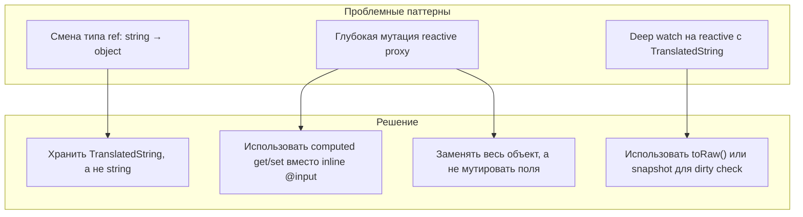
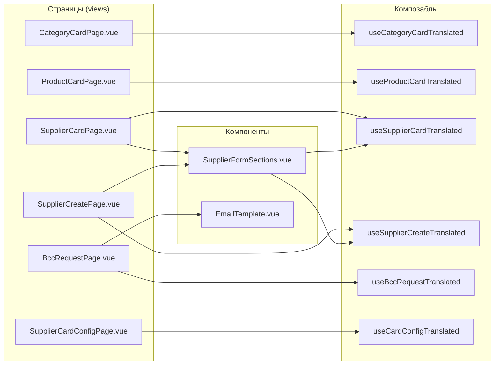

# Исправление `structuredClone` ошибки при редактировании переведённых полей

## Корневая причина

Vue 3 использует `structuredClone` внутри своего механизма реактивности (`reactive`, `ref`, `watch` с `deep: true`) в следующих случаях:

1. **Когда ref меняет тип значения** — если ref изначально содержит `string`, а потом в него присваивается `object`, Vue пытается клонировать старый Proxy, что вызывает `structuredClone` ошибку.
2. **Когда глубокие свойства `reactive` объекта мутируются напрямую** — при `watch` с `deep: true` Vue делает снепшот через `structuredClone`.
3. **Когда `reactive` объекту присваивается новое значение свойства, меняющее структуру** — Vue пересоздаёт Proxy.

## Полный аудит (все страницы и компоненты проверены)

### Безопасные (проблем нет)
| Файл | Причина |
|------|---------|
| `CategoriesPage.vue` | Только список, create modal с plain string полями |
| `ProductsPage.vue` | Только список, create modal с plain string полями |
| `SuppliersListPage.vue` | Только список, `tf()` только для отображения |
| `useCategoriesTranslated` | Только загрузка/удаление, нет мутаций TranslatedString |
| `useProductsTranslated` | Только загрузка/удаление, нет мутаций TranslatedString |
| `useSuppliersTranslated` | Только загрузка/фильтрация, нет мутаций TranslatedString |

### Проблемные места (8 шт.)

| # | Файл | Строки | Проблема | Тип |
|---|------|--------|----------|-----|
| 1 | `CategoryCardPage.vue` | 66-85 | `formName`/`formDescription` computed setters: `'' as unknown as TranslatedString` → `{ ru, en, lt }` | Смена типа ref |
| 2 | `ProductCardPage.vue` | 140, 303 | `form.name` хранит plain string (через `tf()`), сервер ждёт `TranslatedString` | Неверный тип данных |
| 3 | `SupplierFormSections.vue` | 129-130, 148-149, 183-184 | inline `@input` handlers мутируют `supplier.company.ru/en/lt` напрямую | Глубокая мутация reactive |
| 4 | `BccRequestPage.vue` | 880-881 | `@update:subject`/`@update:body` создают новый `{ ru, en, lt }` объект на каждый keystroke в `reactive` template | Смена структуры reactive |
| 5 | `SupplierCardConfigPage.vue` | 965 | inline `@input` мутирует `editSectionName.ru/en/lt` напрямую | Глубокая мутация reactive |
| 6 | `useSupplierCardTranslated` | 58 | `watch(supplier, ..., { deep: true })` триггерит structuredClone при глубоких мутациях | Deep watch |
| 7 | `useCategoryCardTranslated` | 183 | `form` инициализируется с `name: '' as unknown as TranslatedString` | Небезопасный тип |
| 8 | `useProductCardTranslated` | 303 | `form.value.name = tf(data.name)` — сохраняет строку вместо TranslatedString | Неверный тип данных |

## Архитектура решения



## Детальный план по сабтаскам

### Subtask 1: `CategoryCardPage.vue` — computed setters

**Файл:** `frontend_vue/src/views/admin/products/CategoryCardPage.vue`
**Строки:** 66-85

**Проблема:** `formName` computed setter:
```typescript
set: (v: string) => {
  form.value.name = v ? { ru: v, en: v, lt: v } : ('' as unknown as TranslatedString)
}
```
Когда `v` пустая строка — присваивается `string`, когда не пустая — `object`. Vue видит смену типа и вызывает `structuredClone`.

**Решение:** Всегда хранить `TranslatedString | null`:
```typescript
set: (v: string) => {
  form.value.name = v ? { ru: v, en: v, lt: v } : null
}
```
Аналогично для `formDescription`.

### Subtask 2: `ProductCardPage.vue` — form.name

**Файл:** `frontend_vue/src/views/admin/products/ProductCardPage.vue`
**Строки:** 140, 303

**Проблема:** `form.name` получает значение через `tf(data.name)` — это строка. Но при сохранении сервер ожидает `TranslatedString`.

**Решение:** В `useProductCardTranslated` хранить `form.name` как `TranslatedString`, а для отображения использовать `tf(form.name)` в шаблоне. В `v-model` использовать computed с get/set.

### Subtask 3: `SupplierFormSections.vue` — inline @input handlers

**Файл:** `frontend_vue/src/components/admin/SupplierFormSections.vue`
**Строки:** 129-130, 148-149, 183-184

**Проблема:** Прямая мутация глубоких свойств `reactive` proxy:
```html
@input="supplier.company.ru = ...; supplier.company.en = ...; supplier.company.lt = ..."
```

**Решение:** Создать локальный computed с get/set для каждого TranslatedString поля:
```typescript
const companyModel = computed({
  get: () => tf(props.modelValue.company),
  set: (v: string) => {
    const newVal: TranslatedString = { ru: v, en: v, lt: v }
    emit('update:modelValue', { ...props.modelValue, company: newVal })
  }
})
```
И использовать `v-model="companyModel"` вместо `:value`/`@input`.

**Важно:** Нужно эмитить новое значение целиком, чтобы родительский `v-model` обновил ref правильно, без глубокой мутации.

### Subtask 4: `BccRequestPage.vue` — @update:subject/@update:body

**Файл:** `frontend_vue/src/views/admin/suppliers/BccRequestPage.vue`
**Строки:** 880-881

**Проблема:** `template` это `reactive`, и при каждом keystroke создаётся новый объект:
```html
@update:subject="template.subject = { ru: $event, en: $event, lt: $event }"
```

**Решение:** Создать computed модели в `<script setup>`:
```typescript
const subjectModel = computed({
  get: () => tf(template.subject),
  set: (v: string) => { template.subject = { ru: v, en: v, lt: v } }
})
const bodyModel = computed({
  get: () => tf(template.body),
  set: (v: string) => { template.body = { ru: v, en: v, lt: v } }
})
```
И передавать их в `EmailTemplate` как `v-model:subject="subjectModel"` и `v-model:body="bodyModel"`.

### Subtask 5: `SupplierCardConfigPage.vue` — editSectionName

**Файл:** `frontend_vue/src/views/admin/suppliers/SupplierCardConfigPage.vue`
**Строка:** 965

**Проблема:** Та же, что в SupplierFormSections — прямая мутация глубоких свойств:
```html
@input="editSectionName.ru = ...; editSectionName.en = ...; editSectionName.lt = ..."
```

**Решение:** Создать computed модель:
```typescript
const editSectionNameModel = computed({
  get: () => tf(editSectionName.value),
  set: (v: string) => {
    editSectionName.value = { ru: v, en: v, lt: v }
  }
})
```
И использовать `v-model="editSectionNameModel"`.

### Subtask 6: `useSupplierCardTranslated` — dirty check

**Файл:** `frontend_vue/src/composables/useSupplierCard.ts`
**Строка:** 58

**Проблема:** `watch(supplier, ..., { deep: true })` — при глубоких мутациях Vue пытается клонировать supplier через structuredClone.

**Решение:** Использовать `toRaw()` для снепшота или заменить `watch` на ручное сравнение через `JSON.stringify(toRaw(supplier.value))`. Либо использовать `watch` без `deep: true` и вручную вызывать capture после изменений.

### Subtask 7: `useCategoryCardTranslated` — инициализация form

**Файл:** `frontend_vue/src/composables/useCategoryCard.ts`
**Строка:** 183

**Проблема:** `name: '' as unknown as TranslatedString` — TypeScript cast, но в рантайме это string.

**Решение:** Использовать `null` вместо `'' as unknown as TranslatedString`:
```typescript
const form = ref<{ name: TranslatedString | null; description: TranslatedString | null; ... }>({
  name: null,
  description: null,
  ...
})
```

### Subtask 8: `useProductCardTranslated` — form.name

**Файл:** `frontend_vue/src/composables/useProductCard.ts`
**Строка:** 303

**Проблема:** `form.value.name = tf(data.name)` — сохраняет строку.

**Решение:** Сохранять `TranslatedString`:
```typescript
form.value.name = data.name  // data.name уже TranslatedString
```
А для отображения использовать `tf(form.value.name)` в шаблоне.

### Subtask 9: Проверка типов и сборка

После всех изменений запустить `npm run type-check` и `npm run build` (или `vue-tsc --noEmit`) чтобы убедиться, что типы корректны.

## Взаимосвязь компонентов



## Порядок выполнения

1. **Subtask 7** → `useCategoryCardTranslated` — изменить тип `form.name` на `TranslatedString | null`
2. **Subtask 1** → `CategoryCardPage.vue` — исправить computed setters
3. **Subtask 8** → `useProductCardTranslated` — исправить `form.value.name`
4. **Subtask 2** → `ProductCardPage.vue` — исправить v-model для form.name
5. **Subtask 3** → `SupplierFormSections.vue` — заменить inline @input на computed модели
6. **Subtask 6** → `useSupplierCardTranslated` — исправить dirty check
7. **Subtask 4** → `BccRequestPage.vue` — исправить @update:subject/@update:body
8. **Subtask 5** → `SupplierCardConfigPage.vue` — исправить editSectionName
9. **Subtask 9** → Проверка типов и сборка
