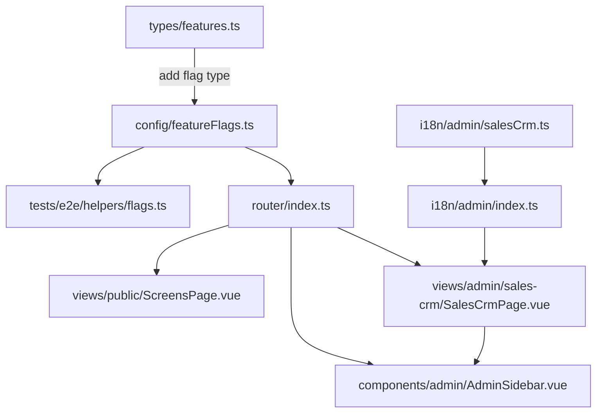

# Plan: Sales & CRM Section — Initial Version

## 1. Current State Analysis

### What Already Exists (Clients Section — Fully Built)
| Component | File | Status |
|---|---|---|
| Types | [`src/types/client.ts`](frontend_vue/src/types/client.ts:1) | ✅ Complete |
| Service | [`src/services/clientsService.ts`](frontend_vue/src/services/clientsService.ts:1) | ✅ Complete |
| Mocks | [`src/services/mocks/clients.ts`](frontend_vue/src/services/mocks/clients.ts:1) | ✅ Complete |
| Mock registration | [`src/services/mocks/index.ts`](frontend_vue/src/services/mocks/index.ts:254) | ✅ Complete |
| i18n | [`src/i18n/admin/clients.ts`](frontend_vue/src/i18n/admin/clients.ts:1) | ✅ Complete |
| i18n registration | [`src/i18n/admin/index.ts`](frontend_vue/src/i18n/admin/index.ts:45) | ✅ Complete |
| Composable (list) | [`useClients.ts`](frontend_vue/src/composables/useClients.ts:9) | ✅ Complete |
| Composable (card) | [`useClientCard.ts`](frontend_vue/src/composables/useClientCard.ts:9) | ✅ Complete |
| List page | [`ClientsListPage.vue`](frontend_vue/src/views/admin/clients/ClientsListPage.vue:1) | ✅ Complete |
| Card page | [`ClientCardPage.vue`](frontend_vue/src/views/admin/clients/ClientCardPage.vue:1) | ✅ Complete |
| Route (`/admin/clients`) | [`router/index.ts:111`](frontend_vue/src/router/index.ts:111) | ✅ Registered |
| Route (`/admin/clients/:id`) | [`router/index.ts:117`](frontend_vue/src/router/index.ts:117) | ✅ Registered |
| Feature flag | [`featureFlags.ts:22`](frontend_vue/src/config/featureFlags.ts:22) | ✅ `adminClients: true` |

### The Problem
In [`AdminSidebar.vue:73`](frontend_vue/src/components/admin/AdminSidebar.vue:73), the "Продажи и CRM" link is a plain `<a href="#">` — a dead link. No route exists for the Sales & CRM section entry point. There is no way to navigate to the Clients page from the sidebar.

```vue
<!-- Current dead link in sidebar -->
<a href="#" class="nav-link" data-test="sidebar-nav-sales">
  <SvgIcon name="staff-user" class="nav-icon" />
  <span>{{ t('side.sales') }}</span>
</a>
```

### TZ Requirements (from [`Flexiron_ERP_CRM.md`](toDo/Flexiron_ERP_CRM.md:46))
Section 2. CRM contains:
- **2.1 Clients** (`page Клиенты`) — ✅ Already built
- **2.2 Orders** (`page Заказы`) — ❌ Not yet built (future iteration)

## 2. Proposed Solution

### Architecture

```
Sidebar "Продажи и CRM"
        │
        ▼
SalesCrmPage (new landing page at /admin/sales-crm)
        │
        ├──► Clients (/admin/clients) — already built
        │
        └──► Orders (/admin/sales-crm/orders) — placeholder / future
```

The Sales & CRM section will follow the same pattern as other sections:
- **Analytics** → `/admin/analytics/dashboard` with sub-nav tabs
- **Products** → `/admin/products` with sub-nav to categories, services
- **Warehouse** → `/admin/warehouse` with tab navigation
- **Suppliers** → `/admin/suppliers` with sub-pages

### What Needs to Be Created/Modified

#### New Files:
1. **`frontend_vue/src/i18n/admin/salesCrm.ts`** — i18n translations for the Sales & CRM section
2. **`frontend_vue/src/views/admin/sales-crm/SalesCrmPage.vue`** — Landing/overview page with navigation cards

#### Modified Files:
3. **`frontend_vue/src/i18n/admin/index.ts`** — Register new i18n module
4. **`frontend_vue/src/router/index.ts`** — Add route for `/admin/sales-crm`
5. **`frontend_vue/src/config/featureFlags.ts`** — Add `adminSalesCrm` feature flag
6. **`frontend_vue/src/types/features.ts`** — Add `adminSalesCrm` to `FeatureFlags` interface
7. **`frontend_vue/src/components/admin/AdminSidebar.vue`** — Replace dead link with `<router-link>`, add active detection
8. **`frontend_vue/src/views/public/ScreensPage.vue`** — Add card for new page
9. **`frontend_vue/tests/e2e/helpers/flags.ts`** — Add new flag

## 3. Detailed Implementation Steps

### Step 1: i18n Translations (`src/i18n/admin/salesCrm.ts`)
Create domain i18n file with RU/EN/LT for:
- `title`, `header_title` — page titles
- `clients_link`, `orders_link`, `orders_coming_soon` — section navigation labels
- `clients_desc`, `orders_desc` — descriptions for navigation cards

### Step 2: Register i18n in `src/i18n/admin/index.ts`
Import and register `adminSalesCrm` in the `mergeLocales` call.

### Step 3: Feature Flag — Update `types/features.ts` and `config/featureFlags.ts`
Add `adminSalesCrm: boolean` to the `FeatureFlags` interface and set default `adminSalesCrm: true`.

### Step 4: SalesCrmPage.vue
Create landing page at `src/views/admin/sales-crm/SalesCrmPage.vue` with:
- Page header with "Продажи и CRM"
- Two navigation cards in a grid:
  1. **Клиенты** (Clients) — icon, description, `<router-link>` to `/admin/clients`
  2. **Заказы** (Orders) — icon, description "Coming soon", disabled/placeholder state
- Use existing patterns: `GlassPanel`, `SvgIcon`, `Breadcrumb`

### Step 5: Route Registration
Add to [`router/index.ts`](frontend_vue/src/router/index.ts:58):
```ts
{
  path: 'sales-crm',
  name: 'admin-sales-crm',
  component: () => import('@/views/admin/sales-crm/SalesCrmPage.vue'),
  meta: { layout: 'admin', featureFlag: 'adminSalesCrm' as FeatureFlagKey },
}
```

### Step 6: Update Sidebar
In [`AdminSidebar.vue`](frontend_vue/src/components/admin/AdminSidebar.vue:72):
- Replace `<a href="#">` with `<router-link :to="{ name: 'admin-sales-crm' }">`
- Add `isSalesCrmActive` computed that checks both `/admin/sales-crm` AND `/admin/clients` paths
- Update `data-test="sidebar-nav-sales"` attribute

### Step 7: ScreensPage & Tests
- Add card for the new page in `ScreensPage.vue`
- Add `adminSalesCrm: true` to `tests/e2e/helpers/flags.ts`

## 4. File Dependency Map



## 5. Visual Layout of SalesCrmPage

```
┌─────────────────────────────────────────────────────┐
│  Sales & CRM  /  Продажи и CRM                      │
├─────────────────────────────────────────────────────┤
│                                                     │
│  ┌────────────────────┐  ┌────────────────────┐     │
│  │    👥 Клиенты       │  │    📋 Заказы        │     │
│  │                    │  │                    │     │
│  │  Справочник        │  │  Создание заказов  │     │
│  │  контрагентов...   │  │  и отгрузок...     │     │
│  │                    │  │                    │     │
│  │  [Открыть →]       │  │  [Скоро ⏳]        │     │
│  └────────────────────┘  └────────────────────┘     │
│                                                     │
└─────────────────────────────────────────────────────┘
```

## 6. Key Design Decisions

1. **Landing page approach** (not direct redirect to clients): This follows the pattern of other sections and provides a scalable structure. When Orders page is built later, it will naturally fit alongside Clients.

2. **Active detection in sidebar**: `isSalesCrmActive` will be `true` when on `/admin/sales-crm` OR `/admin/clients` paths, so the sidebar highlights correctly across the entire section.

3. **Reuse existing components**: `GlassPanel`, `SvgIcon`, `Breadcrumb` — no new UI components needed.

4. **Orders card as placeholder**: Shows "Coming soon" state to indicate the section's future direction without breaking UX.

## 7. Validation Checklist

- [ ] `npm run typecheck` — 0 errors
- [ ] `npm run lint` — 0 errors
- [ ] Sidebar "Продажи и CRM" navigates to `/admin/sales-crm`
- [ ] Sidebar highlights active when on `/admin/sales-crm` or `/admin/clients`
- [ ] "Клиенты" card navigates to `/admin/clients` (existing page renders)
- [ ] "Заказы" card shows placeholder state
- [ ] All text translates in RU/EN/LT
- [ ] Feature flag `adminSalesCrm: false` → route redirects to /404
- [ ] Clients page still works independently
