# Plan: Create Client Creation Page (`/admin/clients/new`)

## Current State

1. **`ClientsListPage.vue`** — "Add Client" button opens an `AppModal` with a create form. On save, calls `createClient()` from the service.
2. **`ClientCardPage.vue`** — Full client card with 3-column layout (General Info, Contact, Status) + audit log section. Uses `useClientCard` composable for loading/saving/dirty-check.
3. **Router** — has `/admin/clients` (list) and `/admin/clients/:id` (card). No `/admin/clients/new` route yet.

## Goal

Replace the modal-based client creation with a dedicated page at `/admin/clients/new`, following the same pattern as:
- `WarehouseBatchCreatePage` (`/admin/warehouse/batches/new`)
- `SupplierCreatePage` (`admin-supplier-create`)

The new page will:
- Look like `ClientCardPage` but **without** the audit log section
- Require **name** as mandatory field (show inline error if missing)
- On successful save → navigate to `admin-client-card` with the new ID
- Cancel → navigate back to `admin-clients`

## Changes Required

### 1. Router — [`frontend_vue/src/router/index.ts`](frontend_vue/src/router/index.ts:117)

Add a new route **before** `clients/:id` (line 124):

```ts
{
  path: 'clients/new',
  name: 'admin-client-create',
  component: () => import('@/views/admin/clients/ClientCreatePage.vue'),
  meta: { layout: 'admin', featureFlag: 'adminClients' as FeatureFlagKey },
},
```

**Critical**: Must be placed BEFORE `clients/:id` to prevent `new` from matching as an ID parameter.

### 2. Create [`frontend_vue/src/views/admin/clients/ClientCreatePage.vue`](frontend_vue/src/views/admin/clients/ClientCreatePage.vue)

A new page component with the following structure:

**Script section:**
- Import `ref`, `computed`, `useRouter`, `useI18n`, `useHead`, `useToast`
- Import `createClient` from `clientsService`
- Import UI components: `GlassPanel`, `Breadcrumb`, `SvgIcon`, `InputGroup`, `CustomSelect`
- Import styles: `@styles/admin/components/_entity-card-layout.css`, `@styles/admin/client_card.css`
- Reactive form state with `ClientFormData` type
- `errors` ref for field-level validation (like batch create page)
- `saving` ref for loading state
- `handleSave()` — validate `name` is required, call `createClient`, on success navigate to `admin-client-card` with new ID
- `handleCancel()` — `router.push({ name: 'admin-clients' })`

**Template structure:**
```
Breadcrumb: Sales & CRM > Clients > New Client
Header: "New Client" title + action bar (Cancel / Save buttons)
Main content (3-column grid, same as ClientCardPage):
  LEFT:   General Information panel — name*, companyCode, vatCode, notes
  CENTER: Contact Information panel — address, phone, email
  RIGHT:  Status panel — status dropdown (active/inactive)
```

**Validation:**
- `name` is required — show `has-error` class on input + inline error message `field-error`
- Display errors like batch create page uses: `<span v-if="errors.name" class="field-error">`
- The save button should be disabled while saving

**No audit log section** — this is the key difference from `ClientCardPage`.

### 3. Modify [`frontend_vue/src/views/admin/clients/ClientsListPage.vue`](frontend_vue/src/views/admin/clients/ClientsListPage.vue)

**Changes needed:**
- Change the "Add Client" button from `@click="showCreateModal = true"` to a `router-link`:
  ```vue
  <router-link
    :to="{ name: 'admin-client-create' }"
    class="btn btn-primary"
    data-test="clients-new-btn"
  >
    <SvgIcon name="plus-add" :width="18" :height="18" stroke-width="2" />
    <span>{{ t('clients.btn_create') }}</span>
  </router-link>
  ```

- Remove:
  - `createClient` import (line 7)
  - `ClientFormData` type import (line 15) — only used for the modal form
  - `showCreateModal`, `creating`, `newForm`, `handleCreate` (lines 63-90)
  - The entire `<AppModal>` create modal template (lines 327-367)

- Keep:
  - Delete modal and its related code
  - All other imports that are still in use

Also update the empty state button (line 177) from `@click="showCreateModal = true"` to navigate to the route.

### 4. i18n — [`frontend_vue/src/i18n/admin/clients.ts`](frontend_vue/src/i18n/admin/clients.ts)

Existing translations already cover all needed field labels. The `create_title` key ("New Client" / "Новый клиент") already exists.

### 5. Mocks — Already handled

The mock service already handles `POST /api/clients` → `mockCreateClient`, which generates a new ID and stores the client. No changes needed.

## File List Summary

| Action | File |
|--------|------|
| **CREATE** | `frontend_vue/src/views/admin/clients/ClientCreatePage.vue` |
| **MODIFY** | `frontend_vue/src/router/index.ts` (add route) |
| **MODIFY** | `frontend_vue/src/views/admin/clients/ClientsListPage.vue` (remove modal, add navigation) |

## Architecture Diagram

```mermaid
flowchart LR
    subgraph "Router"
        AL[admin-clients<br/>/admin/clients] -->|btn: Add Client| AC[admin-client-create<br/>/admin/clients/new]
        AC -->|save success| CC[admin-client-card<br/>/admin/clients/:id]
    end

    subgraph "Components"
        CL[ClientsListPage.vue] -->|route push| CP[ClientCreatePage.vue]
        CP -->|createClient&#40;&#41;| CS[clientsService.ts]
        CS -->|POST /api/clients| MS[mockCreateClient]
        MS -->|returns new Client with id| CP
        CP -->|router.push| CC[ClientCardPage.vue]
    end
```



## Validation Flow

```mermaid
flowchart TD
    S[User clicks Save] --> V{Is name empty?}
    V -->|Yes| E[Show inline error on name field<br/>border-color: danger, field-error text]
    V -->|No| C[Call createClient&#40;&#41;]
    C -->|Success| T[Show success toast]
    T --> N[Navigate to admin-client-card with new ID]
    C -->|Error| T2[Show error toast]
```



## Test IDs

All test IDs follow the existing naming conventions:
- `client-create-page` — page wrapper
- `client-create-title` — h1 title
- `client-create-action-bar` — save/cancel bar
- `client-create-cancel-btn` — cancel button
- `client-create-save-btn` — save button
- `client-create-general` — General Information panel
- `client-create-contact` — Contact Information panel
- `client-create-status` — Status panel
- `field-name` — name input
- `field-company-code` — company code input
- `field-vat` — VAT input
- `field-address` — address input
- `field-phone` — phone input
- `field-email` — email input
- `field-status` — status select
- `field-notes` — notes textarea
