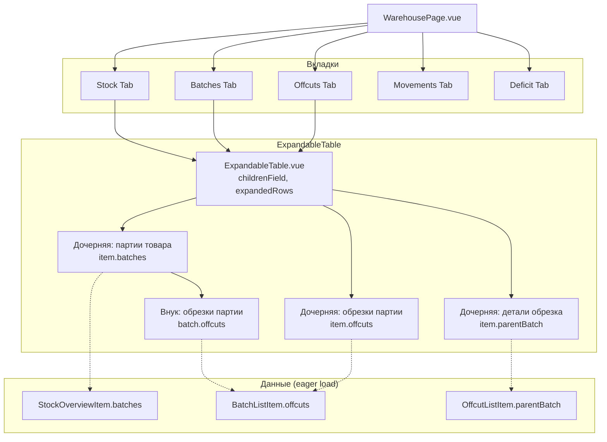

# План: Expandable Rows для страницы Склада

## 1. Обзор

Добавить иерархическую группировку с раскрывающимися строками (expandable rows) на страницу склада. Это позволит видеть вложенные данные без переключения между вкладками.

### Текущая архитектура (проблема)

- **Stock** → показывает товары, но партии видны только на вкладке Batches
- **Batches** → показывает партии, но обрезки видны только на вкладке Offcuts
- **Offcuts** → показывает обрезки без контекста родительской партии
- Нет быстрого способа увидеть "что внутри" без перехода на другую вкладку

### Цель

```
Stock (товар)
  └─ expand → Batches (партии этого товара)
       └─ expand → Offcuts (обрезки этой партии)

Batches (партия)
  └─ expand → Offcuts (обрезки этой партии)

Offcuts (обрезок)
  └─ expand → Details (инфо о родительской партии, движения)
```

---

## 2. Изменения в API / Сервисе

### Eager load — все данные в одном ответе

Вместо отдельных эндпоинтов для lazy-loading, расширяем существующие ответы, включив nested данные **напрямую** в основной ответ. Данные уже есть на сервере, отдаём всё сразу.

### Изменения в типах ответов

#### StockOverviewItem — добавляем вложенные партии

```typescript
// types/warehouse.ts — расширить StockOverviewItem

export interface StockOverviewItem {
  // ... существующие поля
  batchCount: number
  isDeficit: boolean

  // NEW: вложенные партии для expand
  batches?: StockBatchItem[]
}

/** Партия внутри StockOverviewItem */
export interface StockBatchItem {
  id: string
  batchNumber: string
  lotCode: string
  quantity: number
  quantityRemaining: number
  unit: StockUnit
  unitPrice: number
  status: BatchStatus
  offcutCount: number       // сколько обрезков у этой партии
  offcuts?: OffcutChildItem[]  // NEW: вложенные обрезки для expand
}

/** Обрезок внутри StockBatchItem / BatchListItem */
export interface OffcutChildItem {
  id: string
  batchNumber: string
  lengthMm: number | null
  widthMm: number | null
  weightKg: number | null
  quantity: number
  unit: StockUnit
  location: string | null
  status: OffcutStatus
}
```

#### BatchListItem — добавляем вложенные обрезки

```typescript
// types/warehouse.ts — расширить BatchListItem

export interface BatchListItem {
  // ... существующие поля
  offcutCount: number       // NEW: количество обрезков
  offcuts?: OffcutChildItem[]  // NEW: вложенные обрезки для expand
}
```

#### OffcutListItem — добавляем детали родительской партии

```typescript
// types/warehouse.ts — расширить OffcutListItem

export interface OffcutListItem {
  // ... существующие поля
  // NEW: данные родительской партии для expand
  parentBatch?: {
    batchNumber: string
    productName: TranslatedString
    status: BatchStatus
    receivedAt: string
  }
}
```

### Что меняется в сервисе

**Ничего.** Методы остаются те же:
- `getStockOverview()` — теперь возвращает `StockOverviewItem[]` с опциональным полем `batches`
- `getBatches()` — теперь возвращает `BatchListItem[]` с опциональным полем `offcuts`
- `getOffcuts()` — теперь возвращает `OffcutListItem[]` с опциональным полем `parentBatch`

Данные уже включены в ответ — никаких дополнительных запросов при expand не нужно.

---

## 3. Компонент: ExpandableTable

Новый переиспользуемый компонент, который оборачивает таблицу и добавляет логику expand/collapse.

### `src/components/admin/ExpandableTable.vue`

**Props:**
```typescript
interface ExpandableTableProps {
  /** Данные строк первого уровня */
  items: any[]
  /** Ключ для идентификации строки */
  rowKey?: string  // default: 'id'
  /** Имя поля с дочерними данными (e.g. 'batches', 'offcuts') */
  childrenField: string
  /** Функция, определяющая, есть ли у строки дочерние элементы */
  hasChildren?: (row: any) => boolean
  /** Состояние загрузки родительских данных */
  loading?: boolean
  /** Сообщение при пустом списке */
  emptyText?: string
}
```

**Slots:**
- `#row="{ item, expanded }"` — содержимое строки первого уровня
- `#child="{ item, parent }"` — содержимое раскрытой дочерней строки
- `#empty` — кастомный empty-state

**Состояние:**
- `expandedRows: Set<string>` — какие строки раскрыты (Set из rowKey)

**Поведение:**
- Клик по стрелке → toggle expand/collapse
- Данные уже есть в `item[childrenField]` — не нужно ничего загружать
- При смене `items` (новая загрузка) → сброс `expandedRows`

### Макет

```
┌─────────────────────────────────────────────────────────────┐
│ ▶ Товар 1  │ 100  │  20  │  80  │  2 партии  │ ...  │  🔽  │  ← строка с expand
│ ┌─────────────────────────────────────────────────────────┐ │
│ │ Партия #1  │ 50  │  45  │ available  │  1 обрезок  │ 🔽 │  ← дочерняя строка (тоже expandable)
│ │ Партия #2  │ 50  │  35  │ partial    │  0 обрезков │    │
│ └─────────────────────────────────────────────────────────┘ │
├─────────────────────────────────────────────────────────────┤
│   Товар 2  │ 200  │  50  │ 150  │  1 партия   │ ...  │     │  ← без детей, нет стрелки
└─────────────────────────────────────────────────────────────┘
```

---

## 4. Изменения в WarehousePage.vue

### 4.1 Вкладка Stock — expand до партий и обрезков

**Текущая таблица** Stock показывает `StockOverviewItem[]`. Нужно:

1. Заменить обычный `<tr>` на `<ExpandableTable>` с `childrenField="batches"`
2. `hasChildren` проверяет `item.batchCount > 0`
3. В дочерней строке (`#child`) показать таблицу партий этого товара (колонки: № партии, lot-code, кол-во, остаток, цена, статус)
4. Внутри дочерней строки партии — **второй уровень expand** через вложенный `<ExpandableTable>` с `childrenField="offcuts"`, если `offcutCount > 0`
5. Данные уже есть в `item.batches` и `batch.offcuts` — никаких запросов

**Схема вложенности:**
```
Stock row (товар)
  └─ expanded → Batches table (партии товара) — данные из item.batches
       └─ expanded → Offcuts table (обрезки партии) — данные из batch.offcuts
```

### 4.2 Вкладка Batches — expand до обрезков

**Текущая таблица** Batches показывает `BatchListItem[]`. Нужно:

1. Заменить на `<ExpandableTable>` с `childrenField="offcuts"`
2. `hasChildren` проверяет `item.offcutCount > 0`
3. В дочерней строке показать таблицу обрезков (колонки: размеры, вес, кол-во, локация, статус)
4. Данные уже есть в `item.offcuts`

### 4.3 Вкладка Offcuts — expand до деталей

**Текущая таблица** Offcuts показывает `OffcutListItem[]`. Нужно:

1. Заменить на `<ExpandableTable>` с `childrenField="parentBatch"`
2. `hasChildren` проверяет `!!item.parentBatch`
3. В дочерней строке показать карточку с информацией:
   - Родительская партия (название, номер, статус, дата прихода)
4. Данные уже есть в `item.parentBatch`

### 4.4 Вкладки Movements и Deficit

Остаются без изменений — там нет иерархии для expand.

---

## 5. Изменения в useWarehouse.ts

**Никаких изменений.** Композабл не нужно расширять — все данные уже приходят в ответе от сервера. ExpandableTable просто читает `item.batches`, `item.offcuts`, `item.parentBatch` из уже загруженных данных.

Единственное — нужно убедиться, что типы в composable импортируют расширенные интерфейсы (StockOverviewItem, BatchListItem, OffcutListItem с новыми полями).

---

## 6. Изменения в CSS

Добавить стили в [`warehouse_list.css`](frontend_vue/src/styles/admin/warehouse_list.css):

```css
/* ─── Expandable rows ─────────────────────────────────────── */

.expand-row {
  /* строка, которая может раскрываться */
}

.expand-row.expanded {
  /* строка в раскрытом состоянии */
}

.expand-toggle {
  display: inline-flex;
  align-items: center;
  justify-content: center;
  width: 24px;
  height: 24px;
  cursor: pointer;
  transition: transform 0.2s ease;
  color: rgba(255, 255, 255, 0.4);
}

.expand-toggle:hover {
  color: rgba(255, 255, 255, 0.8);
}

.expand-toggle.expanded {
  transform: rotate(90deg);
}

.expand-toggle.hidden {
  visibility: hidden;
}

/* Дочерняя строка */
.child-row {
  /* вложенная строка */
}

.child-row-content {
  padding: 12px 16px 12px 48px;  /* отступ слева для визуальной вложенности */
  background: rgba(255, 255, 255, 0.02);
  border-top: 1px solid rgba(255, 255, 255, 0.04);
}

/* Вложенная таблица */
.child-table {
  width: 100%;
  border-collapse: collapse;
}

.child-table th {
  font-size: 11px;
  text-transform: uppercase;
  letter-spacing: 0.5px;
  color: rgba(255, 255, 255, 0.4);
  padding: 6px 12px;
  text-align: left;
  border-bottom: 1px solid rgba(255, 255, 255, 0.06);
}

.child-table td {
  padding: 8px 12px;
  font-size: 13px;
  color: rgba(255, 255, 255, 0.8);
  border-bottom: 1px solid rgba(255, 255, 255, 0.03);
}

/* Анимация появления */
.child-row-enter-active,
.child-row-leave-active {
  transition: all 0.2s ease;
}

.child-row-enter-from,
.child-row-leave-to {
  opacity: 0;
  max-height: 0;
}
```

---

## 7. Порядок реализации

### Фаза 1 — Типы

1. Добавить типы `StockBatchItem`, `OffcutChildItem` в [`types/warehouse.ts`](frontend_vue/src/types/warehouse.ts)
2. Добавить поле `batches?: StockBatchItem[]` в `StockOverviewItem`
3. Добавить поле `offcutCount: number` и `offcuts?: OffcutChildItem[]` в `BatchListItem`
4. Добавить поле `parentBatch?: {...}` в `OffcutListItem`

### Фаза 2 — Компонент ExpandableTable

5. Создать компонент [`ExpandableTable.vue`](frontend_vue/src/components/admin/ExpandableTable.vue) — без childLoader, данные из `item[childrenField]`
6. Добавить CSS-стили expandable rows в [`warehouse_list.css`](frontend_vue/src/styles/admin/warehouse_list.css)

### Фаза 3 — Expand на вкладке Stock

7. Модифицировать секцию Stock в [`WarehousePage.vue`](frontend_vue/src/views/admin/warehouse/WarehousePage.vue) — использовать `ExpandableTable` с `childrenField="batches"`
8. В дочерней строке Stock — вложенный `ExpandableTable` с `childrenField="offcuts"` для партий

### Фаза 4 — Expand на вкладке Batches

9. Модифицировать секцию Batches в [`WarehousePage.vue`](frontend_vue/src/views/admin/warehouse/WarehousePage.vue) — использовать `ExpandableTable` с `childrenField="offcuts"`

### Фаза 5 — Expand на вкладке Offcuts

10. Модифицировать секцию Offcuts в [`WarehousePage.vue`](frontend_vue/src/views/admin/warehouse/WarehousePage.vue) — использовать `ExpandableTable` с `childrenField="parentBatch"`

### Фаза 6 — Моки (если есть)

11. Обновить мок-данные — добавить nested `batches`, `offcuts`, `parentBatch` в ответы

---

## 8. Диаграмма компонентов



---

## 9. Зависимости

- **От** [`usePagination`](frontend_vue/src/composables/usePagination.ts) — для пагинации дочерних списков (если партий/обрезков много)
- **От** [`SvgIcon`](frontend_vue/src/components/admin/SvgIcon.vue) — для иконки стрелки expand (chevron-right)
- **От** [`GlassPanel`](frontend_vue/src/components/admin/GlassPanel.vue) — существующий wrapper для секций
- **От** существующих типов [`StockOverviewItem`](frontend_vue/src/types/warehouse.ts:293), [`BatchListItem`](frontend_vue/src/types/warehouse.ts:62), [`OffcutListItem`](frontend_vue/src/types/warehouse.ts:132)

---

## 10. Ключевые решения

1. **Eager load** — все nested данные приходят в одном ответе. Нет дополнительных запросов при expand. Проще, быстрее для UX.

2. **Единый компонент ExpandableTable** — переиспользуется на всех трёх вкладках. Упрощает поддержку.

3. **Двойная вложенность** — Stock → партии → обрезки. Batches → обрезки. Это покрывает все сценарии навигации.

4. **Вкладки остаются** — пользователь может как пользоваться expand, так и переключаться между вкладками для "плоского" просмотра.

5. **batchCount уже есть** — в `StockOverviewItem.batchCount` уже хранится количество партий. Используем для показа/скрытия стрелки expand.

6. **Никаких изменений в сервисе/композабле** — только типы и шаблон. Минимальные изменения в существующем коде.
