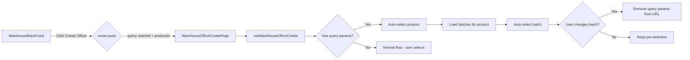
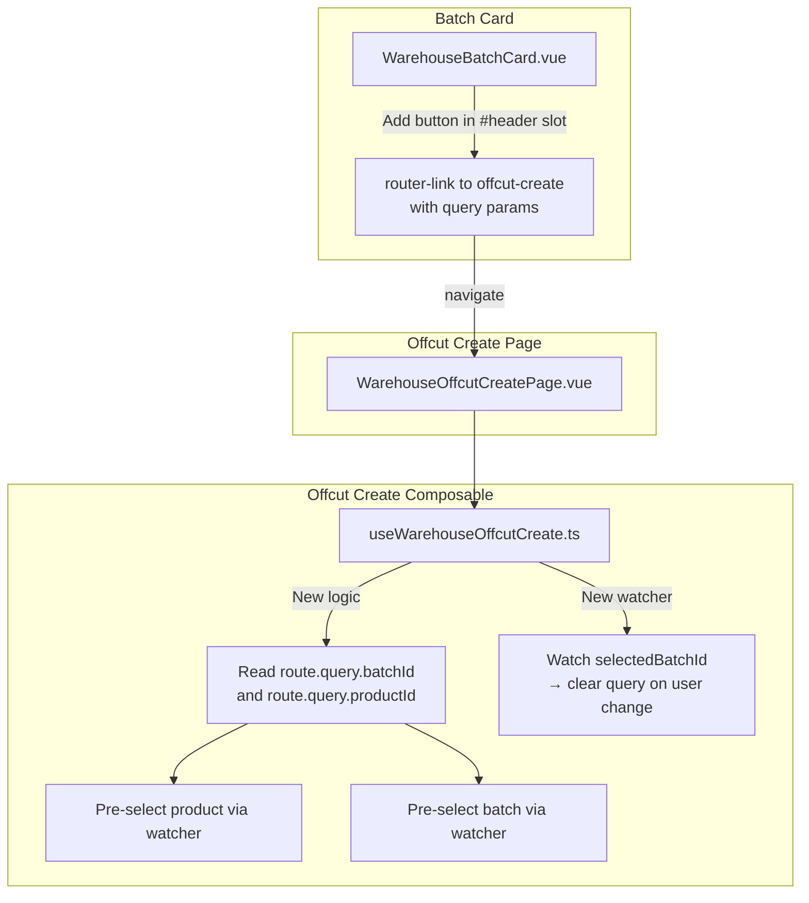

# Plan: Add "Create Offcut" Link Button on Batch Card Page

## Goal

Add a button/link on the [`WarehouseBatchCard.vue`](frontend_vue/src/views/admin/warehouse/WarehouseBatchCard.vue) page that navigates to the offcut creation page ([`WarehouseOffcutCreatePage.vue`](frontend_vue/src/views/admin/warehouse/WarehouseOffcutCreatePage.vue)) with the current batch pre-selected via a query parameter.

## Background

Currently, the batch card page shows a list of offcuts linked to this batch in a "Offcuts from this batch" section. However, there is no quick way to create a **new** offcut that belongs to this batch. The user has to:
1. Navigate to the offcuts tab
2. Click "New Offcut"
3. Find and select the product
4. Find and select the batch again

This is tedious when you're already viewing the batch card.

## Requirements

1. Add a link button in the "Offcuts from this batch" section header on the batch card page
2. The link navigates to `admin-warehouse-offcut-create` route with query parameters `?batchId=<current_batch_id>&productId=<current_product_id>`
3. The offcut creation page must:
   - Read the `batchId` and `productId` query parameters on mount
   - If both are present:
     - Auto-select that product (which triggers loading batches for that product)
     - After batches load, auto-select that batch
   - If the user **changes** the batch selection on the create page (selects a different batch), the query parameters must be **removed** from the URL (since the pre-selected batch is no longer relevant)
4. Add a new i18n key for the button tooltip

## Key Design Decision: How to resolve batchId to productId

The composable [`useWarehouseOffcutCreate`](frontend_vue/src/composables/useWarehouseOffcutCreate.ts) loads products first, then when a product is selected, loads batches for that product.

**Decision:** Pass both `batchId` and `productId` in query params. The batch card already has `batch.productId` available, so no additional API call is needed. This is simpler and more reliable than trying to resolve batchId to productId on the create page.

## Architecture

### Data Flow

```
User clicks "Create Offcut" button on Batch Card
  → router.push({ name: 'admin-warehouse-offcut-create', query: { batchId, productId } })
  → WarehouseOffcutCreatePage.vue mounts
  → useWarehouseOffcutCreate composable reads route.query.batchId and route.query.productId
  → If both present:
      → Store as preselectedProductId and preselectedBatchId
      → After products load (watch products ref):
          → Set selectedProductId = preselectedProductId
          → This triggers product watcher → loadBatches(productId)
      → After batches load (watch batches ref):
          → Find batch by preselectedBatchId in loaded batches
          → If found: set selectedBatchId = preselectedBatchId
          → Clear preselectedBatchId
  → If user manually changes batch selection:
      → Watch selectedBatchId detects change from pre-selected value
      → Call router.replace({ query: {} }) to remove query params
```

## Files to Modify

### 1. [`WarehouseBatchCard.vue`](frontend_vue/src/views/admin/warehouse/WarehouseBatchCard.vue)

**Location:** The "Offcuts from this batch" section (around line 660)

**Current code:**
```vue
<GlassPanel :title="t('warehouse.section_batch_offcuts')" data-test="batch-card-offcuts-section">
```

**Change:** Replace with using the `#header` slot to add a button alongside the title:

```vue
<GlassPanel data-test="batch-card-offcuts-section">
  <template #header>
    <span class="panel-title">{{ t('warehouse.section_batch_offcuts') }}</span>
    <router-link
      v-tooltip="t('warehouse.create_offcut_for_batch')"
      :to="{
        name: 'admin-warehouse-offcut-create',
        query: { batchId: batch.id, productId: batch.productId }
      }"
      class="btn btn-sm btn-primary"
      style="margin-left: auto;"
      data-test="batch-card-create-offcut-link"
    >
      <SvgIcon name="plus-add" :width="14" :height="14" />
      {{ t('warehouse.btn_new_offcut') }}
    </router-link>
  </template>
  <!-- rest of content unchanged -->
  ...
</GlassPanel>
```

**Note:** [`GlassPanel`](frontend_vue/src/components/admin/GlassPanel.vue) has a `#header` slot. When using it, we must render the title ourselves via `<span class="panel-title">`. The button uses `margin-left: auto` to push it to the right side of the header.

### 2. [`useWarehouseOffcutCreate.ts`](frontend_vue/src/composables/useWarehouseOffcutCreate.ts)

**Changes:**

1. Add imports for `useRoute` and `useRouter` from `vue-router`
2. Read `batchId` and `productId` from `route.query` on initialization
3. Add `preselectedBatchId` and `preselectedProductId` refs
4. Add a watcher on `products` (with `{ once: true }`) to apply product pre-selection after products load
5. Add a watcher on `batches` to apply batch pre-selection after batches load
6. Add a watcher on `selectedBatchId` to detect user-initiated changes and clear query params

**Implementation details:**

```typescript
import { useRoute, useRouter } from 'vue-router'

// Inside the composable function:
const route = useRoute()
const router = useRouter()

// Pre-selection from query params
const preselectedBatchId = ref<string | null>(null)
const preselectedProductId = ref<string | null>(null)

// Read query params on init
const queryBatchId = route.query.batchId as string | undefined
const queryProductId = route.query.productId as string | undefined

if (queryBatchId && queryProductId) {
  preselectedBatchId.value = queryBatchId
  preselectedProductId.value = queryProductId
}

// After products load, apply product pre-selection
watch(products, (prods) => {
  if (preselectedProductId.value && preselectedBatchId.value && prods.length > 0) {
    selectedProductId.value = preselectedProductId.value
  }
}, { once: true })

// After batches load, apply batch pre-selection
watch(batches, (batchList) => {
  if (preselectedBatchId.value && batchList.length > 0) {
    const exists = batchList.find(b => b.id === preselectedBatchId.value)
    if (exists) {
      selectedBatchId.value = preselectedBatchId.value
    }
    preselectedBatchId.value = null
  }
})

// Watch for user changing batch away from pre-selected
watch(selectedBatchId, (newVal, oldVal) => {
  if (oldVal && newVal !== oldVal) {
    // User changed batch - remove query params
    router.replace({ query: {} })
  }
})
```

**Important:** The watcher on `selectedBatchId` will fire when the pre-selection sets the value (oldVal=null, newVal=batchId). We only clear query params when `oldVal` is truthy AND `newVal !== oldVal`, meaning the user actively changed from one batch to another.

### 3. [`WarehouseOffcutCreatePage.vue`](frontend_vue/src/views/admin/warehouse/WarehouseOffcutCreatePage.vue)

**Changes:** No template changes needed. The composable handles all logic internally.

### 4. [`warehouse.ts`](frontend_vue/src/i18n/admin/warehouse.ts)

**Add i18n keys** (in all 3 language sections: ru, en, lt):

| Key | RU | EN | LT |
|---|---|---|---|
| `create_offcut_for_batch` | Создать обрезок из этой партии | Create offcut from this batch | Sukurti atraižą iš šios partijos |

## Implementation Order

1. Add i18n key `create_offcut_for_batch` to all 3 languages in [`warehouse.ts`](frontend_vue/src/i18n/admin/warehouse.ts)
2. Modify [`useWarehouseOffcutCreate.ts`](frontend_vue/src/composables/useWarehouseOffcutCreate.ts) to handle query params pre-selection
3. Add the link button in [`WarehouseBatchCard.vue`](frontend_vue/src/views/admin/warehouse/WarehouseBatchCard.vue) in the offcuts section header using `#header` slot
4. Test the flow

## Mermaid Diagram: Navigation Flow



## Mermaid Diagram: Component Changes



## Edge Cases to Consider

1. **Batch not found for product:** If the batchId doesn't match any batch for the given productId (e.g., data inconsistency), just show the batches list without pre-selection — the user can select manually.

2. **User navigates directly to URL with stale batchId:** The pre-selection gracefully handles missing data — if the batch isn't in the loaded list, it's simply ignored.

3. **User refreshes the page:** The query params persist in the URL, so pre-selection works on refresh too. But if the user changed the batch before refresh, the params would have been cleared.

4. **Product has no batches (deleted/consumed):** The "no batches" message appears, and the batch pre-selection is ignored.

5. **Multiple tabs:** Using query params rather than store state ensures each tab works independently.
