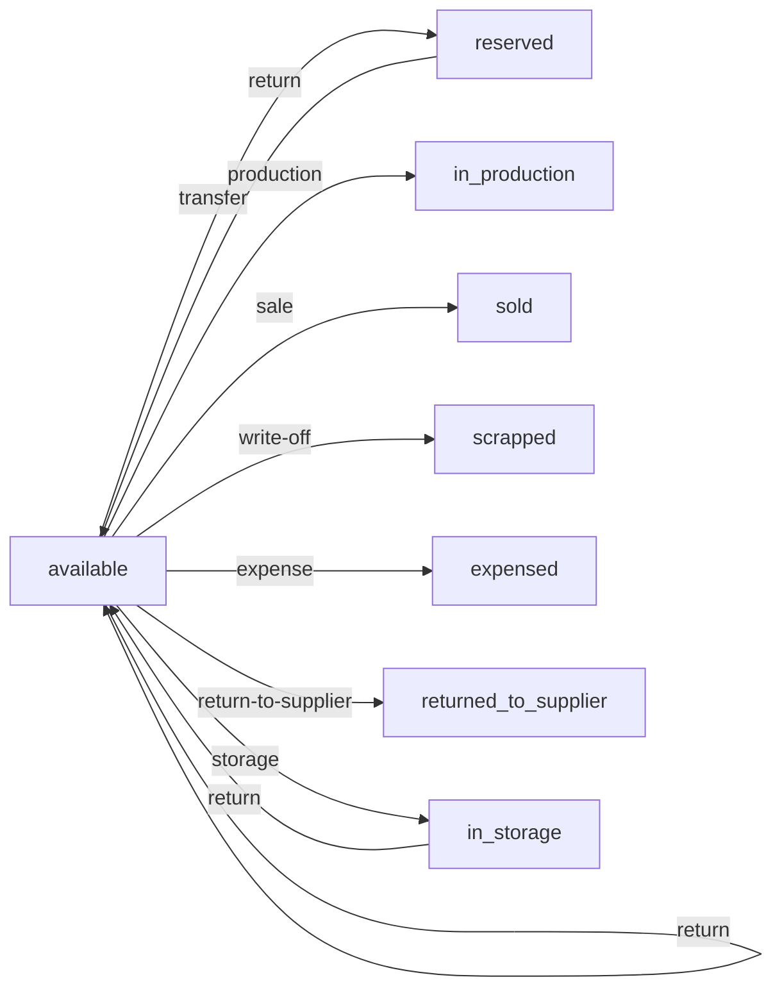

# План: Движения по обрезкам (Offcut Movements)

## 1. Текущее состояние

Сейчас движения (`Movement`) привязаны только к **партиям** через `batchId`. У обрезков отдельного движения нет — только:

- **PATCH статуса** — прямая смена статуса через `OffcutPatchPayload` без создания movement
- **Аудит-лог** (`StockAuditEntry[]`) — внутри самого offcut фиксирует изменения
- **Transfer при смене location** — уже создаётся в [`useWarehouseOffcutCard.ts`](../../../frontend_vue/src/composables/useWarehouseOffcutCard.ts:159), но с ошибкой: использует `batchId` вместо `offcutId` (поля `offcutId` в движении нет)

### Проблема

1. Нет поля `offcutId` в `MovementCreatePayload` / `WarehouseMovement` / `MovementListItem`
2. Смена статуса в таблице (`updateOffcutStatus`) не создаёт движение
3. Смена статуса в карточке (`save`) не создаёт движение
4. Transfer при смене location привязан к `batchId`, а не `offcutId`
5. Фильтр movements по offcut идёт через `referenceId` (костыль)

---

## 2. Целевое состояние

### 2.1. Добавить `offcutId` в модель движения

#### [`frontend_vue/src/types/warehouse.ts`](../../../frontend_vue/src/types/warehouse.ts)

```typescript
// MovementCreatePayload — добавить:
offcutId?: string | null

// WarehouseMovement — добавить:
offcutId: string | null
offcutNumber?: string  // опционально: номер/ID обрезка для отображения

// MovementListItem — добавить:
offcutId: string | null
```

### 2.2. API изменения

Добавить query-параметр `offcutId` в `GET /api/warehouse/movements`:

```typescript
// GET /api/warehouse/movements
filters: {
  // ... существующие
  offcutId?: string   // NEW — фильтр по обрезку
}
```

### 2.3. Логика создания движений

#### 2.3.1. Transfer при смене location (карточка обрезка)

В [`useWarehouseOffcutCard.ts::save()`](../../../frontend_vue/src/composables/useWarehouseOffcutCard.ts:159) — заменить:

```typescript
// БЫЛО:
await createMovement({
  type: 'transfer',
  batchId: updated.batchId,  // ❌ неверно
  quantity: updated.quantity,
  fromLocation: oldLocation,
  toLocation: newLocation,
})

// СТАЛО:
await createMovement({
  type: 'transfer',
  offcutId: updated.id,    // ✅ привязка к обрезку
  batchId: updated.batchId, // сохранить для контекста
  quantity: updated.quantity,
  fromLocation: oldLocation,
  toLocation: newLocation,
  notes: t('warehouse.movement_auto_location_change'),
})
```

#### 2.3.2. Status-change movement при смене статуса (карточка обрезка)

Там же, в [`useWarehouseOffcutCard.ts::save()`](../../../frontend_vue/src/composables/useWarehouseOffcutCard.ts:159), добавить проверку:

```typescript
// Если изменился status — создать movement
if (delta.status && delta.status !== offcut.value.status) {
  await createMovement({
    type: mapOffcutStatusToMovementType(delta.status),
    offcutId: updated.id,
    batchId: updated.batchId,
    quantity: updated.quantity,
    unit: updated.unit,
    movedAt: new Date().toISOString(),
    notes: t(`warehouse.movement_offcut_${delta.status}`, { id: updated.id }),
  })
}
```

#### 2.3.3. Status-change movement из списка (таблица в WarehousePage)

В [`useWarehouse.ts::updateOffcutStatus()`](../../../frontend_vue/src/composables/useWarehouse.ts:343) — добавить создание movement:

```typescript
async function updateOffcutStatus(id: string, status: string, offcut: OffcutListItem) {
  try {
    await patchOffcutApi(id, { status: status as OffcutStatus })
    // NEW: создать movement при смене статуса
    await createMovementApi({
      type: mapOffcutStatusToMovementType(status as OffcutStatus),
      offcutId: id,
      batchId: offcut.batchId,
      quantity: offcut.quantity,
      unit: offcut.unit,
      movedAt: new Date().toISOString(),
      notes: t(`warehouse.movement_offcut_${status}`, { id }),
    })
    toast.success(t('warehouse.toast_offcut_saved'))
    await loadOffcuts()
  } catch {
    toast.error(t('warehouse.toast_error'))
  }
}
```

**Важно:** В `WarehousePage.vue` нужно передавать `offcut` объект, а не только `id`:

```vue
<!-- Было: -->
@click.stop="updateOffcutStatus(offcut.id, 'in_production')"

<!-- Стало: -->
@click.stop="updateOffcutStatus(offcut.id, 'in_production', offcut)"
```

### 2.4. Маппинг статус → тип движения

```typescript
function mapOffcutStatusToMovementType(status: OffcutStatus): MovementType {
  const map: Record<OffcutStatus, MovementType> = {
    available: 'return',           // возврат в наличие
    reserved: 'transfer',           // резервирование
    in_production: 'production',    // в производство
    sold: 'sale',                   // продажа
    scrapped: 'write-off',          // утилизация
    expensed: 'expense',            // расходование
    returned_to_supplier: 'return-to-supplier', // возврат поставщику
    in_storage: 'storage',          // на хранение
  }
  return map[status]
}
```

### 2.5. Cutting operation → движение

Сейчас `POST /api/warehouse/cutting` не создаёт movement. Нужно добавить в API (бэкенд) или на фронте после cutting:

В [`WarehousePage.vue`](../../../frontend_vue/src/views/admin/warehouse/WarehousePage.vue) или в моке `POST /api/warehouse/cutting`:

```typescript
// После выполнения cutting, для каждого созданного offcut:
for (const offcut of result.offcuts) {
  await createMovement({
    type: 'production',
    offcutId: offcut.id,
    batchId: offcut.batchId,
    quantity: offcut.quantity,
    unit: offcut.unit,
    notes: t('warehouse.reference_cutting'),
  })
}
```

### 2.6. Загрузка движений по обрезку

В [`useWarehouseOffcutCard.ts::loadMovements()`](../../../frontend_vue/src/composables/useWarehouseOffcutCard.ts:86) — заменить фильтр:

```typescript
// БЫЛО (костыль через referenceId):
const response = await getMovements(
  { search: '', referenceId: offcut.value.id, sortBy: 'movedAt', sortDir: 'desc' },
  { page: 1, pageSize: 50 },
)

// СТАЛО (через offcutId):
const response = await getMovements(
  { search: '', offcutId: offcut.value.id, sortBy: 'movedAt', sortDir: 'desc' },
  { page: 1, pageSize: 50 },
)
```

### 2.7. Отображение в MovementCard

В [`WarehouseMovementCard.vue`](../../../frontend_vue/src/views/admin/warehouse/WarehouseMovementCard.vue) — добавить ссылку на обрезок если `movement.offcutId` присутствует:

```vue
<div v-if="movement.offcutId" class="input-group">
  <label class="field-label">{{ t('warehouse.col_offcut') }}</label>
  <router-link
    :to="{ name: 'admin-warehouse-offcut', params: { id: movement.offcutId } }"
    class="batch-link-row"
  >
    <span>{{ t('warehouse.open_offcut_card') }}</span>
    <SvgIcon name="external-link" :width="14" :height="14" />
  </router-link>
</div>
```

### 2.8. Mock данные

В [`services/mocks/warehouse.ts`](../../../frontend_vue/src/services/mocks/warehouse.ts) — обновить `mockCreateMovement` чтобы:
1. Принимать `offcutId` и сохранять его в движении
2. Поддерживать фильтр `offcutId` в `GET /api/warehouse/movements`

---

## 3. Файлы для изменения

| # | Файл | Что меняем |
|---|------|-----------|
| 1 | [`types/warehouse.ts`](../../../frontend_vue/src/types/warehouse.ts) | Добавить `offcutId: string \| null` в `MovementCreatePayload`, `WarehouseMovement`, `MovementListItem` |
| 2 | [`services/warehouseService.ts`](../../../frontend_vue/src/services/warehouseService.ts) | Добавить `offcutId` в query-параметры `getMovements` |
| 3 | [`services/mocks/warehouse.ts`](../../../frontend_vue/src/services/mocks/warehouse.ts) | Обновить mock handlers для `offcutId` |
| 4 | [`composables/useWarehouseOffcutCard.ts`](../../../frontend_vue/src/composables/useWarehouseOffcutCard.ts) | Исправить transfer + добавить status-change movement + фильтр `offcutId` |
| 5 | [`composables/useWarehouse.ts`](../../../frontend_vue/src/composables/useWarehouse.ts) | Добавить создание movement в `updateOffcutStatus` |
| 6 | [`views/admin/warehouse/WarehousePage.vue`](../../../frontend_vue/src/views/admin/warehouse/WarehousePage.vue) | Передать `offcut` объект в `updateOffcutStatus` + новый параметр |
| 7 | [`views/admin/warehouse/WarehouseMovementCard.vue`](../../../frontend_vue/src/views/admin/warehouse/WarehouseMovementCard.vue) | Показать ссылку на offcut если `offcutId` есть |
| 8 | [`i18n/admin/warehouse.ts`](../../../frontend_vue/src/i18n/admin/warehouse.ts) | Добавить перевод `col_offcut` для карточки движения |
| 9 | [`views/admin/warehouse/WarehouseOffcutCard.vue`](../../../frontend_vue/src/views/admin/warehouse/WarehouseOffcutCard.vue) | Обновить `OFFCUT_STATUS_PILL` (уже сделано) |

---

## 4. Маппинг статус → движение



---

## 5. Порядок выполнения

1. **Типы** — добавить `offcutId` в movement types
2. **Service** — добавить `offcutId` в query-параметры `getMovements`
3. **Mock** — обновить mock handlers (createMovement, getMovements)
4. **useWarehouseOffcutCard.ts** — исправить transfer + добавить status-change movement
5. **useWarehouse.ts** — добавить создание movement в `updateOffcutStatus`
6. **WarehousePage.vue** — передать `offcut` объект в `updateOffcutStatus`
7. **WarehouseMovementCard.vue** — показать ссылку на offcut
8. **i18n** — добавить недостающие переводы
9. **TypeScript check** — `npx vue-tsc --noEmit`
