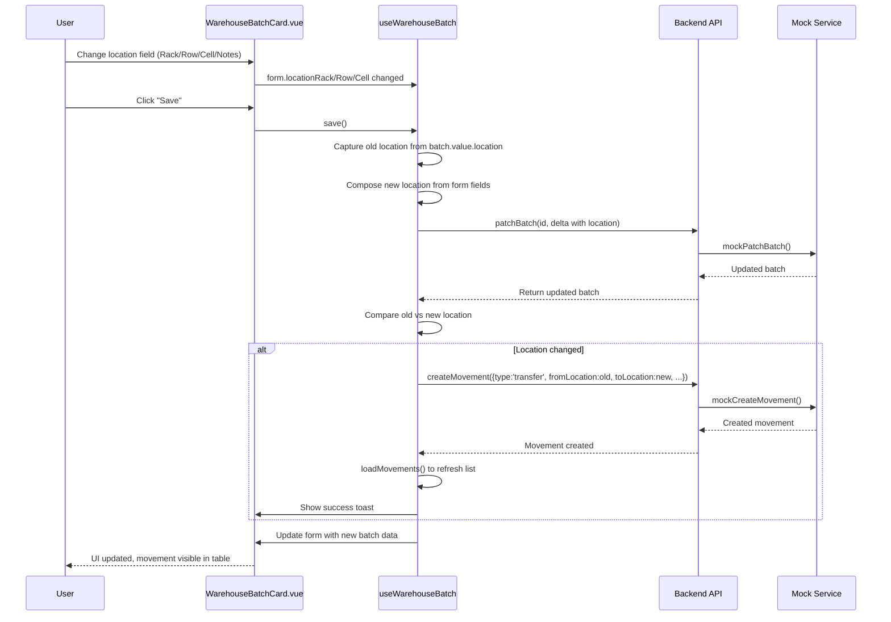

# Plan: Auto-create Transfer Movement on Location Change in Batch Card

## Problem

When a user changes any field in the "Location" section (Rack, Row, Cell, Location Notes) of the batch card ([`WarehouseBatchCard.vue`](frontend_vue/src/views/admin/warehouse/WarehouseBatchCard.vue:603-679)), a transfer movement should be **automatically registered** — not just when the user explicitly clicks "Save" on the batch card.

Currently, location changes are only persisted when the user clicks the "Save" button, which calls [`patchBatch()`](frontend_vue/src/services/warehouseService.ts:88-90) via [`useWarehouseBatch.save()`](frontend_vue/src/composables/useWarehouseBatch.ts:184-228). There is no automatic movement creation.

## Current Architecture

### Location Data Flow

1. **Storage format**: Location is stored as a single string on [`WarehouseBatch.location`](frontend_vue/src/types/warehouse.ts:65) with format: `Rack: X | Row: Y | Cell: Z\nNotes: ...`
2. **Form fields**: The composable [`useWarehouseBatch`](frontend_vue/src/composables/useWarehouseBatch.ts:63-91) parses this string into 4 separate reactive form fields: `locationRack`, `locationRow`, `locationCell`, `locationNotes`
3. **Save flow**: On save, [`composeLocation()`](frontend_vue/src/composables/useWarehouseBatch.ts:40-49) reassembles the 4 fields back into the single `location` string and sends it via `patchBatch()`
4. **Dirty detection**: [`useDirtyCheck`](frontend_vue/src/composables/useDirtyCheck.ts) tracks changes to all form fields including location sub-fields

### Movement Model

A transfer movement ([`MovementCreatePayload`](frontend_vue/src/types/warehouse.ts:253-265)) has:
- `type: 'transfer'`
- `batchId` — the batch being moved
- `fromLocation` — old location
- `toLocation` — new location
- `quantity` — the batch's remaining quantity (the whole batch moves)
- `movedAt` — timestamp
- `notes` — optional

### Existing Movement Creation

The [`CreateMovementModal.vue`](frontend_vue/src/views/admin/warehouse/CreateMovementModal.vue) calls [`createMovement()`](frontend_vue/src/services/warehouseService.ts:160-162) which hits `POST /api/warehouse/movements`. The mock implementation is in [`mockCreateMovement()`](frontend_vue/src/services/mocks/warehouse.ts:675-725).

## Implementation Plan

### Step 1: Add `createMovement` to `useWarehouseBatch` composable

**File**: [`frontend_vue/src/composables/useWarehouseBatch.ts`](frontend_vue/src/composables/useWarehouseBatch.ts)

**What**: Import and use `createMovement` from the warehouse service. After a successful `patchBatch()` call, detect if the location changed, and if so, automatically create a transfer movement.

**Details**:
1. Import `createMovement` alongside existing imports from `@/services/warehouseService`
2. In the `save()` function, after `patchBatch()` succeeds, compare the old location (from `batch.value.location` before save) with the new location (from the composed `delta.location`).
3. If they differ, call `createMovement()` with:
   - `type: 'transfer'`
   - `batchId: batch.value.id`
   - `quantity: batch.value.quantityRemaining` (the whole remaining quantity moves)
   - `fromLocation: batch.value.location` (old location)
   - `toLocation: delta.location` (new location)
   - `movedAt: new Date().toISOString()`
   - `notes: 'Auto-created on location change'`
4. After movement is created, reload the movements list via `loadMovements()`
5. Show a success toast for the movement creation

**Key consideration**: The movement should only be created when the location actually changed (not on every save). We need to capture the old location before the patch.

### Step 2: Update `mockPatchBatch` to return the old location for comparison

**File**: [`frontend_vue/src/services/mocks/warehouse.ts`](frontend_vue/src/services/mocks/warehouse.ts)

**What**: The mock `mockPatchBatch` currently mutates the batch in-place. We need to ensure the old location is accessible. Since the composable will capture `batch.value.location` before calling `patchBatch()`, this should work naturally — the mock doesn't need changes for this.

However, we need to ensure the mock properly handles the location field update. Currently line 378 does `if (data.location !== undefined) batch.location = data.location` — this is correct.

### Step 3: Add i18n translation keys for the auto-created movement

**File**: [`frontend_vue/src/i18n/admin/warehouse.ts`](frontend_vue/src/i18n/admin/warehouse.ts)

Add a translation key for the auto-movement note:
```typescript
movement_auto_location_change: 'Auto-created on location change'
// Russian: 'Автоматически создано при изменении местоположения'
// Lithuanian: 'Automatiškai sukurta pakeitus vietą'
```

And a toast message:
```typescript
toast_movement_auto_created: 'Transfer movement created due to location change'
// Russian: 'Создано перемещение в связи с изменением местоположения'
// Lithuanian: 'Sukurtas perkėlimas dėl vietos pakeitimo'
```

### Step 4: Update the mock to also auto-create movement on location change

**File**: [`frontend_vue/src/services/mocks/warehouse.ts`](frontend_vue/src/services/mocks/warehouse.ts)

**What**: In `mockPatchBatch()`, when `data.location` is provided and differs from the current batch location, also create a movement record in the `movementStore` (similar to how `mockCreateBatch` creates a receipt movement).

This ensures the mock behavior matches the real backend behavior.

### Step 5: Reload movements after save in the batch card

**File**: [`frontend_vue/src/views/admin/warehouse/WarehouseBatchCard.vue`](frontend_vue/src/views/admin/warehouse/WarehouseBatchCard.vue)

**What**: The `useWarehouseBatch` composable already returns `loadMovements`. After a successful save that created a movement, call `loadMovements()` to refresh the movements table in the UI.

This is already handled in Step 1 (inside the composable's `save()` function).

## Flow Diagram



## Files to Modify

| # | File | Change |
|---|------|--------|
| 1 | [`frontend_vue/src/composables/useWarehouseBatch.ts`](frontend_vue/src/composables/useWarehouseBatch.ts) | Import `createMovement`; after successful `patchBatch`, detect location change and auto-create transfer movement; reload movements |
| 2 | [`frontend_vue/src/i18n/admin/warehouse.ts`](frontend_vue/src/i18n/admin/warehouse.ts) | Add translation keys for auto-movement note and toast message (RU, EN, LT) |
| 3 | [`frontend_vue/src/services/mocks/warehouse.ts`](frontend_vue/src/services/mocks/warehouse.ts) | In `mockPatchBatch`, when location changes, also create a movement record in `movementStore` |

## Edge Cases & Considerations

1. **No location change on save**: If location fields weren't modified, no movement should be created. The `dirty.diff()` already handles this — location won't be in the delta if unchanged.

2. **First-time location set**: If the batch had `location: null` and the user sets a location for the first time, this is still a location change (null → "Rack: ..."). A transfer movement should be created with `fromLocation: null`.

3. **Location cleared**: If the user clears all location fields, `composeLocation()` returns `null`. This is a valid change and should create a movement with `toLocation: null`.

4. **Concurrent saves**: If the user saves multiple times, each save with a location change will create a separate movement. This is correct behavior.

5. **Error handling**: If `createMovement()` fails, the batch was already saved (location updated). We should show a warning toast but not roll back the batch save. The movement can be created manually via the "Create Movement" modal.

6. **Quantity for transfer**: The movement quantity should be `batch.value.quantityRemaining` since the entire remaining stock at that location is being moved.
