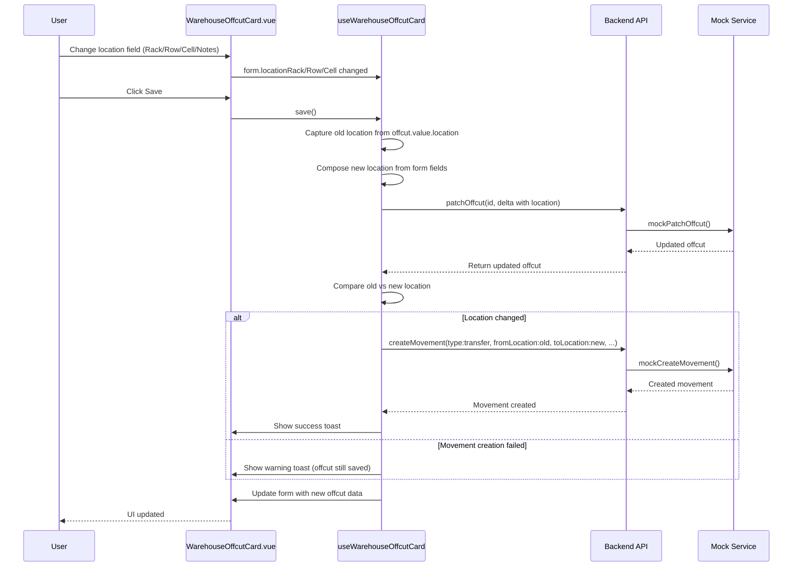

# Plan: Auto-create Transfer Movement on Location Change in Offcut Card

## Problem

When a user changes any field in the "Location" section (Rack, Row, Cell, Location Notes) of the offcut card ([`WarehouseOffcutCard.vue`](frontend_vue/src/views/admin/warehouse/WarehouseOffcutCard.vue:480-556)), a transfer movement should be **automatically registered** — just like it already works for the batch card.

Currently, the offcut card's [`useWarehouseOffcutCard.save()`](frontend_vue/src/composables/useWarehouseOffcutCard.ts:120-150) does NOT detect location changes and does NOT create a movement. The mock service [`mockPatchOffcut()`](frontend_vue/src/services/mocks/warehouse.ts:581-608) also does NOT auto-create a movement.

## Current Architecture (Batch Card — Reference Implementation)

The batch card already has this feature working:

1. **Composable** [`useWarehouseBatch.save()`](frontend_vue/src/composables/useWarehouseBatch.ts:207-214) — Captures old location before patch, compares after patch, shows toast, reloads movements
2. **Mock service** [`mockPatchBatch()`](frontend_vue/src/services/mocks/warehouse.ts:399-424) — Auto-creates a transfer movement in `movementStore` when location changes
3. **i18n** — Keys `toast_movement_auto_created`, `toast_movement_auto_failed`, `movement_auto_location_change` already exist in all 3 languages (RU, EN, LT)

## Implementation Plan

### Step 1: Update `useWarehouseOffcutCard` composable

**File**: [`frontend_vue/src/composables/useWarehouseOffcutCard.ts`](frontend_vue/src/composables/useWarehouseOffcutCard.ts)

**Changes**:
1. Import `createMovement` from `@/services/warehouseService` (alongside existing imports)
2. In the `save()` function, after `patchOffcut()` succeeds:
   - Capture old location from `offcut.value.location` before the patch
   - Compose new location from form fields (already done via `composeLocation()`)
   - If old location !== new location, call `createMovement()` with:
     - `type: 'transfer'`
     - `batchId: offcut.value.batchId` (the offcut's source batch)
     - `quantity: offcut.value.quantity` (the offcut's quantity)
     - `fromLocation: oldLocation`
     - `toLocation: newLocation`
     - `movedAt: new Date().toISOString()`
     - `notes: t('warehouse.movement_auto_location_change')`
   - Show success toast `toast_movement_auto_created` on success
   - Show warning toast `toast_movement_auto_failed` on failure (but don't roll back the offcut save)

**Key difference from batch card**: The offcut card doesn't have a movements list to reload, so we just show the toast. The movement will be visible in the movements tab.

### Step 2: Update `mockPatchOffcut` in mock service

**File**: [`frontend_vue/src/services/mocks/warehouse.ts`](frontend_vue/src/services/mocks/warehouse.ts)

**Changes** in [`mockPatchOffcut()`](frontend_vue/src/services/mocks/warehouse.ts:581-608):
1. Capture old location before applying changes
2. After updating the offcut, if `data.location !== undefined` and `oldLocation !== data.location`, create a transfer movement in `movementStore` (same pattern as [`mockPatchBatch()`](frontend_vue/src/services/mocks/warehouse.ts:399-424))
3. The movement should reference the offcut's batch (`offcut.batchId`, `offcut.batchNumber`) and use the offcut's quantity

### Step 3: Verify i18n keys

**File**: [`frontend_vue/src/i18n/admin/warehouse.ts`](frontend_vue/src/i18n/admin/warehouse.ts)

The following keys already exist (used by batch card) and can be reused:
- `toast_movement_auto_created` (line 381 RU, 818 EN, 1255 LT)
- `toast_movement_auto_failed` (line 382 RU, 819 EN, 1256 LT)
- `movement_auto_location_change` (line 220 RU, 657 EN, 1094 LT)

No new i18n keys needed.

## Flow Diagram

## Files to Modify

| # | File | Change |
|---|------|--------|
| 1 | [`frontend_vue/src/composables/useWarehouseOffcutCard.ts`](frontend_vue/src/composables/useWarehouseOffcutCard.ts) | Import `createMovement`; after successful `patchOffcut`, detect location change and auto-create transfer movement |
| 2 | [`frontend_vue/src/services/mocks/warehouse.ts`](frontend_vue/src/services/mocks/warehouse.ts) | In `mockPatchOffcut`, when location changes, create a movement record in `movementStore` |

## Edge Cases & Considerations

1. **No location change on save**: If location fields weren't modified, no movement should be created. The `dirty.diff()` already handles this — location won't be in the delta if unchanged.

2. **First-time location set**: If the offcut had `location: null` and the user sets a location for the first time, this is still a location change (null → "Rack: ..."). A transfer movement should be created with `fromLocation: null`.

3. **Location cleared**: If the user clears all location fields, `composeLocation()` returns `null`. This is a valid change and should create a movement with `toLocation: null`.

4. **Error handling**: If `createMovement()` fails, the offcut was already saved (location updated). Show a warning toast but don't roll back the offcut save. The movement can be created manually.

5. **Quantity for transfer**: The movement quantity should be `offcut.value.quantity` since the entire offcut is being moved.

6. **Batch reference**: The movement should reference the offcut's source batch (`offcut.value.batchId`, `offcut.value.batchNumber`) so it appears in the batch's movements list.
