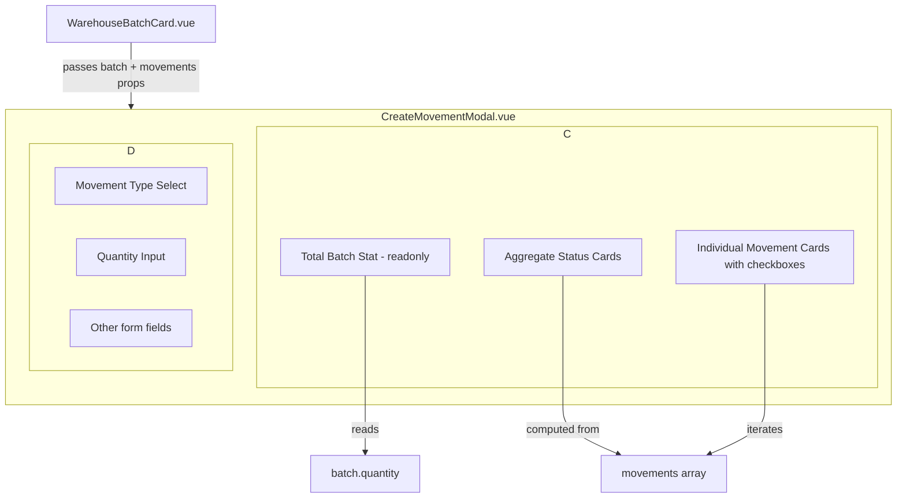

# Enhance Movement Modal with Batch Summary & Movement Cards

## Problem

Currently, the "Add Movement" modal (opened from the batch card page at `/admin/warehouse/batches/whb-001`) only shows a simple quantity input field. The user has **no visibility** into what's currently happening with the batch — how much is already sold, scrapped, in stock, reserved, etc. This makes it hard to make informed decisions about new movements.

## Proposed Solution

Add a **batch summary section** at the top of the modal that shows:

1. **Total quantity in batch** (read-only) — so the user always knows the full batch size.
2. **Aggregated status cards** — small visual cards showing how much is in each state (in stock, sold, scrapped, reserved, etc.).
3. **Individual movement cards** — one card per existing movement, each selectable via checkbox, so the user can visually see which specific movements they're working with.

---

## Design Details

### Layout Structure (top to bottom)

```
┌─────────────────────────────────────────────────────┐
│  Modal Title: "Новое движение" / "New Movement"      │
├─────────────────────────────────────────────────────┤
│                                                       │
│  ┌─── Batch Summary ──────────────────────────────┐  │
│  │                                                  │  │
│  │  Total in batch: 1000 kg                        │  │
│  │  (read-only, always visible)                    │  │
│  │                                                  │  │
│  │  ┌──────────┐ ┌──────────┐ ┌──────────┐        │  │
│  │  │ В наличии │ │ Продано  │ │ В утиль  │        │  │
│  │  │   450 kg  │ │  300 kg  │ │  100 kg  │        │  │
│  │  └──────────┘ └──────────┘ └──────────┘        │  │
│  │                                                  │  │
│  │  ─── Individual Movements ───                   │  │
│  │                                                  │  │
│  │  ☑ Продажа #1 — 200 kg        [→ карточка]     │  │
│  │  ☑ Продажа #2 — 100 kg        [→ карточка]     │  │
│  │  ☐ Списание — 100 kg          [→ карточка]     │  │
│  │  ☐ Перемещение — 50 kg        [→ карточка]     │  │
│  │                                                  │  │
│  └──────────────────────────────────────────────────┘  │
│                                                       │
│  ─── Form fields (existing) ───                       │
│  [Movement type] [Quantity] [Unit price] ...          │
│                                                       │
│  [Cancel]  [Save]                                     │
└─────────────────────────────────────────────────────┘
```

### 1. Total Batch Quantity (Read-Only)

- Displayed as a prominent stat at the very top of the modal body.
- Shows: `{batch.quantity} {unit}` (e.g., "1000 kg").
- Style: large font, semi-transparent background, no border — informational only.
- Always visible regardless of batch status.

### 2. Aggregated Status Cards

Small cards (like mini-stat tiles) that summarize the batch's current state. Each card shows:
- **Label** (e.g., "В наличии", "Продано", "В утиль", "Зарезервировано")
- **Quantity** with unit
- **Color-coded border/background** for quick visual scanning

**How to calculate the aggregates:**

The modal receives the batch's `movements` array (already available from `useWarehouseBatch` composable). We compute aggregates from movements:

| Aggregate | Calculation |
|-----------|------------|
| **Total in stock** | `batch.quantityRemaining` (directly from batch data) |
| **Sold** | Sum of `quantity` where `type === 'sale'` |
| **Scrapped / Written off** | Sum of `quantity` where `type === 'write-off'` |
| **Used in production** | Sum of `quantity` where `type === 'production'` |
| **Expensed** | Sum of `quantity` where `type === 'expense'` |
| **Returned to supplier** | Sum of `quantity` where `type === 'return-to-supplier'` |
| **Transferred** | Sum of `quantity` where `type === 'transfer'` |
| **Returned** | Sum of `quantity` where `type === 'return'` (adds back) |
| **Corrected** | Sum of `quantity` where `type === 'correction'` |

**Display logic:** Only show cards that have `quantity > 0`. If a category has 0, hide it to keep the UI clean.

**Color mapping for cards:**

| Type | Color |
|------|-------|
| In stock (remaining) | `#52c41a` (green) |
| Sold | `#1890ff` (blue) |
| Scrapped / Write-off | `#ff4d4f` (red) |
| Production | `#faad14` (yellow/amber) |
| Expense | `#ff7a45` (orange) |
| Return to supplier | `#f5222d` (dark red) |
| Transfer | `#722ed1` (purple) |
| Return (inbound) | `#13c2c2` (teal) |
| Correction | `#eb2f96` (pink) |

### 3. Individual Movement Cards (Selectable)

Below the aggregated cards, show a **scrollable list** of individual movement cards. Each card represents one existing movement for this batch.

**Each movement card shows:**
- **Checkbox** (left side) — for selecting which movements the user wants to reference
- **Movement type** (with color dot matching the aggregated card colors)
- **Quantity** with unit
- **Date** (short format)
- **Reference** (if any)
- **Link to movement card** — external-link icon on the right side; clicking it opens the full movement card page in a new tab/navigation

**Interaction:**
- **Click on the card body** (anywhere except the link) → toggles the checkbox
- **Click on the external-link icon** → opens the movement card page (does NOT toggle checkbox)
- This way the user can both select movements for visual tracking AND open any movement to see details

**Checkbox behavior:**
- Checkboxes are **purely informational/visual** for now — they help the user track which movements they're considering when creating a new one.
- They do NOT affect the form submission logic (no batch operations yet).
- Multiple checkboxes can be selected.
- A "Select All" / "Deselect All" toggle at the top of the list.

**Empty state:** If there are no movements yet, show a simple message: "No movements recorded for this batch yet."

### 4. Scroll Behavior

The batch summary section (total + aggregated cards + movement cards) should be **scrollable independently** from the form fields below. The form fields (movement type, quantity, etc.) remain fixed at the bottom.

**Layout approach:**
- Modal size: `large` (wider than current `medium`)
- The modal body is split into two sections:
  - **Top:** Batch summary (scrollable, max-height ~300px)
  - **Bottom:** Form fields (always visible, no scroll)

---

## Implementation Plan

### Files to modify:

1. **`frontend_vue/src/views/admin/warehouse/CreateMovementModal.vue`**
   - Change modal size from `medium` to `large`
   - Add `batch` and `movements` props (passed from parent)
   - Add computed aggregates from movements
   - Add the batch summary section at the top
   - Add aggregated status cards
   - Add individual movement cards with checkboxes
   - Add scrollable container for the summary section

2. **`frontend_vue/src/views/admin/warehouse/WarehouseBatchCard.vue`**
   - Pass `batch` and `movements` to `CreateMovementModal`
   - The modal is already opened from this component

3. **`frontend_vue/src/i18n/admin/warehouse.ts`**
   - Add new i18n keys for the summary section labels

4. **`frontend_vue/src/styles/admin/components/_forms.css`** (or a new CSS file)
   - Add styles for:
     - `.batch-summary-section` — the scrollable container
     - `.batch-total-stat` — the total quantity display
     - `.aggregate-cards` — flex container for status cards
     - `.aggregate-card` — individual status card
     - `.movement-card-list` — container for movement cards
     - `.movement-select-card` — individual selectable movement card
     - `.movement-card-checkbox` — checkbox styling

### New i18n keys needed:

```typescript
// Russian
batch_summary_total: 'Всего в партии: {quantity} {unit}'
batch_summary_in_stock: 'В наличии'
batch_summary_sold: 'Продано'
batch_summary_scrapped: 'В утиль'
batch_summary_production: 'В производстве'
batch_summary_expensed: 'Израсходовано'
batch_summary_returned_to_supplier: 'Возвращено поставщику'
batch_summary_transferred: 'Перемещено'
batch_summary_returned: 'Возвращено на склад'
batch_summary_corrected: 'Скорректировано'
batch_summary_no_movements: 'По партии ещё нет движений'
batch_summary_select_all: 'Выбрать все'
batch_summary_deselect_all: 'Снять все'
```

### Data flow:

```
WarehouseBatchCard.vue
  │
  ├── batch (WarehouseBatch) ──────────┐
  ├── movements (MovementListItem[]) ───┤
  │                                    │
  ▼                                    ▼
CreateMovementModal.vue
  │
  ├── Props: batch, movements
  ├── Computed: aggregates from movements
  ├── State: selectedMovementIds (Set<string>)
  │
  └── Template:
      ├── Batch Summary (scrollable)
      │   ├── Total stat
      │   ├── Aggregate cards
      │   └── Movement cards with checkboxes
      └── Form fields (existing)
```

### Component template structure (pseudocode):

```vue
<AppModal size="large" ...>
  <div class="modal-form">
    <!-- BATCH SUMMARY SECTION -->
    <div class="batch-summary-section">
      <!-- Total stat -->
      <div class="batch-total-stat">
        {{ t('warehouse.batch_summary_total', { quantity: batch.quantity, unit: unitLabel }) }}
      </div>

      <!-- Aggregate cards -->
      <div class="aggregate-cards">
        <div v-for="agg in visibleAggregates" :key="agg.type"
             class="aggregate-card"
             :style="{ borderLeftColor: agg.color }">
          <span class="aggregate-card-label">{{ agg.label }}</span>
          <span class="aggregate-card-value">{{ agg.quantity }} {{ unitLabel }}</span>
        </div>
      </div>

      <!-- Individual movement cards -->
      <div class="movement-cards-header">
        <span class="movement-cards-title">
          {{ t('warehouse.section_batch_movements') }}
        </span>
        <button class="btn btn-ghost btn-sm" @click="toggleSelectAll">
          {{ allSelected ? t('warehouse.batch_summary_deselect_all') : t('warehouse.batch_summary_select_all') }}
        </button>
      </div>

      <div v-if="movements.length" class="movement-card-list">
        <label v-for="movement in movements" :key="movement.id"
               class="movement-select-card"
               :class="{ selected: selectedMovementIds.has(movement.id) }">
          <input type="checkbox"
                 :checked="selectedMovementIds.has(movement.id)"
                 @change="toggleMovement(movement.id)"
                 class="movement-card-checkbox" />
          <span class="movement-card-type-dot"
                :style="{ background: movementTypeColor(movement.type) }">
          </span>
          <span class="movement-card-info">
            <span class="movement-card-type">
              {{ t(`warehouse.movement_type_${movement.type}`) }}
            </span>
            <span class="movement-card-qty">
              {{ movement.quantity }} {{ t(`warehouse.unit_${movement.unit}`) }}
            </span>
            <span class="movement-card-date">
              {{ movement.movedAt.slice(0, 10) }}
            </span>
          </span>
          <router-link
            v-tooltip="t('warehouse.open_movement_card')"
            :to="{ name: 'admin-warehouse-movement', params: { id: movement.id } }"
            class="action-icon-btn"
            @click.stop
          >
            <SvgIcon name="external-link" :width="14" :height="14" />
          </router-link>
        </label>
      </div>
      <p v-else class="text-muted">
        {{ t('warehouse.batch_summary_no_movements') }}
      </p>
    </div>

    <!-- FORM FIELDS (existing, unchanged) -->
    <div class="batch-form-fields">
      <!-- Movement type, quantity, etc. -->
    </div>
  </div>

  <template #footer>
    <!-- existing buttons -->
  </template>
</AppModal>
```

---

## Future Considerations (not in scope now)

- **Pre-selecting movements:** When creating a "correction" or "write-off", the user might want to pre-select specific movements to correct. This could auto-fill the quantity.
- **Bulk operations:** Selecting multiple movements and performing an action on all of them (e.g., "reverse selected").
- **Filtering movements:** Add a search/filter within the movement list if there are many movements.

---

## Mermaid Diagram: Component Architecture



---

## Steps to Implement

1. Add new i18n keys for batch summary labels (ru, en, lt)
2. Add CSS styles for the new components
3. Update `CreateMovementModal.vue`:
   - Accept `batch` and `movements` as props
   - Add computed aggregates
   - Add movement selection state
   - Add the batch summary template
   - Change modal size to `large`
4. Update `WarehouseBatchCard.vue`:
   - Pass `batch` and `movements` to the modal
5. Test all states: empty movements, many movements, various movement types
