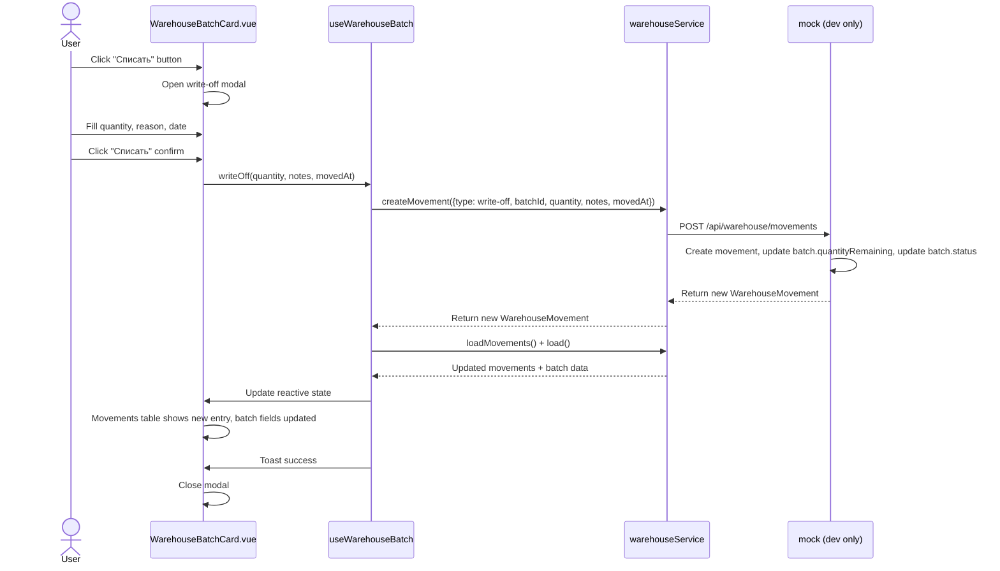

# Plan: Implement Write-Off (Списание в утиль) in Batch Card

## Overview

Add **scrap write-off** (списание в утиль) functionality to the batch card (`WarehouseBatchCard.vue`). This covers only non-order write-offs: **defect (брак), damage (повреждение), expiration (истечение срока)**. Sale and reservation are handled in the Orders module and are NOT part of this feature.

When a write-off is performed:
1. A new movement of type `'write-off'` is created via the existing `createMovement()` API
2. The movement immediately appears in the movements section (already auto-refreshes via `loadMovements()`)
3. The batch's `quantityRemaining` is reduced accordingly (handled server-side / mock-side in `mockCreateMovement`)
4. The batch status auto-updates to `'partial'` or `'depleted'` based on remaining quantity (already handled in mock)

## Current State Analysis

### What already exists:

| Aspect | Status |
|--------|--------|
| `MovementType` includes `'write-off'` | ✅ Already in types (`'receipt' \| 'expense' \| 'transfer' \| 'write-off'`) |
| `createMovement()` service function | ✅ Already exists in `warehouseService.ts` |
| `mockCreateMovement()` handles `'write-off'` type | ✅ Already updates `quantityRemaining` and batch status |
| Movements section in batch card | ✅ Already exists, auto-refreshes via `loadMovements()` |
| `useWarehouseBatch` composable | ✅ Exposes `movements`, `movementsLoading`, `loadMovements()` |
| `MovementCreatePayload` type | ✅ Supports all needed fields (type, batchId, quantity, notes, movedAt) |
| i18n keys for movement type `'write-off'` | ✅ `movement_type_write_off` exists in all 3 locales |
| i18n hint for write-off reason | ✅ `movement_type_hint_write_off` exists in all 3 locales |

### What's missing:

| Aspect | Status |
|--------|--------|
| UI button / trigger for write-off in batch card | ❌ Not present |
| Write-off modal/form (quantity, reason/notes, date) | ❌ Not present |
| Integration: after write-off → refresh movements + batch data | ❌ Not wired up |
| i18n keys for write-off UI (button, modal title, etc.) | ❌ Not present |

## Business Logic Rules

1. **Scoped to scrap only**: Write-off in batch card is ONLY for списание в утиль (defect, damage, expiration). Sale and reservation happen in Orders.
2. **Full write-off**: If quantity = `quantityRemaining`, the batch status becomes `'depleted'`
3. **Partial write-off**: If quantity < `quantityRemaining`, the batch status becomes `'partial'` (if it was `'available'`) or stays as is
4. **Validation**: Quantity must be > 0 and ≤ `quantityRemaining`
5. **Movement visibility**: The new movement appears immediately in the movements table (sorted by date desc, newest first)
6. **No location change**: Write-off doesn't change location, so `fromLocation`/`toLocation` are not needed

## Proposed Solution

### UI Placement

The write-off trigger is placed in the **movements section header** of the batch card, as a small button — similar to how the offcuts section has a "New Offcut" button:

```
┌─────────────────────────────────────────────────────────────┐
│  Движения по партии                          [✏️ Списать]   │
├─────────────────────────────────────────────────────────────┤
│  ... movements table ...                                    │
└─────────────────────────────────────────────────────────────┘
```

### Write-off Modal

A simple modal form with:

```
┌─ Списание товара ──────────────────────────────────┐
│                                                     │
│  Партия: BATCH-001 — Сталь листовая 2мм             │
│  Доступно: 500 кг                                   │
│                                                     │
│  Количество *  ┌─────────────────────┐              │
│                │      100            │  кг           │
│                └─────────────────────┘              │
│                                                     │
│  Причина       ┌─────────────────────┐              │
│                │  Брак при раскрое   │              │
│                └─────────────────────┘              │
│                                                     │
│  Дата          ┌─────────────────────┐              │
│                │  2026-05-28         │              │
│                └─────────────────────┘              │
│                                                     │
│        [Отмена]              [Списать]              │
└─────────────────────────────────────────────────────┘
```

### Data Flow

```
User clicks "Списать" button
  → Write-off modal opens
  → User enters quantity, reason, date
  → User clicks "Списать" confirm
  → handleWriteOff() / writeOff() called
    → createMovement({ type: 'write-off', batchId, quantity, notes, movedAt })
      → mockCreateMovement() in mock:
        - Creates movement record
        - Updates batch.quantityRemaining
        - Updates batch.status (partial/depleted)
    → loadMovements() — refreshes movements table
    → load() — refreshes batch data (quantityRemaining, status)
    → Toast success
  → Modal closes
  → Movements section shows new write-off entry immediately
```

### Sequence Diagram



## Changes Required

### 1. Add i18n keys

**File: [`frontend_vue/src/i18n/admin/warehouse.ts`](frontend_vue/src/i18n/admin/warehouse.ts)**

Add in all 3 locales (ru, en, lt):

| Key | ru | en | lt |
|-----|----|----|----|
| `write_off_title` | Списание товара | Write-off Goods | Prekių nurašymas |
| `write_off_btn` | Списать | Write-off | Nurašyti |
| `write_off_quantity` | Количество | Quantity | Kiekis |
| `write_off_reason` | Причина списания | Write-off Reason | Nurašymo priežastis |
| `write_off_reason_placeholder` | Например, брак, повреждение... | e.g., defect, damage... | Pvz., brokas, pažeidimas... |
| `write_off_available` | Доступно: {quantity} {unit} | Available: {quantity} {unit} | Prieinama: {quantity} {unit} |
| `write_off_confirm` | Списать {quantity} {unit}? | Write off {quantity} {unit}? | Nurašyti {quantity} {unit}? |
| `toast_write_off_success` | Товар списан | Goods written off | Prekės nurašytos |
| `write_off_quantity_exceeds` | Количество превышает доступный остаток ({max}) | Quantity exceeds available remaining ({max}) | Kiekis viršija turimą likutį ({max}) |

### 2. Add `writeOff()` method to composable

**File: [`frontend_vue/src/composables/useWarehouseBatch.ts`](frontend_vue/src/composables/useWarehouseBatch.ts)**

- `createMovement` is already imported at line 4
- Add `writeOffSaving` ref
- Add `writeOff()` async method:

```ts
const writeOffSaving = ref(false)

async function writeOff(quantity: number, notes: string | null, movedAt: string) {
  if (!batch.value) return
  writeOffSaving.value = true
  try {
    await createMovement({
      type: 'write-off',
      batchId: batch.value.id,
      quantity,
      notes,
      movedAt,
    })
    await Promise.all([loadMovements(), load()])
    toast.success(t('warehouse.toast_write_off_success'))
    return true
  } catch {
    toast.error(t('warehouse.toast_error_save'))
    return false
  } finally {
    writeOffSaving.value = false
  }
}
```

- Expose `writeOff` and `writeOffSaving` in the return object

### 3. Add write-off button and modal to batch card template

**File: [`frontend_vue/src/views/admin/warehouse/WarehouseBatchCard.vue`](frontend_vue/src/views/admin/warehouse/WarehouseBatchCard.vue)**

#### a) In `<script setup>`:
- Import `ref`, `computed` from vue (already imported)
- Add reactive state:
  - `showWriteOffModal = ref(false)`
  - `writeOffQuantity = ref<number | null>(null)`
  - `writeOffReason = ref('')`
  - `writeOffDate = ref(new Date().toISOString().slice(0, 10))`
- Add computed `writeOffQuantityError` that validates:
  - Must be > 0
  - Must be ≤ `batch.value.quantityRemaining`
- Add `handleWriteOff()` async function:
  1. Validates quantity
  2. Calls `writeOff()` from composable
  3. On success: closes modal, resets form
  4. On failure: shows error (already handled in composable)

#### b) In `<template>`:
- **Movements section header**: Add `<template #header>` to the movements `GlassPanel` with a "Списать" button (same pattern as offcuts section at line 722)
- **Write-off modal**: Add `AppModal` at the bottom of the template with:
  - Modal title: `t('warehouse.write_off_title')`
  - Batch info: batch number + product name
  - Available quantity display
  - Quantity input (number, required)
  - Reason textarea (optional)
  - Date input (date type, defaults to today)
  - Footer with Cancel and Confirm buttons
  - Confirm button disabled when quantity is invalid or saving

### 4. Button visibility

The "Списать" button should only be visible when:
- Batch is loaded (`batch.value` exists)
- Batch status is `'available'` or `'partial'` (not already `'depleted'`)
- `quantityRemaining > 0`

## Files to Modify

| # | File | Change |
|---|------|--------|
| 1 | [`frontend_vue/src/i18n/admin/warehouse.ts`](frontend_vue/src/i18n/admin/warehouse.ts) | Add write-off i18n keys (ru, en, lt) |
| 2 | [`frontend_vue/src/composables/useWarehouseBatch.ts`](frontend_vue/src/composables/useWarehouseBatch.ts) | Add `writeOff()` method and `writeOffSaving` ref, expose them |
| 3 | [`frontend_vue/src/views/admin/warehouse/WarehouseBatchCard.vue`](frontend_vue/src/views/admin/warehouse/WarehouseBatchCard.vue) | Add write-off button in movements header, add write-off modal, wire up logic |

## Testing Notes

1. **Partial write-off**: Write off 100 kg from a batch with 500 kg remaining → verify movement created, batch shows 400 kg remaining, status = `'partial'`
2. **Full write-off**: Write off all remaining quantity → verify batch status = `'depleted'`
3. **Validation**: Try to write off more than available → error message shown, confirm button disabled
4. **Movement visibility**: New movement appears at top of movements table (sorted by date desc)
5. **Batch data refresh**: `quantityRemaining` and status fields update immediately after write-off
6. **Button visibility**: Button hidden when batch status is `'depleted'` or `quantityRemaining` = 0
7. **Offcut card**: No changes needed — write-off is batch-level only for now
5. **Batch data refresh**: `quantityRemaining` and status fields update immediately after write-off
6. **Offcut card**: No changes needed — write-off is batch-level only for now
