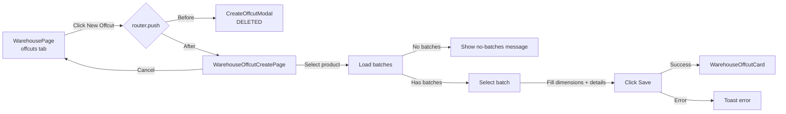
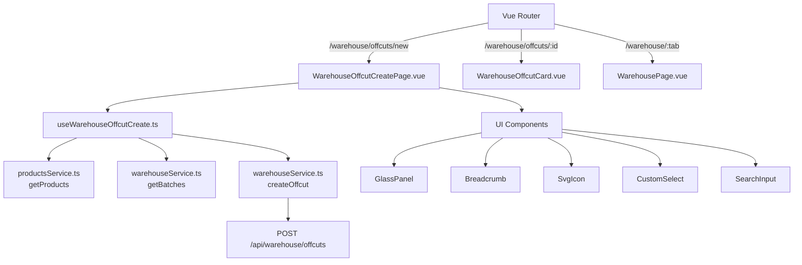

# Plan: New Offcut Creation Page

## Goal

Replace the current modal-based offcut creation (`CreateOffcutModal.vue`) with a dedicated page (`WarehouseOffcutCreatePage.vue`), following the same pattern as the existing offcut card page (`WarehouseOffcutCard.vue`) but with empty form fields and placeholders.

## Background

Currently, the "New Offcut" button in the Warehouse page's offcuts tab opens a modal (`CreateOffcutModal.vue`) that implements a **cutting operation** — it requires selecting a source batch, specifying source quantity, kerf width, waste, and then adding offcuts. This is a complex operation for production cutting.

The user wants a simpler **direct offcut creation** page, similar to how suppliers have both a card page (`SupplierCardPage.vue`) and a create page (`SupplierCreatePage.vue`). The new page should:
- Be a full-page view (not a modal)
- Have all fields empty (with placeholders)
- Use `OffcutCreatePayload` (direct creation via `POST /api/warehouse/offcuts`)
- Follow the same 3-column layout as `WarehouseOffcutCard.vue`

## Key Design Decisions (from user feedback)

### Product & Batch Selection
- **Single product selection** via radio buttons (not checkboxes), with search and category filter — similar to BCC Request's product table but single-select
- **Batch selection** appears below the product, filtered by the selected product
- If the selected product has **no batches in stock**, show a message: "Cannot create an offcut for a product that is not in stock"
- The batch list should also be searchable/filterable

### Remove CreateOffcutModal.vue
- The old cutting modal is no longer needed and should be deleted

## Architecture

### Data Flow

```
User clicks "New Offcut" button
  → router.push({ name: 'admin-warehouse-offcut-create' })
  → WarehouseOffcutCreatePage.vue mounts
  → useWarehouseOffcutCreate composable initializes empty form
  → useProducts() composable loads products with search + category filter
  → User selects a product (radio button)
  → Batches for that product are loaded via getBatches({ productId })
  → User selects a batch (radio button)
  → User fills in dimensions, quantity, location, notes
  → User clicks "Save"
  → composable calls createOffcut(payload) → POST /api/warehouse/offcuts
  → On success: router.push({ name: 'admin-warehouse-offcut', params: { id } })
  → On error: show toast error
```

### Route Structure

```
warehouse/offcuts/new  →  WarehouseOffcutCreatePage.vue  (name: admin-warehouse-offcut-create)
warehouse/offcuts/:id  →  WarehouseOffcutCard.vue        (name: admin-warehouse-offcut)
```

## Files to Create

### 1. `frontend_vue/src/composables/useWarehouseOffcutCreate.ts`

New composable for the create page.

**State:**
- `form`: reactive object with all `OffcutCreatePayload` fields (empty defaults)
- `saving`: ref<boolean>
- `error`: ref<string | null>
- `products`: ref<ProductListItem[]> — loaded products list
- `batches`: ref<BatchListItem[]> — batches for selected product
- `productSearch`: ref<string>
- `productCategoryFilter`: ref<string>
- `categories`: ref from useProducts or similar
- `selectedProductId`: ref<string | null>
- `selectedBatchId`: ref<string | null>
- `noBatchesMessage`: computed — shows if product selected but no batches

**Methods:**
- `loadProducts()`: fetches products with search + category filter
- `loadBatches(productId)`: fetches batches for selected product
- `save()`: validates form, calls `createOffcut(form)`, returns created offcut or null
- `reset()`: resets form to empty defaults

### 2. `frontend_vue/src/views/admin/warehouse/WarehouseOffcutCreatePage.vue`

New page component.

**Layout:**

```
┌─────────────────────────────────────────────────────────────┐
│ Breadcrumb: Warehouse > Offcuts > New Offcut                │
├─────────────────────────────────────────────────────────────┤
│ [Cancel]  [Create Offcut]                                   │
├─────────────────────────────────────────────────────────────┤
│                                                             │
│  ┌─ Product & Batch Selection ──────────────────────────┐  │
│  │  [SearchInput]  [CategoryFilter ▼]                    │  │
│  │                                                       │  │
│  │  ┌─ Category Name ───────────────────────────────┐   │  │
│  │  │ ○ Product A                                    │   │  │
│  │  │ ○ Product B                                    │   │  │
│  │  └────────────────────────────────────────────────┘   │  │
│  │  ...pagination...                                     │  │
│  │                                                       │  │
│  │  ── Selected Product Batches ──                       │  │
│  │  [SearchInput]                                        │  │
│  │  ○ Batch #12345 (100 kg remaining)                    │  │
│  │  ○ Batch #12346 (50 kg remaining)                     │  │
│  │  OR: "No batches in stock for this product"           │  │
│  └───────────────────────────────────────────────────────┘  │
│                                                             │
│  ┌─ Dimensions ───────────┐  ┌─ Details ────────────────┐  │
│  │ Length [___] mm        │  │ Quantity [1]             │  │
│  │ Width  [___] mm        │  │ Unit     [pcs ▼]         │  │
│  │ Thick  [___] mm        │  │ Location [___________]   │  │
│  │ Weight [___] kg        │  │ Notes    [___________]   │  │
│  └────────────────────────┘  └──────────────────────────┘  │
└─────────────────────────────────────────────────────────────┘
```

**Key UI patterns:**
- Product selection uses radio buttons (single select) in a table/list with search + category filter (like BCC Request but single-select)
- Batch selection uses radio buttons, filtered by selected product
- Dimensions and details follow the same `entity-card-grid` 3-column layout as `WarehouseOffcutCard.vue`

### 3. Feature Flag: `warehouseOffcutCreate`

Add to:
- `frontend_vue/src/types/features.ts` — add `warehouseOffcutCreate: boolean`
- `frontend_vue/src/config/featureFlags.ts` — add `warehouseOffcutCreate: true`

## Files to Modify

### 4. `frontend_vue/src/router/index.ts`

Add new route BEFORE the `warehouse/offcuts/:id` route:
```ts
{
  path: 'warehouse/offcuts/new',
  name: 'admin-warehouse-offcut-create',
  component: () => import('@/views/admin/warehouse/WarehouseOffcutCreatePage.vue'),
  meta: { layout: 'admin', featureFlag: 'warehouseOffcutCreate' as FeatureFlagKey },
}
```

### 5. `frontend_vue/src/i18n/admin/warehouse.ts`

Add i18n keys for the create page (in ru, en, lt):

| Key | RU | EN | LT |
|---|---|---|---|
| `offcut_create_title` | Новый обрезок | New Offcut | Nauja atraiža |
| `offcut_create_save` | Создать обрезок | Create Offcut | Sukurti atraižą |
| `offcut_create_cancel` | Отмена | Cancel | Atšaukti |
| `offcut_create_select_product` | Выберите товар | Select product | Pasirinkite prekę |
| `offcut_create_select_batch` | Выберите партию | Select batch | Pasirinkite partiją |
| `offcut_create_no_batches` | Нет партий в наличии для этого товара | No batches in stock for this product | Šiai prekei nėra partijų sandėlyje |
| `offcut_create_no_batches_hint` | Нельзя создать обрезок для товара, которого нет на складе | Cannot create an offcut for a product that is not in stock | Negalima sukurti atraižos prekei, kurios nėra sandėlyje |
| `offcut_create_search_product` | Поиск товаров... | Search products... | Ieškoti prekių... |
| `offcut_create_search_batch` | Поиск партий... | Search batches... | Ieškoti partijų... |
| `offcut_create_all_categories` | Все категории | All categories | Visos kategorijos |
| `field_length_placeholder` | 0 | 0 | 0 |
| `field_width_placeholder` | 0 | 0 | 0 |
| `field_thickness_placeholder` | 0 | 0 | 0 |
| `field_weight_placeholder` | 0.0 | 0.0 | 0.0 |
| `field_quantity_placeholder` | 1 | 1 | 1 |
| `field_location_placeholder` | Ячейка / стеллаж... | Cell / shelf... | Ląstelė / lentyna... |
| `field_notes_placeholder` | Примечания... | Notes... | Pastabos... |
| `toast_offcut_created` | Обрезок создан | Offcut created | Atraiža sukurta |
| `toast_offcut_create_error` | Ошибка при создании обрезка | Error creating offcut | Klaida kuriant atraižą |

### 6. `frontend_vue/src/views/admin/warehouse/WarehousePage.vue`

Change the "New Offcut" button from opening the modal to navigating to the new page:

```vue
<!-- Before -->
@click="showCreateOffcutModal = true"

<!-- After -->
@click="router.push({ name: 'admin-warehouse-offcut-create' })"
```

Also remove the `<CreateOffcutModal>` component and its `showCreateOffcutModal` ref from the template and script.

### 7. Delete `frontend_vue/src/views/admin/warehouse/CreateOffcutModal.vue`

The cutting modal is no longer needed.

## Implementation Order

1. Add feature flag `warehouseOffcutCreate` to types and config
2. Create `useWarehouseOffcutCreate` composable
3. Create `WarehouseOffcutCreatePage.vue`
4. Add route to router
5. Add i18n keys
6. Update `WarehousePage.vue` — change button, remove modal
7. Delete `CreateOffcutModal.vue`

## Mermaid Diagram: Navigation Flow



## Mermaid Diagram: Component Architecture



## Testing Notes

- The new page should have `data-test` attributes for E2E tests
- Existing E2E tests that click "New Offcut" button may need updating
- The `warehouse.spec.ts` E2E test file should be checked for offcut creation tests
- Test the flow: select product → select batch → fill dimensions → save → redirect to card
- Test edge case: select product with no batches → see "no batches" message
