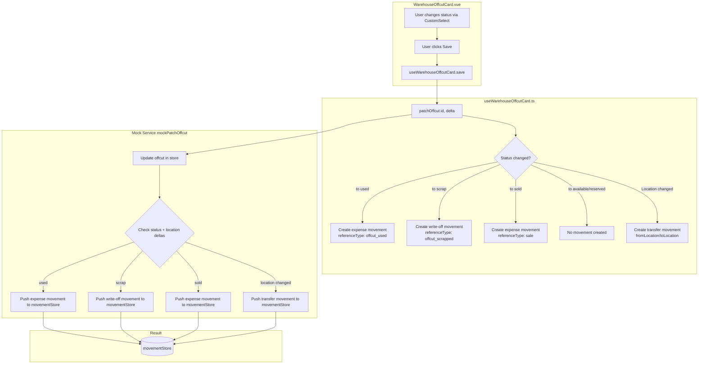

# Plan: Verify and Implement Offcut Movements

## Overview

Analyse and implement all warehouse movements related to offcuts (обрезки). The goal is to verify existing movement logic and implement missing ones.

## Current State Analysis

### Movement Types (from [`MovementType`](frontend_vue/src/types/warehouse.ts:7))

| Type | Purpose |
|------|---------|
| `receipt` | Поступление |
| `expense` | Расход |
| `transfer` | Перемещение |
| `write-off` | Списание |

### Offcut Statuses (from [`OffcutStatus`](frontend_vue/src/types/warehouse.ts:13))

| Status | Meaning |
|--------|---------|
| `available` | В наличии |
| `reserved` | Зарезервировано |
| `used` | Использован |
| `scrap` | В утиль |

Note: `sold` status exists in i18n keys (`offcut_status_sold`) and in [`AUDIT_ENUM_MAP`](frontend_vue/src/views/admin/warehouse/WarehouseOffcutCard.vue:106) but is **NOT** in the [`OffcutStatus`](frontend_vue/src/types/warehouse.ts:13) type definition.

### Movement Model Limitation

[`WarehouseMovement`](frontend_vue/src/types/warehouse.ts:204-235) and [`MovementCreatePayload`](frontend_vue/src/types/warehouse.ts:253-265) have **no `offcutId` field** — movements are linked only to `batchId`. All offcut movements are indirect (reference the source batch).

---

## Task 1: Verify Cutting Operation (Резка материала)

**Current implementation**: [`mockExecuteCutting()`](frontend_vue/src/services/mocks/warehouse.ts:807-871)

### What to verify:

1. **Source batch quantity reduced** ✅ — Line 814: `batch.quantityRemaining = Math.max(0, batch.quantityRemaining - data.sourceQuantity)`
2. **Batch status updated** ✅ — Lines 815-816: sets `depleted` or `partial`
3. **Offcuts created** ✅ — Lines 820-842: creates `WarehouseOffcut[]` with status `available`
4. **Expense movement created** ✅ — Lines 847-868: creates movement with `type: 'expense'`, `referenceType: 'cutting'`
5. **Waste quantity returned** ✅ — Line 870: returns `wasteQuantity`

**UI**: There is NO cutting modal/UI component in the batch card (`WarehouseBatchCard.vue`). The cutting operation is only accessible via the API (`POST /api/warehouse/cutting`). The i18n key `modal_cutting_title` exists but no modal uses it.

### Actions:
- [ ] **1.1** — Verify the cutting API endpoint is wired in [`services/mocks/index.ts`](frontend_vue/src/services/mocks/index.ts:474)
- [ ] **1.2** — Check if there's a UI button/modal to trigger cutting from the batch card (currently missing)
- [ ] **1.3** — Verify the expense movement references the correct batch and has `referenceType: 'cutting'`

---

## Task 2: Verify Transfer Movement on Location Change (Перемещение при смене локации)

**Current implementation**: Already implemented in both composable and mock.

### What to verify:

1. **Composable**: [`useWarehouseOffcutCard.save()`](frontend_vue/src/composables/useWarehouseOffcutCard.ts:138-154) — captures old location, compares after patch, calls `createMovement({ type: 'transfer', ... })`
2. **Mock**: [`mockPatchOffcut()`](frontend_vue/src/services/mocks/warehouse.ts:610-635) — creates transfer movement in `movementStore` when location changes
3. **i18n**: Keys `movement_auto_location_change`, `toast_movement_auto_created`, `toast_movement_auto_failed` exist in all 3 languages

### Actions:
- [ ] **2.1** — Verify the movement is created with correct `fromLocation` / `toLocation`
- [ ] **2.2** — Verify the movement references the offcut's source batch (`offcut.batchId`)
- [ ] **2.3** — Verify edge cases: first-time location set (null → value), location cleared (value → null)

---

## Task 3: Implement Expense Movement on Status Change to `used` (Расход при использовании)

**Current state**: NOT implemented. Changing status to `used` via [`patchOffcut()`](frontend_vue/src/services/warehouseService.ts:126-131) only updates the status field. No movement is created.

### Implementation:

**3a. Update [`mockPatchOffcut()`](frontend_vue/src/services/mocks/warehouse.ts:581-638)**

After updating status, if `data.status === 'used'` and old status was not `'used'`, create an `expense` movement:

```typescript
// In mockPatchOffcut(), after status update:
if (data.status === 'used' && offcut.status !== 'used') {
  const now = new Date().toISOString()
  movementStore.push({
    id: `whm-${String(movementSeq++).padStart(3, '0')}`,
    type: 'expense',
    batchId: offcut.batchId,
    batchNumber: offcut.batchNumber,
    productId: offcut.productId,
    productName: offcut.productName,
    quantity: offcut.quantity,
    unit: offcut.unit,
    unitPrice: 0,
    totalCost: 0,
    referenceId: offcut.id,
    referenceType: 'offcut_used',
    fromLocation: offcut.location,
    toLocation: null,
    performedBy: null,
    notes: 'Offcut used in production',
    movedAt: now,
    createdAt: now,
    auditLog: [],
  })
}
```

**3b. Add i18n keys** (if needed):
- `movement_offcut_used` — 'Обрезок использован в производстве' / 'Offcut used in production' / 'Atraiža panaudota gamyboje'

### Actions:
- [ ] **3.1** — Add expense movement creation in [`mockPatchOffcut()`](frontend_vue/src/services/mocks/warehouse.ts) when status changes to `used`
- [ ] **3.2** — Add i18n keys for the auto-created movement note

---

## Task 4: Implement Write-off Movement on Status Change to `scrap` (Списание при утилизации)

**Current state**: NOT implemented. Changing status to `scrap` only updates the status field.

### Implementation:

**4a. Update [`mockPatchOffcut()`](frontend_vue/src/services/mocks/warehouse.ts:581-638)**

After updating status, if `data.status === 'scrap'` and old status was not `'scrap'`, create a `write-off` movement:

```typescript
// In mockPatchOffcut(), after status update:
if (data.status === 'scrap' && offcut.status !== 'scrap') {
  const now = new Date().toISOString()
  movementStore.push({
    id: `whm-${String(movementSeq++).padStart(3, '0')}`,
    type: 'write-off',
    batchId: offcut.batchId,
    batchNumber: offcut.batchNumber,
    productId: offcut.productId,
    productName: offcut.productName,
    quantity: offcut.quantity,
    unit: offcut.unit,
    unitPrice: 0,
    totalCost: 0,
    referenceId: offcut.id,
    referenceType: 'offcut_scrapped',
    fromLocation: offcut.location,
    toLocation: null,
    performedBy: null,
    notes: 'Offcut scrapped',
    movedAt: now,
    createdAt: now,
    auditLog: [],
  })
}
```

### Actions:
- [ ] **4.1** — Add write-off movement creation in [`mockPatchOffcut()`](frontend_vue/src/services/mocks/warehouse.ts) when status changes to `scrap`
- [ ] **4.2** — Add i18n keys for the auto-created movement note

---

## Task 5: Add `sold` Status and Implement Expense Movement on Sale (Расход при продаже)

**Current state**: `sold` status exists in i18n and audit enum map but is **NOT** in the [`OffcutStatus`](frontend_vue/src/types/warehouse.ts:13) type.

### Implementation:

**5a. Add `sold` to [`OffcutStatus`](frontend_vue/src/types/warehouse.ts:13)**

```typescript
export type OffcutStatus = 'available' | 'reserved' | 'used' | 'scrap' | 'sold'
```

**5b. Add `sold` to [`OFFCUT_STATUSES`](frontend_vue/src/views/admin/warehouse/WarehouseOffcutCard.vue:18-23)**

```typescript
const OFFCUT_STATUSES: Array<OffcutStatus> = [
  'available',
  'reserved',
  'used',
  'scrap',
  'sold',
]
```

**5c. Add `sold` to [`OFFCUT_STATUS_PILL`](frontend_vue/src/views/admin/warehouse/WarehouseOffcutCard.vue:56-61)**

```typescript
const OFFCUT_STATUS_PILL: Record<string, string> = {
  available: 'pill-success',
  reserved: 'pill-info',
  used: 'pill-secondary',
  scrap: 'pill-danger',
  sold: 'pill-warning', // or another appropriate style
}
```

**5d. Update [`mockPatchOffcut()`](frontend_vue/src/services/mocks/warehouse.ts:581-638)**

After updating status, if `data.status === 'sold'` and old status was not `'sold'`, create an `expense` movement with `referenceType: 'sale'`:

```typescript
if (data.status === 'sold' && offcut.status !== 'sold') {
  const now = new Date().toISOString()
  movementStore.push({
    id: `whm-${String(movementSeq++).padStart(3, '0')}`,
    type: 'expense',
    batchId: offcut.batchId,
    batchNumber: offcut.batchNumber,
    productId: offcut.productId,
    productName: offcut.productName,
    quantity: offcut.quantity,
    unit: offcut.unit,
    unitPrice: 0,
    totalCost: 0,
    referenceId: offcut.id,
    referenceType: 'sale',
    fromLocation: offcut.location,
    toLocation: null,
    performedBy: null,
    notes: 'Offcut sold',
    movedAt: now,
    createdAt: now,
    auditLog: [],
  })
}
```

**5e. Add i18n keys** (if missing):
- `offcut_status_sold` — already exists in all 3 languages ✅
- `offcut_status_hint_sold` — may need to add if missing

### Actions:
- [ ] **5.1** — Add `'sold'` to [`OffcutStatus`](frontend_vue/src/types/warehouse.ts:13)
- [ ] **5.2** — Add `'sold'` to [`OFFCUT_STATUSES`](frontend_vue/src/views/admin/warehouse/WarehouseOffcutCard.vue:18-23)
- [ ] **5.3** — Add `'sold'` to [`OFFCUT_STATUS_PILL`](frontend_vue/src/views/admin/warehouse/WarehouseOffcutCard.vue:56-61)
- [ ] **5.4** — Add expense movement creation in [`mockPatchOffcut()`](frontend_vue/src/services/mocks/warehouse.ts) when status changes to `sold`
- [ ] **5.5** — Verify/add i18n keys for `offcut_status_sold` and `offcut_status_hint_sold`

---

## Task 6: Consolidate Movement Creation Logic in `mockPatchOffcut`

**Current state**: The three new movement types (used, scrap, sold) will all be added in [`mockPatchOffcut()`](frontend_vue/src/services/mocks/warehouse.ts:581-638). This function already handles the transfer movement on location change.

**Refactoring suggestion**: Extract movement creation into a helper function to avoid duplication:

```typescript
function createOffcutMovement(
  offcut: WarehouseOffcut,
  type: MovementType,
  referenceType: string,
  notes: string,
): void {
  const now = new Date().toISOString()
  movementStore.push({
    id: `whm-${String(movementSeq++).padStart(3, '0')}`,
    type,
    batchId: offcut.batchId,
    batchNumber: offcut.batchNumber,
    productId: offcut.productId,
    productName: offcut.productName,
    quantity: offcut.quantity,
    unit: offcut.unit,
    unitPrice: 0,
    totalCost: 0,
    referenceId: offcut.id,
    referenceType,
    fromLocation: offcut.location,
    toLocation: null,
    performedBy: null,
    notes,
    movedAt: now,
    createdAt: now,
    auditLog: [],
  })
}
```

### Actions:
- [ ] **6.1** — Extract `createOffcutMovement()` helper in [`mockPatchOffcut()`](frontend_vue/src/services/mocks/warehouse.ts) to reduce duplication

---

## Files to Modify

| # | File | Change |
|---|------|--------|
| 1 | [`frontend_vue/src/types/warehouse.ts`](frontend_vue/src/types/warehouse.ts:13) | Add `'sold'` to `OffcutStatus` |
| 2 | [`frontend_vue/src/views/admin/warehouse/WarehouseOffcutCard.vue`](frontend_vue/src/views/admin/warehouse/WarehouseOffcutCard.vue:18-23) | Add `'sold'` to `OFFCUT_STATUSES` array |
| 3 | [`frontend_vue/src/views/admin/warehouse/WarehouseOffcutCard.vue`](frontend_vue/src/views/admin/warehouse/WarehouseOffcutCard.vue:56-61) | Add `'sold'` to `OFFCUT_STATUS_PILL` |
| 4 | [`frontend_vue/src/services/mocks/warehouse.ts`](frontend_vue/src/services/mocks/warehouse.ts:581-638) | Add movement creation for `used`, `scrap`, `sold` status changes; extract helper |
| 5 | [`frontend_vue/src/i18n/admin/warehouse.ts`](frontend_vue/src/i18n/admin/warehouse.ts) | Add any missing i18n keys for movement notes |

## Flow Diagram



## Edge Cases & Considerations

1. **Status already set**: If user saves without changing status, no movement should be created. The `dirty.diff()` already handles this.
2. **Multiple status changes**: Each save with a status change creates one movement. This is correct.
3. **Status + location change simultaneously**: Both movements should be created (transfer + expense/write-off/expense). The mock handles this since checks are independent.
4. **Reverting status**: If user changes `used` → `available`, no movement is created (only forward transitions create movements). This is intentional — you can't "un-use" an offcut.
5. **Sold status i18n**: Verify `offcut_status_hint_sold` exists in all 3 languages. Currently only `offcut_status_sold` exists.
