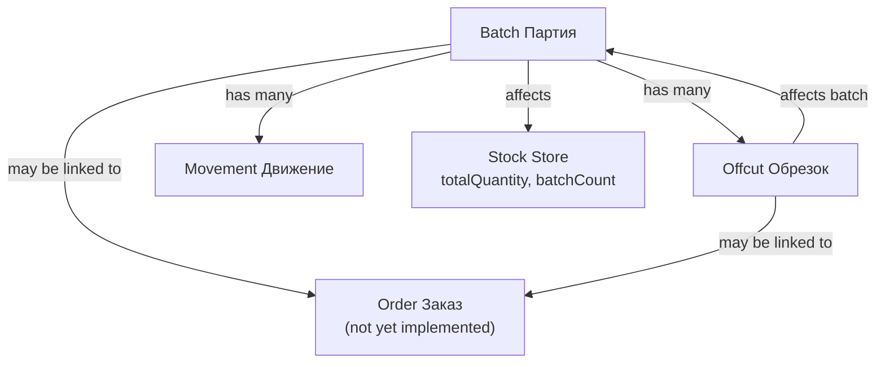

# Safe Cascade Deletion Plan

## Overview

Implement safe cascade deletion for warehouse entities (batches, offcuts) with order-link checks, cascade cleanup of related data, and stock store recalculation. The deletion must work both via API (server-side, backend not yet implemented) and via mock data (in-memory).

---

## Architecture

### Current State

| File | Role |
|------|------|
| [`frontend_vue/src/types/warehouse.ts`](../../frontend_vue/src/types/warehouse.ts) | Type definitions for all warehouse entities |
| [`frontend_vue/src/services/warehouseService.ts`](../../frontend_vue/src/services/warehouseService.ts) | API service layer (calls `apiDelete` etc.) |
| [`frontend_vue/src/services/mocks/warehouse.ts`](../../frontend_vue/src/services/mocks/warehouse.ts) | Mock in-memory stores and mock implementations |
| [`frontend_vue/src/composables/useWarehouseBatch.ts`](../../frontend_vue/src/composables/useWarehouseBatch.ts) | Batch card composable (has `remove()`) |
| [`frontend_vue/src/composables/useWarehouseOffcutCard.ts`](../../frontend_vue/src/composables/useWarehouseOffcutCard.ts) | Offcut card composable (has `remove()`) |
| [`frontend_vue/src/views/admin/warehouse/WarehouseBatchCard.vue`](../../frontend_vue/src/views/admin/warehouse/WarehouseBatchCard.vue) | Batch card view (delete modal at line 756) |
| [`frontend_vue/src/views/admin/warehouse/WarehouseOffcutCard.vue`](../../frontend_vue/src/views/admin/warehouse/WarehouseOffcutCard.vue) | Offcut card view (delete modal at line 544) |
| [`frontend_vue/src/views/admin/warehouse/WarehousePage.vue`](../../frontend_vue/src/views/admin/warehouse/WarehousePage.vue) | Warehouse list page (has inline delete at line 3196) |
| [`frontend_vue/src/i18n/admin/warehouse.ts`](../../frontend_vue/src/i18n/admin/warehouse.ts) | i18n translations |

### Data Relationships



---

## Implementation Plan

### Step 1: Add `orderId` / `orderRef` fields to types (for future order linking)

**Files to modify:**
- [`frontend_vue/src/types/warehouse.ts`](../../frontend_vue/src/types/warehouse.ts)

Add optional `orderId` field to `WarehouseBatch` and `WarehouseOffcut` interfaces so the system can check if an entity is linked to an order.

```typescript
// On WarehouseBatch
orderId: string | null  // Link to order if batch is reserved/allocated to an order

// On WarehouseOffcut
orderId: string | null  // Link to order if offcut is reserved for an order
```

Also add `orderId` to `BatchListItem` and `OffcutListItem`.

### Step 2: Add order-link mock data to some batches and offcuts

**Files to modify:**
- [`frontend_vue/src/mocks/warehouse-batches.ts`](../../frontend_vue/src/mocks/warehouse-batches.ts)
- [`frontend_vue/src/mocks/warehouse-offcuts.ts`](../../frontend_vue/src/mocks/warehouse-offcuts.ts)

Add `orderId: 'ord-001'` to 2-3 batches and 2-3 offcuts so the "linked to order" check can be demonstrated.

### Step 3: Update mock in-memory stores to include `orderId`

**Files to modify:**
- [`frontend_vue/src/services/mocks/warehouse.ts`](../../frontend_vue/src/services/mocks/warehouse.ts)

The mock data already imports from the mock files, so the `orderId` will flow through automatically. But we need to ensure the mock store types include it.

### Step 4: Enhance `mockDeleteBatch` with cascade logic

**Files to modify:**
- [`frontend_vue/src/services/mocks/warehouse.ts`](../../frontend_vue/src/services/mocks/warehouse.ts) — function `mockDeleteBatch` (line 346)

New logic:

```typescript
export async function mockDeleteBatch(id: string): Promise<void> {
  const batch = batchStore.find((b) => b.id === id)
  if (!batch) throw new Error('BATCH_NOT_FOUND')

  // 1. Check if batch is linked to any order
  if (batch.orderId) {
    throw new Error('BATCH_LINKED_TO_ORDER')
  }

  // 2. Find and remove related offcuts
  const relatedOffcuts = offcutStore.filter((o) => o.batchId === id)
  for (const offcut of relatedOffcuts) {
    if (offcut.orderId) {
      throw new Error('OFFCUT_LINKED_TO_ORDER')
    }
  }
  // Remove offcuts
  offcutStore = offcutStore.filter((o) => o.batchId !== id)

  // 3. Find and remove related movements
  movementStore = movementStore.filter((m) => m.batchId !== id)

  // 4. Recalculate stockStore
  recalculateStockForProduct(batch.productId)

  // 5. Remove the batch itself
  const idx = batchStore.findIndex((b) => b.id === id)
  batchStore.splice(idx, 1)
}
```

### Step 5: Enhance `mockDeleteOffcut` with cascade logic

**Files to modify:**
- [`frontend_vue/src/services/mocks/warehouse.ts`](../../frontend_vue/src/services/mocks/warehouse.ts) — function `mockDeleteOffcut` (line 490)

New logic:

```typescript
export async function mockDeleteOffcut(id: string): Promise<void> {
  const offcut = offcutStore.find((o) => o.id === id)
  if (!offcut) throw new Error('OFFCUT_NOT_FOUND')

  // 1. Check if offcut is linked to any order
  if (offcut.orderId) {
    throw new Error('OFFCUT_LINKED_TO_ORDER')
  }

  // 2. Recalculate batch quantityRemaining if offcut affected it
  // (In real scenario, offcut creation reduces batch remaining; deletion should restore it)
  const batch = batchStore.find((b) => b.id === offcut.batchId)
  if (batch && offcut.unit === batch.unit) {
    batch.quantityRemaining += offcut.quantity
    if (batch.quantityRemaining > batch.quantity) {
      batch.quantityRemaining = batch.quantity
    }
    batch.updatedAt = new Date().toISOString()
  }

  // 3. Remove the offcut
  const idx = offcutStore.findIndex((o) => o.id === id)
  offcutStore.splice(idx, 1)

  // 4. Recalculate stockStore
  recalculateStockForProduct(offcut.productId)
}
```

### Step 6: Implement `recalculateStockForProduct` helper

**Files to modify:**
- [`frontend_vue/src/services/mocks/warehouse.ts`](../../frontend_vue/src/services/mocks/warehouse.ts)

Add a new helper function:

```typescript
function recalculateStockForProduct(productId: string): void {
  const stockItem = stockStore.find((s) => s.productId === productId)
  if (!stockItem) return

  const productBatches = batchStore.filter((b) => b.productId === productId)
  const totalQuantity = productBatches.reduce((sum, b) => sum + b.quantityRemaining, 0)
  const batchCount = productBatches.length
  const totalValue = productBatches.reduce((sum, b) => sum + b.totalCost, 0)

  stockItem.totalQuantity = totalQuantity
  stockItem.batchCount = batchCount
  stockItem.avgUnitPrice = batchCount > 0 ? totalValue / totalQuantity : 0
  stockItem.totalValue = totalValue
  stockItem.availableQuantity = totalQuantity - stockItem.reservedQuantity
}
```

### Step 7: Update API service layer to handle new error types

**Files to modify:**
- [`frontend_vue/src/services/warehouseService.ts`](../../frontend_vue/src/services/warehouseService.ts)

The `deleteBatch` and `deleteOffcut` functions already call `apiDelete`. The error handling in the composables will catch the new error messages (`BATCH_LINKED_TO_ORDER`, `OFFCUT_LINKED_TO_ORDER`).

### Step 8: Update composables to handle order-link errors

**Files to modify:**
- [`frontend_vue/src/composables/useWarehouseBatch.ts`](../../frontend_vue/src/composables/useWarehouseBatch.ts) — `remove()` function (line 183)
- [`frontend_vue/src/composables/useWarehouseOffcutCard.ts`](../../frontend_vue/src/composables/useWarehouseOffcutCard.ts) — `remove()` function (line 100)

Update the `remove()` functions to catch specific errors and set a reactive flag so the view can show the appropriate modal content.

```typescript
// In useWarehouseBatch.ts
const deleteBlockedByOrder = ref(false)
const deleteBlockedByOffcuts = ref(false)
const deleteBlockedByMovements = ref(false)

async function remove() {
  if (!batch.value) return
  saving.value = true
  deleteBlockedByOrder.value = false
  deleteBlockedByOffcuts.value = false
  deleteBlockedByMovements.value = false
  try {
    await deleteBatch(id)
    toast.success(t('warehouse.toast_batch_deleted'))
    router.push({ name: 'admin-warehouse', params: { tab: 'batches' } })
  } catch (e) {
    const msg = e instanceof Error ? e.message : ''
    if (msg === 'BATCH_LINKED_TO_ORDER') {
      deleteBlockedByOrder.value = true
    } else {
      toast.error(t('warehouse.toast_error_save'))
    }
  } finally {
    saving.value = false
  }
}
```

Similarly for offcut:

```typescript
// In useWarehouseOffcutCard.ts
const deleteBlockedByOrder = ref(false)

async function remove() {
  if (!offcut.value) return
  saving.value = true
  deleteBlockedByOrder.value = false
  try {
    await deleteOffcut(id)
    toast.success(t('warehouse.toast_offcut_deleted'))
    router.push({ name: 'admin-warehouse', params: { tab: 'offcuts' } })
  } catch (e) {
    const msg = e instanceof Error ? e.message : ''
    if (msg === 'OFFCUT_LINKED_TO_ORDER') {
      deleteBlockedByOrder.value = true
    } else {
      toast.error(t('warehouse.toast_error_save'))
    }
  } finally {
    saving.value = false
  }
}
```

### Step 9: Update delete modals in views

**Files to modify:**
- [`frontend_vue/src/views/admin/warehouse/WarehouseBatchCard.vue`](../../frontend_vue/src/views/admin/warehouse/WarehouseBatchCard.vue) — delete modal (line 756)
- [`frontend_vue/src/views/admin/warehouse/WarehouseOffcutCard.vue`](../../frontend_vue/src/views/admin/warehouse/WarehouseOffcutCard.vue) — delete modal (line 544)

The delete modal should show:

1. **If blocked by order**: Show message "This batch/offcut is linked to an order and cannot be deleted." Replace "Delete" button with "OK" button.
2. **If not blocked**: Show warnings about cascade effects:
   - "This will also delete N related offcuts"
   - "This will also delete N related movements"
   - "Stock data will be recalculated"
   Then show "Delete" and "Cancel" buttons.

#### Batch Card Delete Modal Logic

```vue
<AppModal v-model="showDeleteModal" :title="t('warehouse.delete_title')" size="small">
  <!-- Blocked by order -->
  <template v-if="deleteBlockedByOrder">
    <p>{{ t('warehouse.delete_blocked_by_order_batch') }}</p>
    <template #footer>
      <button type="button" class="btn btn-primary" @click="showDeleteModal = false">
        {{ t('btn.ok') }}
      </button>
    </template>
  </template>

  <!-- Normal delete with cascade warnings -->
  <template v-else>
    <p>{{ t('warehouse.confirm_delete_batch') }}</p>
    <ul class="cascade-warnings">
      <li v-if="offcuts.length > 0">
        {{ t('warehouse.delete_cascade_offcuts', { count: offcuts.length }) }}
      </li>
      <li v-if="movements.length > 0">
        {{ t('warehouse.delete_cascade_movements', { count: movements.length }) }}
      </li>
      <li>
        {{ t('warehouse.delete_cascade_stock') }}
      </li>
    </ul>
    <template #footer>
      <button type="button" class="btn btn-secondary" :disabled="saving"
        @click="showDeleteModal = false">
        {{ t('btn.cancel') }}
      </button>
      <button type="button" class="btn btn-danger" :disabled="saving"
        @click="onDeleteConfirm">
        {{ saving ? t('btn.delete') + '...' : t('btn.delete') }}
      </button>
    </template>
  </template>
</AppModal>
```

#### Offcut Card Delete Modal Logic

```vue
<AppModal v-model="showDeleteModal" :title="t('warehouse.delete_title')" size="small">
  <!-- Blocked by order -->
  <template v-if="deleteBlockedByOrder">
    <p>{{ t('warehouse.delete_blocked_by_order_offcut') }}</p>
    <template #footer>
      <button type="button" class="btn btn-primary" @click="showDeleteModal = false">
        {{ t('btn.ok') }}
      </button>
    </template>
  </template>

  <!-- Normal delete -->
  <template v-else>
    <p>{{ t('warehouse.confirm_delete_offcut') }}</p>
    <p class="cascade-warning">
      {{ t('warehouse.delete_cascade_stock') }}
    </p>
    <template #footer>
      <button type="button" class="btn btn-secondary" :disabled="saving"
        @click="showDeleteModal = false">
        {{ t('btn.cancel') }}
      </button>
      <button type="button" class="btn btn-danger" :disabled="saving"
        @click="onDeleteConfirm">
        {{ saving ? t('btn.delete') + '...' : t('btn.delete') }}
      </button>
    </template>
  </template>
</AppModal>
```

### Step 10: Add new i18n translation keys

**Files to modify:**
- [`frontend_vue/src/i18n/admin/warehouse.ts`](../../frontend_vue/src/i18n/admin/warehouse.ts)

Add the following keys in all 3 locales (ru, en, lt):

| Key | ru | en | lt |
|-----|----|----|----|
| `delete_blocked_by_order_batch` | Партия привязана к заказу и не может быть удалена | Batch is linked to an order and cannot be deleted | Partija susieta su užsakymu ir negali būti ištrinta |
| `delete_blocked_by_order_offcut` | Обрезок привязан к заказу и не может быть удален | Offcut is linked to an order and cannot be deleted | Atraiža susieta su užsakymu ir negali būti ištrinta |
| `delete_cascade_offcuts` | Будет удалено {count} связанных обрезков | {count} related offcuts will be deleted | Bus ištrinta {count} susijusių atraižų |
| `delete_cascade_movements` | Будет удалено {count} связанных движений | {count} related movements will be deleted | Bus ištrinta {count} susijusių judėjimų |
| `delete_cascade_stock` | Данные остатков будут пересчитаны | Stock data will be recalculated | Likutiniai duomenys bus perskaičiuoti |
| `btn_ok` | Ок | OK | Gerai |

### Step 11: Add CSS for cascade warnings list

**Files to modify:**
- [`frontend_vue/src/styles/admin/warehouse_list.css`](../../frontend_vue/src/styles/admin/warehouse_list.css)

Add minimal styling for the cascade warnings list in the delete modal.

```css
.cascade-warnings {
  margin: 12px 0;
  padding-left: 20px;
  color: var(--text-muted, #888);
  font-size: 0.9em;
  line-height: 1.6;
}

.cascade-warning {
  margin: 12px 0;
  color: var(--text-muted, #888);
  font-size: 0.9em;
}
```

---

## Execution Order

```mermaid
flowchart LR
    A["Step 1: Types<br/>add orderId"] --> B["Step 2: Mock data<br/>add orderId to some items"]
    B --> C["Step 3: Mock stores<br/>update in-memory"]
    C --> D["Step 4: mockDeleteBatch<br/>cascade logic"]
    D --> E["Step 5: mockDeleteOffcut<br/>cascade logic"]
    E --> F["Step 6: recalculateStockForProduct<br/>helper"]
    F --> G["Step 7: API service<br/>error handling"]
    G --> H["Step 8: Composables<br/>error handling + flags"]
    H --> I["Step 9: Views<br/>update delete modals"]
    I --> J["Step 10: i18n<br/>new translation keys"]
    J --> K["Step 11: CSS<br/>cascade warnings styling"]
```



---

## Files to Modify (Summary)

| # | File | Change |
|---|------|--------|
| 1 | [`frontend_vue/src/types/warehouse.ts`](../../frontend_vue/src/types/warehouse.ts) | Add `orderId: string \| null` to `WarehouseBatch`, `WarehouseOffcut`, `BatchListItem`, `OffcutListItem` |
| 2 | [`frontend_vue/src/mocks/warehouse-batches.ts`](../../frontend_vue/src/mocks/warehouse-batches.ts) | Add `orderId: 'ord-001'` to 2-3 batches |
| 3 | [`frontend_vue/src/mocks/warehouse-offcuts.ts`](../../frontend_vue/src/mocks/warehouse-offcuts.ts) | Add `orderId: 'ord-001'` to 2-3 offcuts |
| 4 | [`frontend_vue/src/services/mocks/warehouse.ts`](../../frontend_vue/src/services/mocks/warehouse.ts) | Enhance `mockDeleteBatch`, `mockDeleteOffcut`; add `recalculateStockForProduct` helper |
| 5 | [`frontend_vue/src/composables/useWarehouseBatch.ts`](../../frontend_vue/src/composables/useWarehouseBatch.ts) | Add `deleteBlockedByOrder` flag; update `remove()` |
| 6 | [`frontend_vue/src/composables/useWarehouseOffcutCard.ts`](../../frontend_vue/src/composables/useWarehouseOffcutCard.ts) | Add `deleteBlockedByOrder` flag; update `remove()` |
| 7 | [`frontend_vue/src/views/admin/warehouse/WarehouseBatchCard.vue`](../../frontend_vue/src/views/admin/warehouse/WarehouseBatchCard.vue) | Update delete modal with cascade warnings and order-blocked state |
| 8 | [`frontend_vue/src/views/admin/warehouse/WarehouseOffcutCard.vue`](../../frontend_vue/src/views/admin/warehouse/WarehouseOffcutCard.vue) | Update delete modal with order-blocked state |
| 9 | [`frontend_vue/src/i18n/admin/warehouse.ts`](../../frontend_vue/src/i18n/admin/warehouse.ts) | Add 6 new translation keys in ru/en/lt |
| 10 | [`frontend_vue/src/styles/admin/warehouse_list.css`](../../frontend_vue/src/styles/admin/warehouse_list.css) | Add `.cascade-warnings` and `.cascade-warning` styles |

---

## Error Handling Flow

```mermaid
flowchart TD
    UserClick["User clicks Delete"] --> ModalOpen["Delete modal opens"]
    ModalOpen --> CheckOrder{"Check orderId"}
    CheckOrder -->|has orderId| Blocked["Show blocked message<br/>OK button only"]
    CheckOrder -->|no orderId| CascadeWarn["Show cascade warnings<br/>offcuts, movements, stock"]
    CascadeWarn --> Confirm{"User clicks Delete?"}
    Confirm -->|Yes| Execute["Execute deletion"]
    Execute --> Success["Success: toast + redirect"]
    Execute --> Error["Error: toast error"]
    Blocked --> Close["User clicks OK<br/>modal closes"]
