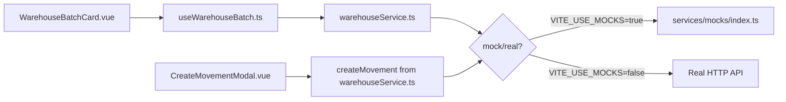
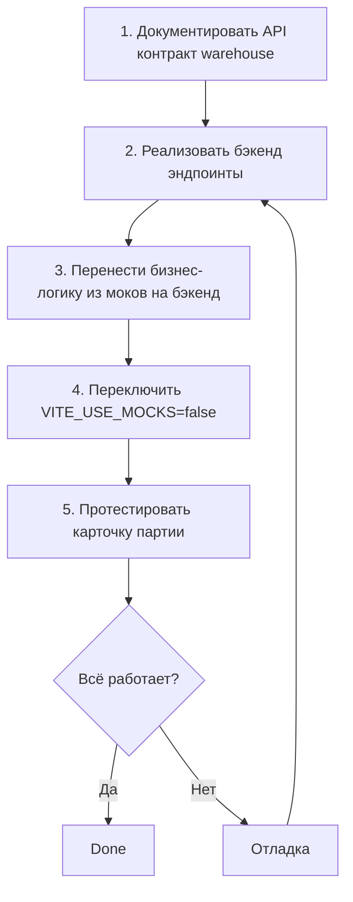

# Verify Batch Card API Readiness — Analysis & Plan

## Summary

**Карточка партии (`WarehouseBatchCard.vue`) практически готова для перехода на реальное API.** Архитектура следует DDD-паттерну: View → Composable → Service → Mock/Real API. Никаких прямых обращений к мокам из компонента нет. Однако есть несколько моментов, которые нужно проверить и/или доработать.

---

## 1. Текущая архитектура



### Все эндпоинты, используемые карточкой партии:

| # | Endpoint | Method | Source | Используется в |
|---|----------|--------|--------|----------------|
| 1 | `/api/warehouse/batches/:id` | GET | `getBatch()` | `useWarehouseBatch.load()` |
| 2 | `/api/warehouse/batches/:id` | PATCH | `patchBatch()` | `useWarehouseBatch.save()` |
| 3 | `/api/warehouse/batches/:id` | DELETE | `deleteBatch()` | `useWarehouseBatch.remove()` |
| 4 | `/api/warehouse/batches/:id/aggregates` | GET | `getBatchAggregates()` | `useWarehouseBatch.loadBatchAggregates()` |
| 5 | `/api/warehouse/batches/:id/active-sales` | GET | `getBatchActiveSales()` | `useWarehouseBatch.loadBatchActiveSales()` |
| 6 | `/api/warehouse/batches/:id/audit` | GET | `getBatchAudit()` | `useWarehouseBatch.loadAudit()` |
| 7 | `/api/warehouse/batches/:id/audit/:entryIndex` | DELETE | `deleteBatchAuditEntry()` | `useWarehouseBatch.deleteAuditEntry()` |
| 8 | `/api/warehouse/movements?batchNumber=...` | GET | `getMovements()` | `useWarehouseBatch.loadMovements()` |
| 9 | `/api/warehouse/offcuts?batchNumber=...` | GET | `getOffcuts()` | `useWarehouseBatch.loadOffcuts()` |
| 10 | `/api/warehouse/movements` | POST | `createMovement()` | `useWarehouseBatch.createBatchMovement()`, `CreateMovementModal.onSave()` |
| 11 | `/api/uploads` | POST | `uploadFile()` | `DropZone` component → `onFilesUploaded()` |

---

## 2. Проверка готовности по каждому слою

### 2.1 Service Layer ✅ — Готов

Файл [`warehouseService.ts`](frontend_vue/src/services/warehouseService.ts) содержит все необходимые функции с корректными эндпоинтами и типами:

```ts
getBatch(id)                    → GET /api/warehouse/batches/:id
patchBatch(id, delta)           → PATCH /api/warehouse/batches/:id
deleteBatch(id)                 → DELETE /api/warehouse/batches/:id
getBatchAggregates(batchId)     → GET /api/warehouse/batches/:id/aggregates
getBatchActiveSales(batchId)    → GET /api/warehouse/batches/:id/active-sales
getBatchAudit(batchId)          → GET /api/warehouse/batches/:id/audit
deleteBatchAuditEntry(batchId)  → DELETE /api/warehouse/batches/:id/audit/:entryIndex
getMovements(filters, page)     → GET /api/warehouse/movements?batchNumber=...
getOffcuts(filters, page)       → GET /api/warehouse/offcuts?batchNumber=...
createMovement(data)            → POST /api/warehouse/movements
```

**Проблем:** Нет. Все функции корректно обёрнуты в `apiGet/apiPost/apiPatch/apiDelete`.

### 2.2 Composable Layer ✅ — Готов

Файл [`useWarehouseBatch.ts`](frontend_vue/src/composables/useWarehouseBatch.ts) чисто использует сервисный слой:

- `load()` вызывает `getBatch(id)` и параллельно грузит движения, обрезки, аудит, агрегаты, активные продажи
- `save()` вызывает `patchBatch(id, delta)` с dirty-check diff
- `remove()` вызывает `deleteBatch(id)`
- `createBatchMovement()` вызывает `createMovement()`
- Никаких прямых `import` из `mocks/`

**Проблем:** Нет.

### 2.3 View Layer (WarehouseBatchCard.vue) ✅ — Готов

- Импортирует только `getBatch` напрямую (для `onMovementCreated` — чтобы обновить данные после создания движения через модалку)
- Все остальные данные идут через composable
- Никаких прямых обращений к мокам

**Единственный прямой импорт сервиса:**
```ts
import { getBatch } from '@/services/warehouseService'
```
Это корректно — через сервис, а не через мок.

### 2.4 CreateMovementModal.vue ✅ — Готов

- Использует `createMovement()` из `warehouseService.ts`
- Никаких прямых ссылок на моки
- Все данные приходят через `props`: batch, movements, aggregates, activeSales

---

## 3. Бизнес-логика, которую должен реализовать бэкенд

Сейчас вся бизнес-логика живёт в [`mocks/warehouse.ts`](frontend_vue/src/services/mocks/warehouse.ts). При переходе на реальное API, бэкенд должен реализовать:

### 3.1 `GET /api/warehouse/batches/:id/aggregates` — **Критично**

Вычисление агрегированных статусов из движений:

```
receipt  = batch.quantityRemaining (остаток на складе)
sale     = SUM(movements WHERE type='sale') - SUM(movements WHERE type='return' AND referenceType='sale')
expense  = SUM(movements WHERE type='expense') - SUM(movements WHERE type='return' AND referenceType='expense')
write-off, production, return-to-supplier, storage — аналогично
correction = напрямую задаёт значение агрегата (override)
```

### 3.2 `GET /api/warehouse/batches/:id/active-sales` — **Критично**

Нетто-продажи с учётом возвратов:

```
FOR each sale movement:
  returnedQty = SUM(return movements WHERE referenceId = sale.referenceId)
  remaining = sale.quantity - returnedQty
  IF remaining > 0 → include in response
```

### 3.3 `POST /api/warehouse/movements` — **Критично**

Обновление остатков партии в зависимости от типа движения:

| Movement Type | Effect on batch |
|--------------|-----------------|
| `sale`, `expense`, `write-off`, `production`, `storage`, `return-to-supplier` | `quantityRemaining -= quantity` |
| `receipt` | `quantityRemaining += quantity`, `quantity += quantity`, `totalCost += quantity × unitPrice` |
| `return` | `quantityRemaining += quantity` |
| `correction` (receipt) | `quantityRemaining = quantity`, `quantity += delta` |
| `correction` (non-receipt) | `quantity += delta`, `totalCost += delta × unitPrice` |

### 3.4 `computeBatchStatus` — **Важно**

Автоматическое определение статуса партии на основе распределения агрегатов:

```
receipt > 0 AND no other aggregates → 'available'
receipt > 0 AND other aggregates exist → 'partial'
receipt = 0 AND one other aggregate → that aggregate's status
receipt = 0 AND multiple/zero aggregates → 'depleted'
```

---

## 4. API Contract Document — Нужно добавить

Файл [`03-api-contract.md`](roo_code/roo-context/03-api-contract.md) не содержит warehouse-эндпоинтов. Контракт существует только в виде TypeScript-файла [`warehouseService.ts`](frontend_vue/src/services/warehouseService.ts). Рекомендуется добавить секцию Warehouse в API contract.

---

## 5. План действий для перехода на реальное API



### Todo List

1. **Документировать warehouse API контракт** — добавить секцию в `03-api-contract.md` со всеми эндпоинтами, request/response shape, error codes

2. **Реализовать бэкенд эндпоинты** (в порядке приоритета):
   - `GET /api/warehouse/batches/:id` — базовая информация о партии
   - `PATCH /api/warehouse/batches/:id` — обновление полей
   - `DELETE /api/warehouse/batches/:id` — удаление партии (с проверкой на привязку к заказу)
   - `POST /api/warehouse/movements` — создание движения с пересчётом остатков
   - `GET /api/warehouse/batches/:id/aggregates` — вычисление агрегатов
   - `GET /api/warehouse/batches/:id/active-sales` — активные продажи
   - `GET /api/warehouse/movements?batchNumber=...` — движения партии
   - `GET /api/warehouse/offcuts?batchNumber=...` — обрезки партии
   - `GET /api/warehouse/batches/:id/audit` — аудит партии
   - `DELETE /api/warehouse/batches/:id/audit/:entryIndex` — удаление записи аудита

3. **Перенести бизнес-логику** из моков на бэкенд (секция 3 выше)

4. **Протестировать** после переключения `VITE_USE_MOCKS=false`

---

## 6. Заключение

**WarehouseBatchCard.vue готова к переходу на реальное API.** Все данные запрашиваются через сервисный слой, моки изолированы. Единственная необходимая работа — реализация бэкенд-эндпоинтов с бизнес-логикой из `mocks/warehouse.ts`. Клиентский код изменений не требует.

### Что НЕ нужно менять во фронтенде:
- Service layer — остаётся как есть
- Composable — остаётся как есть
- View — остаётся как есть
- CreateMovementModal — остаётся как есть
- Types — остаются как есть

### Что нужно сделать:
1. Добавить warehouse секцию в API contract документ
2. Backend реализация эндпоинтов с бизнес-логикой
3. Переключить `VITE_USE_MOCKS` и протестировать
