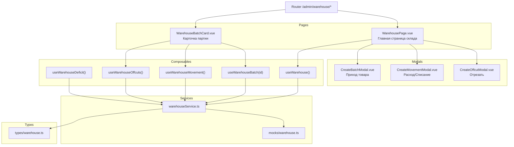

# План: page Склад (Warehouse) — Физическое наличие, партии, обрезки

## 1. Обзор

Страница **Склад** — ядро ERP-системы. Это главная рабочая страница для кладовщика и закупщика. Здесь ведётся учёт физического наличия товаров по партиям, приход/расход, работа с обрезками (Atraižos).

**Источники требований:**
- [`Flexiron_ERP_CRM.md`](../../toDo/Flexiron_ERP_CRM.md) — раздел 1.2
- [`Flexiron_ERP_Process_Algorithm.md`](../../toDo/Flexiron_ERP_Process_Algorithm.md) — Блок 1 (приём партии), Блок 2 (обрезки), Блок 4 (отгрузка)
- [`02.3_Deficit_Management.md`](../../toDo/design/screen_specs/02.3_Deficit_Management.md) — монитор дефицита

---

## 2. Архитектура

### 2.1 Маршрутизация

Новый роут в [`router/index.ts`](../../frontend_vue/src/router/index.ts):

```
/admin/warehouse              → WarehousePage.vue        (список остатков)
/admin/warehouse/batches      → WarehouseBatchesPage.vue (список партий)
/admin/warehouse/batches/:id  → WarehouseBatchCard.vue   (карточка партии)
/admin/warehouse/offsets      → WarehouseOffcutsPage.vue (обрезки)
/admin/warehouse/movement     → WarehouseMovement.vue    (приход/расход)
```

**Feature flag:** `adminWarehouse` (уже существует в [`features.ts`](../../frontend_vue/src/types/features.ts))

### 2.2 Типы (новый файл `src/types/warehouse.ts`)

```typescript
// ── Партия (Batch) ──
interface WarehouseBatch {
  id: string
  productId: string
  productName: string
  supplierId: string | null
  supplierName: string | null
  quantity: number           // текущее количество
  unit: string               // 'шт' | 'кг' | 'м'
  location: string           // сектор хранения (напр. "Стойка B5")
  status: BatchStatus
  receivedAt: string         // ISO дата прихода
  expiresAt: string | null   // ISO дата истечения (если применимо)
  notes: string
  files: WarehouseFile[]
  auditLog: WarehouseAuditEntry[]
  createdAt: string
  updatedAt: string
}

type BatchStatus = 'in_stock' | 'reserved' | 'partially_shipped' | 'shipped' | 'written_off'

// ── Обрезок (Offcut) ──
interface WarehouseOffcut {
  id: string
  parentBatchId: string
  productId: string
  productName: string
  length: number | null      // мм
  width: number | null       // мм
  weight: number | null      // кг
  quantity: number
  unit: string
  location: string
  status: OffcutStatus
  photoUrl: string | null    // фото сложной формы
  qrCode: string             // сгенерированный QR
  createdAt: string
}

type OffcutStatus = 'available' | 'reserved' | 'sold'

// ── Движение (Movement) ──
interface WarehouseMovement {
  id: string
  type: 'receipt' | 'sale' | 'write_off' | 'transfer' | 'cut'
  batchId: string
  productId: string
  productName: string
  quantity: number           // положительное для прихода, отрицательное для расхода
  unit: string
  reference: string | null   // номер заказа / накладной
  notes: string
  performedBy: string
  performedAt: string        // ISO
  createdAt: string
}

// ── Фильтры ──
interface WarehouseFilters {
  search: string
  categoryIds: string[]
  status: string             // 'all' | BatchStatus
  location: string           // сектор хранения
  sortBy: string | null
  sortDir: 'asc' | 'desc'
}

// ── Вспомогательные ──
interface WarehouseFile {
  id: string
  name: string
  size: number
  type: string
  uploadedAt: string
}

interface WarehouseAuditEntry {
  id: string
  timestamp: string
  user: string
  action: string
  details: string
}
```

### 2.3 API-контракт (эндпоинты)

| Метод | Path | Описание |
|-------|------|----------|
| `GET` | `/api/warehouse` | Список остатков (сводный) |
| `GET` | `/api/warehouse/batches` | Список партий (пагинированный) |
| `GET` | `/api/warehouse/batches/:id` | Карточка партии |
| `POST` | `/api/warehouse/batches` | Создание партии (приход) |
| `PATCH` | `/api/warehouse/batches/:id` | Обновление партии |
| `DELETE` | `/api/warehouse/batches/:id` | Удаление партии (только если нет движений) |
| `GET` | `/api/warehouse/offcuts` | Список обрезков |
| `GET` | `/api/warehouse/offcuts/:id` | Карточка обрезка |
| `POST` | `/api/warehouse/offcuts` | Создание обрезка (при отрезании) |
| `GET` | `/api/warehouse/movements` | История движений |
| `POST` | `/api/warehouse/movements` | Создать движение (расход/списание) |
| `GET` | `/api/warehouse/locations` | Список секторов хранения |
| `GET` | `/api/warehouse/deficit` | Данные дефицита (для вкладки) |

### 2.4 Сервис (`src/services/warehouseService.ts`)

```typescript
export function getWarehouseItems(filters, pagination): Promise<PaginatedResponse<WarehouseBatch>>
export function getWarehouseBatches(filters, pagination): Promise<PaginatedResponse<WarehouseBatch>>
export function getWarehouseBatch(id): Promise<WarehouseBatch>
export function createWarehouseBatch(data): Promise<WarehouseBatch>
export function patchWarehouseBatch(id, delta): Promise<WarehouseBatch>
export function deleteWarehouseBatch(id): Promise<void>
export function getWarehouseOffcuts(filters, pagination): Promise<PaginatedResponse<WarehouseOffcut>>
export function getWarehouseOffcut(id): Promise<WarehouseOffcut>
export function createWarehouseOffcut(data): Promise<WarehouseOffcut>
export function getWarehouseMovements(batchId?, pagination?): Promise<PaginatedResponse<WarehouseMovement>>
export function createWarehouseMovement(data): Promise<WarehouseMovement>
export function getWarehouseLocations(): Promise<string[]>
export function getWarehouseDeficit(): Promise<DeficitData>
```

### 2.5 Моки (`src/services/mocks/warehouse.ts`)

- 15+ партий с разными статусами
- 10+ обрезков с привязкой к партиям
- 30+ движений (приход/расход)
- 5+ секторов хранения
- Данные дефицита

### 2.6 Композаблы

| Композабл | Назначение |
|-----------|-----------|
| `useWarehouse()` | Список остатков/партий — фильтры, пагинация, загрузка |
| `useWarehouseBatch(id)` | Карточка партии — загрузка, dirty-check, save/discard |
| `useWarehouseOffcuts()` | Список обрезков — фильтры, пагинация |
| `useWarehouseMovement()` | Создание движения (приход/расход) |
| `useWarehouseDeficit()` | Данные дефицита |

---

## 3. UI / Страницы

### 3.1 `WarehousePage.vue` — Главная страница склада

**Макет:**
```
┌─────────────────────────────────────────────────┐
│ [Search]  [Category filter]  [Status filter]     │
│ [Location filter]  [Sort]                        │
├─────────────────────────────────────────────────┤
│ [Tab: Остатки] [Tab: Партии] [Tab: Обрезки]     │
│ [Tab: Движения] [Tab: Дефицит]                   │
├─────────────────────────────────────────────────┤
│                                                 │
│  Таблица / Список в зависимости от вкладки       │
│                                                 │
│  [Pagination]                                    │
└─────────────────────────────────────────────────┘
```

**Вкладки:**

1. **Остатки (Stock Overview)** — сводная таблица: товар, общее количество, единицы, сектор, статус. Группировка по категориям.
2. **Партии (Batches)** — детальный список партий с пагинацией. Колонки: товар, поставщик, количество, сектор, статус, дата прихода.
3. **Обрезки (Offcuts)** — список обрезков. Колонки: родительский товар, размеры, вес, сектор, статус, QR-код.
4. **Движения (Movements)** — история прихода/расхода. Колонки: тип, товар, количество, ссылка, дата, кто выполнил.
5. **Дефицит (Deficit)** — две подвкладки: "Заказы в минус" и "Пополнение склада" (согласно [`02.3_Deficit_Management.md`](../../toDo/design/screen_specs/02.3_Deficit_Management.md)).

**Quick actions:**
- Кнопка "Приход" → модалка создания партии
- Кнопка "Расход" → модалка создания движения
- Кнопка "Отрезать" → модалка создания обрезка
- Клик по строке партии → переход в карточку партии

### 3.2 `WarehouseBatchCard.vue` — Карточка партии

**Макет:**
```
┌─────────────────────────────────────────────────┐
│ [Back]  [Save/Discard bar]                       │
├─────────────────────────────────────────────────┤
│  Партия #{id}                                    │
│  ┌─────────────────────────────────────────────┐ │
│  │ Товар: [select / display]                    │ │
│  │ Поставщик: [select / display]                │ │
│  │ Количество: [input]  Единицы: [select]       │ │
│  │ Сектор: [select location]                    │ │
│  │ Статус: [badge]                              │ │
│  │ Дата прихода: [date]                         │ │
│  │ Примечания: [textarea]                       │ │
│  └─────────────────────────────────────────────┘ │
│                                                  │
│  ── Файлы ──                                     │
│  [DropZone]  [file list]                         │
│                                                  │
│  ── Обрезки от этой партии ──                    │
│  [table of offcuts]                              │
│                                                  │
│  ── История движений ──                          │
│  [table of movements]                            │
│                                                  │
│  ── Аудит ──                                     │
│  [audit log table]                               │
└─────────────────────────────────────────────────┘
```

**Clean-slate save UX** (как в [`ProductCardPage`](../../frontend_vue/src/views/admin/products/ProductCardPage.vue)):
- `useDirtyCheck` для полей формы
- Save = PATCH с дельтой
- Discard = перезагрузка с сервера

### 3.3 Модалки

1. **Модалка "Приход товара"** — выбор товара из справочника, поставщик, количество, сектор, дата, файлы
2. **Модалка "Расход/Списание"** — выбор партии, количество, причина, ссылка на заказ
3. **Модалка "Отрезать"** — выбор партии, длина/размер, учёт ширины реза (kerf), авто-расчёт веса обрезка
4. **Модалка "QR-код"** — отображение QR для печати Lipdukas

---

## 4. i18n

Новый файл: `src/i18n/admin/warehouse.ts`

Ключи:
- `warehouse.title` — "Склад"
- `warehouse.tabs.stock` — "Остатки"
- `warehouse.tabs.batches` — "Партии"
- `warehouse.tabs.offcuts` — "Обрезки"
- `warehouse.tabs.movements` — "Движения"
- `warehouse.tabs.deficit` — "Дефицит"
- `warehouse.batch.create` — "Приход товара"
- `warehouse.batch.edit` — "Редактировать партию"
- `warehouse.movement.create` — "Расход / Списание"
- `warehouse.offcut.create` — "Отрезать"
- `warehouse.toast_created` — "Партия создана"
- `warehouse.toast_updated` — "Партия обновлена"
- `warehouse.toast_deleted` — "Партия удалена"
- `warehouse.toast_error` — "Ошибка при сохранении"
- И т.д. по аналогии с [`services.ts`](../../frontend_vue/src/i18n/admin/services.ts)

---

## 5. Feature Flags

| Флаг | Уровень | Назначение |
|------|---------|-----------|
| `adminWarehouse` | page-level | Уже существует, защищает роут `/admin/warehouse/*` |
| `warehouseOffcuts` | section-level | Скрывает вкладку "Обрезки" (если функционал не готов) |
| `warehouseDeficit` | section-level | Скрывает вкладку "Дефицит" |
| `warehouseQrPrint` | section-level | Скрывает кнопку печати QR/Lipdukai |

Добавить в [`features.ts`](../../frontend_vue/src/types/features.ts):
```typescript
warehouseOffcuts: boolean
warehouseDeficit: boolean
warehouseQrPrint: boolean
```

---

## 6. CSS

Новый файл: `src/styles/admin/warehouse.css`

Стили для:
- Таблицы склада (адаптация под разные вкладки)
- Карточка партии
- Модалки прихода/расхода/отрезания
- QR-код display
- Статус-бейджи (in_stock, reserved, etc.)

---

## 7. E2E тесты

Новый файл: `tests/e2e/admin/warehouse/warehouse.spec.ts`

Тест-кейсы:
1. Загрузка страницы склада — видит таблицу остатков
2. Переключение вкладок (Остатки → Партии → Обрезки → Движения → Дефицит)
3. Фильтрация по поиску, категории, статусу
4. Создание партии (модалка "Приход")
5. Создание движения расхода
6. Создание обрезка (модалка "Отрезать")
7. Открытие карточки партии
8. Редактирование и сохранение карточки партии
9. Пагинация

---

## 8. Порядок реализации

### Фаза 1 — Инфраструктура (базовые типы, сервис, моки)
1. Создать [`src/types/warehouse.ts`](../../frontend_vue/src/types/warehouse.ts) — все типы
2. Создать [`src/services/warehouseService.ts`](../../frontend_vue/src/services/warehouseService.ts) — все эндпоинты
3. Создать [`src/services/mocks/warehouse.ts`](../../frontend_vue/src/services/mocks/warehouse.ts) — мок-данные
4. Добавить мок-роуты в [`src/services/mocks/index.ts`](../../frontend_vue/src/services/mocks/index.ts)
5. Добавить feature flags в [`src/types/features.ts`](../../frontend_vue/src/types/features.ts)
6. Создать [`src/i18n/admin/warehouse.ts`](../../frontend_vue/src/i18n/admin/warehouse.ts) — переводы
7. Подключить переводы в [`src/i18n/admin.ts`](../../frontend_vue/src/i18n/admin.ts)

### Фаза 2 — Главная страница склада
8. Создать [`src/composables/useWarehouse.ts`](../../frontend_vue/src/composables/useWarehouse.ts)
9. Создать [`src/views/admin/warehouse/WarehousePage.vue`](../../frontend_vue/src/views/admin/warehouse/WarehousePage.vue) — вкладки, таблицы, фильтры
10. Создать [`src/styles/admin/warehouse.css`](../../frontend_vue/src/styles/admin/warehouse.css)
11. Добавить роуты в [`src/router/index.ts`](../../frontend_vue/src/router/index.ts)

### Фаза 3 — Карточка партии
12. Создать [`src/composables/useWarehouseBatch.ts`](../../frontend_vue/src/composables/useWarehouseBatch.ts)
13. Создать [`src/views/admin/warehouse/WarehouseBatchCard.vue`](../../frontend_vue/src/views/admin/warehouse/WarehouseBatchCard.vue)
14. Добавить роут `/admin/warehouse/batches/:id`

### Фаза 4 — Модалки (приход, расход, отрезание)
15. Создать модалку "Приход товара" (CreateBatchModal.vue)
16. Создать модалку "Расход/Списание" (CreateMovementModal.vue)
17. Создать модалку "Отрезать" (CreateOffcutModal.vue)
18. Создать [`src/composables/useWarehouseMovement.ts`](../../frontend_vue/src/composables/useWarehouseMovement.ts)

### Фаза 5 — Обрезки и дефицит
19. Создать [`src/composables/useWarehouseOffcuts.ts`](../../frontend_vue/src/composables/useWarehouseOffcuts.ts)
20. Создать [`src/composables/useWarehouseDeficit.ts`](../../frontend_vue/src/composables/useWarehouseDeficit.ts)
21. Реализовать вкладки "Обрезки" и "Дефицит" на WarehousePage

### Фаза 6 — E2E тесты
22. Создать [`tests/e2e/admin/warehouse/warehouse.spec.ts`](../../frontend_vue/tests/e2e/admin/warehouse/warehouse.spec.ts)
23. Добавить API моки через Playwright route interception

---

## 9. Диаграмма компонентов



---

## 10. Зависимости

- **От** [`ProductsPage`](../../frontend_vue/src/views/admin/products/ProductsPage.vue) — для выбора товара при создании партии (lookup)
- **От** [`SuppliersListPage`](../../frontend_vue/src/views/admin/suppliers/SuppliersListPage.vue) — для выбора поставщика
- **От** [`usePagination`](../../frontend_vue/src/composables/usePagination.ts) — для пагинации
- **От** [`useDirtyCheck`](../../frontend_vue/src/composables/useDirtyCheck.ts) — для clean-slate save UX
- **От** [`useToast`](../../frontend_vue/src/composables/useToast.ts) — для уведомлений
- **От** [`useFeatureFlag`](../../frontend_vue/src/composables/useFeatureFlag.ts) — для section-level флагов
- **От** [`DropZone.vue`](../../frontend_vue/src/components/admin/ui/DropZone.vue) — для загрузки файлов
- **От** [`CustomSelect.vue`](../../frontend_vue/src/components/admin/ui/CustomSelect.vue) — для выпадающих списков
- **От** [`AppModal.vue`](../../frontend_vue/src/components/admin/ui/AppModal.vue) — для модалок
